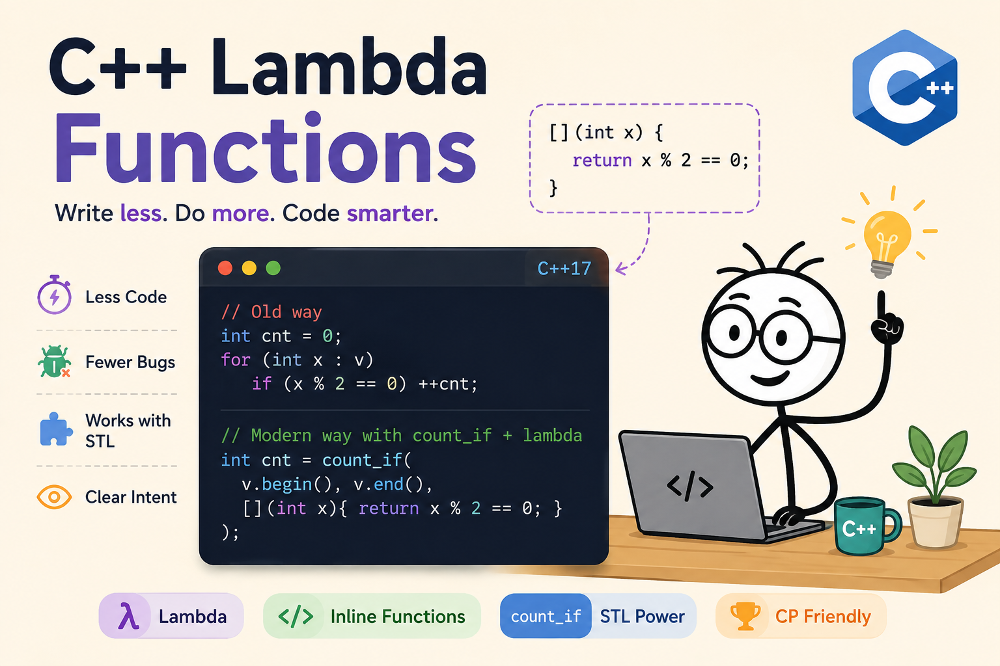
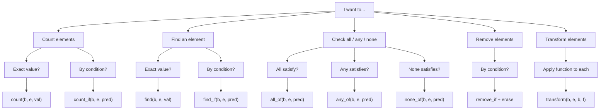

# Lambda Functions in C++ — with count_if in Action

`C++17` · `<algorithm>` · `Lambda Captures` · `Competitive Programming`

From zero to competitive programming — a complete guide to lambda functions, capture lists, and STL `count_if`, with real examples, patterns, and practice problems.

  
*Power of Lambda Function*

---

## 1. What Problem Does This Solve?

Imagine you have a list of numbers and you want to count how many are even. The old way requires writing a loop, a counter variable, and a condition. It works, but it's verbose and distracting from the actual intent.

**❌ Old way — manual loop**
```cpp
vector<int> v = {1, 2, 3, 4, 5, 6};
int cnt = 0;
for (int x : v)
    if (x % 2 == 0)
        ++cnt;
```

**✅ Modern way — `count_if` + lambda**
```cpp
vector<int> v {1, 2, 3, 4, 5, 6};
int cnt = count_if(
    v.begin(), v.end(),
    [](int x){ return !(x % 2); });
```

The modern version is **shorter, more expressive, and reveals your intent immediately**. This is why lambdas were introduced in C++11 — to let you write small, inline functions wherever a function is expected, without the ceremony of naming and defining them separately.

### ⚡ Why This Matters in Competitive Programming

- Saves lines → faster to write under contest time pressure
- Reduces off-by-one and loop-counter bugs
- Composes naturally with other STL algorithms (`sort`, `find_if`, `remove_if`, etc.)
- Makes code reviewable at a glance

---

## 2. Lambda Anatomy

A lambda expression has the following full syntax:

```cpp
[capture_list](parameters) -> return_type {
    // body
    return value;
}
```

```
[&threshold]  (int x)  ->  bool  { return x > threshold; }
     |           |         |              |
     v           v         v              v
  Capture     Param      Return          Body
   List        List       Type
  (which      (input    (optional,     (logic goes
  outside     args)      often          here)
  vars can              inferred)
  be used)
```

### 🔑 Each Part Explained

| Part | Required? | What it Does | Example |
|---|---|---|---|
| `[]` — Capture list | ✅ Yes | Defines which outer variables are visible inside | `[]`, `[&]`, `[x]` |
| `(params)` | ✅ Yes* | Parameters the lambda receives when called | `(int x)` |
| `-> type` | ❌ Optional | Explicit return type (compiler infers it usually) | `-> bool` |
| `{ body }` | ✅ Yes | The actual logic | `{ return x%2==0; }` |

\* `()` can be omitted entirely if the lambda takes no parameters — this has been valid since **C++11**, not just C++14. (What C++14 actually added was generic `auto` parameters, e.g. `[](auto x){ ... }` — a different feature, easy to mix up with this one.)

### 📖 Examples of Valid Lambda Forms

```cpp
// Shortest possible lambda — no captures, no parameters, no return value
auto HW = [] { cout << "Hello, World!"; };
HW(); // prints Hello, World!

// Minimal — no captures, simple return
auto isEven = [](int x) { return !(x % 2); };

// With capture by reference
int limit{10};
auto underLimit = [&limit](int x) { return x < limit; };

// Explicit return type
auto safeDivide = [](double a, double b) -> double {
    if (!b) return 0;
    return a / b;
};

// Immediately invoked (IIFE style)
int result = [](int x) { return x * x; }(5); // result = 25
```

> 💡 **Efficiency note:** none of these forms are "faster" than another at runtime — the compiler inlines all of them identically when passed straight into an STL algorithm (see Section 10). The only real difference is *readability*. `[]{ ... }` (no parentheses) is fine for a quick one-off like the `HW` example above, but once a lambda takes parameters, keeping the `()` — even when it's technically optional — makes it easier to scan at a glance.

---

## 3. Capture List Deep Dive

The capture list controls what variables from the **outer (enclosing) scope** the lambda can see and use. Think of it as a gateway between the outside world and the lambda's inner world.

```
Outer scope:  int threshold = 5;   vector<int> v = {3, 7, 1, 9};
```

| Lambda | Nickname | What it can see | Can it modify the originals? |
|---|---|---|---|
| `[]` | 🔒 Sealed box | Only its own parameters, e.g. `(int x)` — `threshold` and `v` are invisible | N/A — nothing outer is captured |
| `[&]` | 🔓 Open box | `threshold`, `v`, and everything else in scope, live | ✅ Yes — reads and writes the real variables |
| `[=]` | 📸 Snapshot | A copy of `threshold`, `v`, etc., frozen at the moment the lambda was created | ❌ No — only the copies change |
| `[threshold]` | 🎯 Selective | Only `threshold` (by value) — `v` stays invisible | ❌ No — `threshold` is copied, not shared |

The mental model: `[]` hands the lambda nothing from outside, `[&]` hands it a direct line to the real variables, `[=]` hands it photographs of them, and naming a variable explicitly (like `[threshold]`) hands it exactly that one item and nothing else.

### 📋 All Capture Variants

| Syntax | Meaning | Can Modify Original? | Use When |
|---|---|---|---|
| `[]` | Capture nothing | N/A | Lambda needs no outer data |
| `[&]` | All by reference | ✅ Yes | Need to read/modify outer vars |
| `[=]` | All by value (copy) | ❌ No (copy only) | Need snapshot, no modification |
| `[x]` | Only `x` by value | ❌ No | Use only one specific var |
| `[&x]` | Only `x` by reference | ✅ Yes (`x` only) | Modify one specific var |
| `[&x, y]` | `x` by ref, `y` by value | ✅ `x` only | Mixed: modify `x`, read `y` |
| `[this]` | Current object | ✅ Yes | Inside a class method |

### ⚡ `[]` vs `[&]` vs `[=]` — Live Comparison

```cpp
#include <bits/stdc++.h>
using namespace std;

int main() {
    int val {10};

    // [] — capture nothing, val is unknown
    // auto f1 = [](){ return val; }; // ❌ ERROR

    // [&] — capture by reference, can modify original
    auto f2 = [&]() { val = 99; };
    f2();
    cout << val; // prints 99 — original changed

    // [=] — capture by value (copy), original safe
    int x {5};
    auto f3 = [=]() { return x * 2; }; // x is copied
    x = 100; // changing x doesn't affect f3's copy
    cout << f3(); // still prints 10 (5*2, snapshot)

    // [&x] — only capture x by reference
    int a {1}, b{2};
    auto f4 = [&a]() { ++a; }; // only a is captured
    // b is not accessible inside f4
}
```

> ⚠️ **Dangling Reference Risk:** If you capture by reference `[&]` and the lambda outlives the variable it captured (e.g., stored in a callback called later), you get undefined behavior. In competitive programming this rarely matters, but in production code be careful.

---

## 4. `count_if` Explained

`count_if` is an STL algorithm from `<algorithm>` that counts how many elements in a range satisfy a given predicate (condition).

```cpp
// From <algorithm>
template<class InputIt, class UnaryPredicate>
typename iterator_traits<InputIt>::difference_type
count_if(InputIt first, InputIt last, UnaryPredicate p);
```

### How `count_if` Works Internally

```
vector v = { 1,  4,  3,  8,  5,  6 }
              ↓   ↓   ↓   ↓   ↓   ↓
predicate:  ❌  ✅  ❌  ✅  ❌  ✅     (x % 2 == 0)
              ↓   ↓   ↓   ↓   ↓   ↓
count:        0   1   1   2   2   3   ← final count = 3

count_if(v.begin(), v.end(), [](int x){ return x%2==0; }) → 3
```

### 📦 Parameters

| Parameter | Type | Description |
|---|---|---|
| `first` | InputIterator | Beginning of range |
| `last` | InputIterator | End of range (one past the last element) |
| `p` | UnaryPredicate | A callable that takes one element and returns `bool` |

### 📤 Return Value

Returns `ptrdiff_t` (a signed integer type). In practice you can safely assign it to `int` or `long long` for competitive programming.

> 💡 **Tip:** The predicate can be any callable — a lambda (most common), a regular function, a functor, or even `std::function`. Lambdas are preferred because they're inline and the compiler can inline-optimize them easily.

---

## 5. Combined Examples — All Containers

### 🔷 `vector<int>`
```cpp
vector<int> v {3, 1, 4, 1, 5, 9, 2, 6};

// Count even numbers
int evens = count_if(v.begin(), v.end(),
    [](int x) { return !(x % 2); }); // 3

// Count elements greater than threshold
int threshold {4};
int big = count_if(v.begin(), v.end(),
    [&threshold](int x) { return x > threshold; }); // 3

// Count elements in range [lo, hi]
int lo {2}, hi {5};
int in_range = count_if(v.begin(), v.end(),
    [&](int x) { return x >= lo && x <= hi; }); // 4
```

### 🔷 `string`
```cpp
string s {"Hello, World! 123"};

// Count uppercase letters
int uppers = count_if(s.begin(), s.end(),
    [](char c) { return isupper(c); }); // 2

// Count digits
int digits = count_if(s.begin(), s.end(),
    [](char c) { return isdigit(c); }); // 3

// Count vowels
int vowels = count_if(s.begin(), s.end(),
    [](char c) {
        char lc = tolower(c);
        return lc=='a'||lc=='e'||lc=='i'||lc=='o'||lc=='u';
    }); // 3
```

### 🔷 `array<int, N>`
```cpp
array<int, 6> arr {2, 4, 7, 1, 9, 3};

// Count odd numbers in array
int odds = count_if(arr.begin(), arr.end(),
    [](int x) { return x % 2; }); // 3

// Works on raw C-style arrays too:
int raw[] = {1, 2, 3, 4, 5};
int c = count_if(raw, raw + 5,
    [](int x) { return x > 3; }); // 2
```

### 🔷 `map<K, V>` and `set<T>`
```cpp
// ── map ──────────────────────────────────────────────
map<string, int> scores {
    {"Alice", 85}, {"Bob", 42}, {"Carol", 91}, {"Dave", 67}
};

// Count students who passed (score >= 60)
int passed = count_if(scores.begin(), scores.end(),
    [](const auto& p) { return p.second >= 60; }); // 3

// ── set ──────────────────────────────────────────────
set<int> st {1, 3, 5, 7, 9, 11};

// Count elements divisible by 3
int div3 = count_if(st.begin(), st.end(),
    [](const auto& x) { return !(x % 3); }); // 2 (3, 9)
```

### 🔷 `vector<pair>` and `vector<string>`
```cpp
// ── vector of pairs ─────────────────────────────────
vector<pair<int,int>> edges {{1,2},{3,4},{5,1},{2,2}};

// Count self-loops (both endpoints same)
int loops = count_if(edges.begin(), edges.end(),
    [](const pair<int,int>& e) {
        return e.first == e.second;
    }); // 1 ({2,2})

// ── vector of strings ───────────────────────────────
vector<string> words {"apple","banana","apricot","cherry"};

// Count words starting with 'a'
int aWords = count_if(words.begin(), words.end(),
    [](const string& w) { return w[0] == 'a'; }); // 2

// Count words with length > 5
int longWords = count_if(words.begin(), words.end(),
    [](const string& w) { return w.size() > 5; }); // 3
```

### 🔷 `deque` and `list`
```cpp
// ── deque ─────────────────────────────────
deque<int> dq {5, 10, 15, 20, 25};

// Count multiples of 10
int tens = count_if(dq.begin(), dq.end(),
    [](int x) { return !(x % 10); }); // 2

// ── list ──────────────────────────────────
list<int> lst {-3, -1, 0, 2, 4};

// Count negative numbers
int negs = count_if(lst.begin(), lst.end(),
    [](int x) { return x < 0; }); // 2
```
---

## 6. When to Use / When NOT to Use

**✅ USE `count_if` when...**
```cpp
// Condition is non-trivial
count_if(v.begin(), v.end(),
  [](int x){ return x>0 && x%2==0; });

// Uses captured variable
count_if(v.begin(), v.end(),
  [&t](int x){ return x > t; });

// Checking string properties
count_if(words.begin(), words.end(),
  [](const string& w){
    return w.size() > 3 && w[0]=='a';
  });
```

**❌ AVOID `count_if` when...**
```cpp
// Exact value match — use count instead
count_if(v.begin(), v.end(),
  [](int x){ return x == 5; }); // BAD
count(v.begin(), v.end(), 5);   // GOOD

// Body is 20+ lines — extract function
count_if(v.begin(), v.end(),
  [](int x){ /* huge logic */ });

// Need recursion inside predicate
// lambdas can't directly recurse
```

> 💡 **Rule of Thumb:** If the predicate is more than 2–3 lines or is reused in multiple places, extract it into a named function. `count_if` shines for short, one-off conditions.

---

## 7. Competitive Programming Patterns

### 🏆 Pattern 1 — Count Elements in Range
```cpp
// How many elements of v are in [L, R]?
int L = 3, R = 7;
int cnt = count_if(v.begin(), v.end(),
    [&](int x) { return x >= L && x <= R; });
```

### 🏆 Pattern 2 — Count with Multiple Conditions
```cpp
// Count elements satisfying multiple conditions
int result = count_if(v.begin(), v.end(),
    [](int x) {
        return x > 0          // positive
            && x % 2 == 0    // even
            && x % 3 == 0;   // divisible by 3
    });
```

### 🏆 Pattern 3 — Count Strings Matching Property
```cpp
// Count strings that are palindromes
auto isPalin = [](const string& s) {
    string r = s;
    reverse(r.begin(), r.end());
    return s == r;
};
int palinCount = count_if(words.begin(), words.end(), isPalin);
```

### 🏆 Pattern 4 — Count Pairs Satisfying Condition
```cpp
// Count pairs where sum > target
int target = 10;
int cnt = count_if(pairs.begin(), pairs.end(),
    [&](const pair<int,int>& p) {
        return p.first + p.second > target;
    });
```

### 🏆 Pattern 5 — Frequency Count per Character
```cpp
string s = "competitive programming";

// Count each vowel efficiently
for (char v : string("aeiou")) {
    int freq = count_if(s.begin(), s.end(),
        [v](char c) { return c == v; });
    cout << v << ": " << freq << "\n";
}
```

---

## 8. Common Mistakes & Gotchas

### 🐛 Mistake 1 — Forgetting `[&]` When Needed

**❌ Bug**
```cpp
int threshold = 5;
count_if(v.begin(), v.end(),
    [](int x) {
        // ERROR: threshold not captured
        return x > threshold;
    });
```

**✅ Fixed**
```cpp
int threshold = 5;
count_if(v.begin(), v.end(),
    [&threshold](int x) {
        return x > threshold;
    });
```

### 🐛 Mistake 2 — Modifying with `[=]` (Copy)

**❌ Bug — original unchanged**
```cpp
int cnt = 0;
count_if(v.begin(), v.end(),
    [=](int x) {
        cnt++; // modifies copy!
        return x > 0;
    });
// cnt is still 0 outside
```

**✅ Fixed — use `[&]`**
```cpp
int cnt = 0;
count_if(v.begin(), v.end(),
    [&](int x) {
        if (x>0) cnt++; // modifies original
        return x > 0;
    });
// cnt is correct now
```

### 🐛 Mistake 3 — Wrong Iterator Range
```cpp
vector<int> v = {1,2,3,4,5};

// ❌ Only counts first 3 elements (maybe intentional, maybe not)
count_if(v.begin(), v.begin() + 3, [](int x){ return x>2; });

// ✅ Count all elements
count_if(v.begin(), v.end(),   [](int x){ return x>2; });
```

### 🐛 Mistake 4 — Using `count_if` When `count` Suffices
```cpp
vector<int> v = {1,2,3,2,4};

// ❌ Unnecessarily verbose
count_if(v.begin(), v.end(), [](int x){ return x == 2; });

// ✅ Use plain count for exact value matching
count(v.begin(), v.end(), 2);
```

> 💡 **Rule of thumb:** Use `count` for exact value matching. Use `count_if` when you need a condition (range check, property check, etc.).

### 🐛 Mistake 5 — Signed/Unsigned Comparison Warning
```cpp
vector<string> words = {"hi", "hello", "hey"};

// ⚠️ Warning: comparing signed int with unsigned size_t
count_if(words.begin(), words.end(),
    [](const string& w) { return w.size() > 2; }); // may warn

// ✅ Clean: cast to int
count_if(words.begin(), words.end(),
    [](const string& w) { return (int)w.size() > 2; });
```

---

## 9. Complexity & STL Internals

### ⏱️ Time Complexity

| Algorithm | Time | Notes |
|---|---|---|
| `count_if` | O(n) | Visits every element exactly once |
| `count` | O(n) | Same — linear scan |
| `find_if` | O(n) worst | Stops at first match — O(1) best case |
| `all_of / any_of / none_of` | O(n) worst | Short-circuit evaluation |
| `sort` with lambda | O(n log n) | Introsort; lambda is called O(n log n) times |

### 🧠 Space Complexity

| Component | Space | Notes |
|---|---|---|
| `count_if` call | O(1) | Only a counter variable internally |
| Lambda with `[]` | O(1) | No captures — essentially a function pointer |
| Lambda with `[=]` | O(k) | k = number of captured variables |
| Lambda with `[&]` | O(k) | k = number of reference pointers stored |

### ⚙️ What the Compiler Does

When you write a lambda, the compiler generates an anonymous class (called a **closure type**) with:

```cpp
// You write:
int t = 5;
auto f = [&t](int x) { return x > t; };

// Compiler generates something like:
struct __lambda_1 {
    int& t; // captured by reference
    bool operator()(int x) const {
        return x > t;
    }
};
__lambda_1 f{t}; // instance created with captured ref
```

Because the compiler knows the exact type of the closure, it can **inline the lambda call** completely when used with STL algorithms — meaning there's **zero overhead** compared to a hand-written loop (unlike `std::function`, which uses type erasure).

> 💡 **Performance:** A lambda passed to `count_if` is **at least as fast** as a hand-written loop in optimized builds, because the compiler inlines it. Use `std::function` only when you need to store/pass lambdas polymorphically — it's slower due to virtual dispatch overhead.

---

## 10. Practice Problem List
| # | Problem | Short Description | Guidance |
|---|---|---|---|
| 1 | [Love Story (CF 1829A)](https://codeforces.com/problemset/problem/1829/A) | Count of character difference. | _Hint:_ Iterate over the given string and compare with same positioned character of codeforces using _Lambda + count_if_. <br><br> _Solution:_ [⏎](https://codeforces.com/contest/1829/submission/387093913) |

---

## 11. Quick Reference Cheat Sheet

### 📦 Capture List
```cpp
[]       // capture nothing
[&]      // all by reference
[=]      // all by value (copy)
[x]      // only x by value
[&x]     // only x by reference
[&x, y]  // x by ref, y by val
```

### 🔧 `count_if` Patterns
```cpp
// Even numbers
count_if(b,e,[](int x){return x%2==0;});

// With threshold [&]
count_if(b,e,[&](int x){return x>t;});

// map values
count_if(b,e,[](const auto& p){
    return p.second>60;});
```

### ⚡ Related Algorithms
```cpp
count(b,e,val)       // exact match
find_if(b,e,pred)    // first match
all_of(b,e,pred)     // all true?
any_of(b,e,pred)     // any true?
none_of(b,e,pred)    // none true?
remove_if(b,e,pred)  // remove
transform(b,e,b,f)   // map/transform
```

### ⚠️ Golden Rules
- No outer var needed → `[]`
- Read outer var → `[&var]`
- Modify outer var → `[&]`
- Snapshot (no modify) → `[=]`
- Exact value → use `count`, not `count_if`
- Recursion → use a named function
- Long body → extract to a named function

### 📊 STL Algorithm Decision Tree


---
