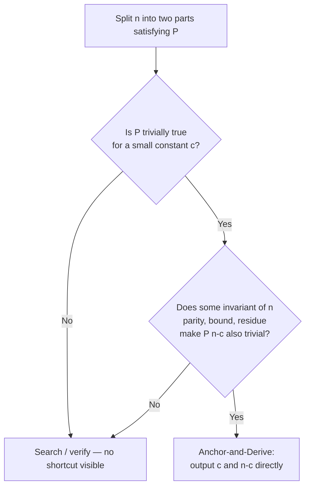

# Anchor-and-Derive

.jpg)

## Definition
A construction strategy for "split n into two parts, each satisfying property P" problems. Instead of searching for a valid pair — generating candidates, sieving, checking membership — fix one part to a small constant *c* for which P(c) holds trivially, then show that the remaining part, n − c, also satisfies P, using some invariant of n (parity, a fixed lower bound, a residue class) rather than a search or lookup. The construction *is* the proof; nothing needs to be verified afterward.

## Why it arises
Splitting problems tempt a "generate and check" reflex: build the space of values satisfying P, then look for two that sum to n. That approach generalizes to almost anything, which is exactly why it's tempting — but it throws away structure the problem is quietly offering. Many properties (evenness, being ≥ some bound, divisibility by a small fixed number) are *free* to establish for one side once you fix a small anchor and let an invariant of n carry the proof for the other side. When P is easy to satisfy for infinitely many small numbers and n is guaranteed large enough, an anchor usually exists — the problem is asking you to find it, not to search for it.

## Example from practice
**Problem:** [472A — Design Tutorial: Learn from Math](https://codeforces.com/problemset/problem/472/A) (n ≥ 12, express n as a sum of two composite numbers).

Two accepted solutions, same problem, very different amount of machinery:
- [Sieve approach](https://codeforces.com/contest/472/submission/387141515) — build the set of composites up to n, then search it for a matching pair. Correct, but the machinery (sieve + search) is heavier than an 800-rated problem calls for.
- [Algebraic approach](https://codeforces.com/contest/472/submission/387142011) — anchor on a fixed small composite and let parity finish the proof: if n is even, output 4 and n − 4 (n − 4 is even and ≥ 8, hence composite); if n is odd, output 9 and n − 9 (n − 9 is even and ≥ 4, hence composite). Two constants, one parity check, O(1) — no lookup involved.

The gap between the two solutions is the whole point of this entry: the second one didn't get found by searching harder, it got found by asking a different question.

## How to recognize one
- The problem asks you to split n into two parts, each satisfying some property P.
- P is easy to satisfy for infinitely many small values (any even number, any multiple of a small constant, etc.).
- n is bounded below by something safely large relative to the anchor you'd pick.
- Your first instinct produces a sieve, a set, a map, or a search/verification loop for what the rating or phrasing suggests should be a one-line construction — that mismatch in scale is itself a signal worth pausing on.

## Analogy
Like proving a claim by exhibiting a witness instead of searching a haystack for one: you don't scan every possible split looking for two composites, you *build* one — the same way you'd hand a judge a specific example rather than describe an exhaustive search that happens to find it.

## Related
- [Trust the Predicate](https://github.com/Mojahidul21/My-Competitive-Programming-Journey/blob/main/General%20Tricks%20&%20Techniques/Contest%20Strategy/Trust%20the%20Predicate%3A%20Stop%20Simulating%20What%20You've%20Already%20Proven.md) — Anchor-and-Derive is the constructive sibling: Trust the Predicate says trust a proven predicate instead of simulating a process to check it; Anchor-and-Derive goes one step earlier and lets a proven predicate hand you the witness directly, skipping the search that would have found it.
- [Parity Chain](https://github.com/Mojahidul21/My-Competitive-Programming-Journey/blob/main/General%20Tricks%20&%20Techniques/Contest%20Strategy/Trust%20the%20Predicate%3A%20Stop%20Simulating%20What%20You've%20Already%20Proven.md) — the invariant that most often makes the second half of the derivation trivial; splitting reasoning along even/odd from the start is frequently what makes "n − c also satisfies P" free to claim.
