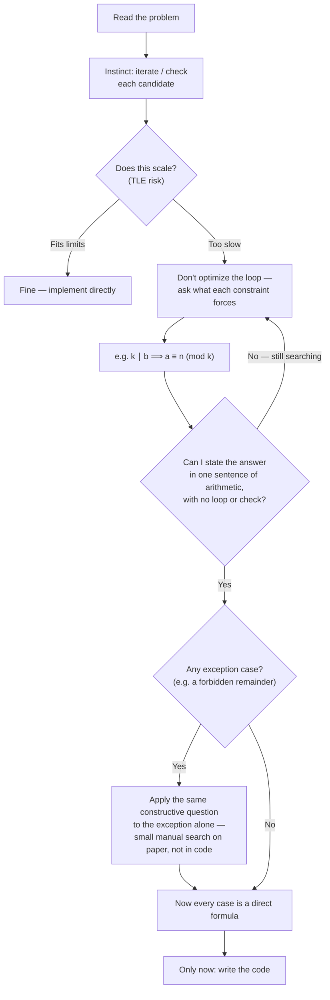

# From Search to Construction: Thinking Mathematically in Contests

**Category:** Contest Strategy | **Relevant for:** Codeforces Div. 2 B/C and similar math problems

---

## The Pattern That Slows You Down

On math-heavy problems, a very common experience goes like this:

- You read the problem and understand it.
- You think: "I will iterate / check each candidate / use a function to verify."
- You realize that will TLE.
- You get stuck — you know the brute force is wrong but cannot see what replaces it.

This is not a knowledge gap. It is a **thinking direction** gap. You are approaching the problem from the implementation side before the math side is fully settled.

The fix is a single discipline:

> **Do not think about implementation until you can state the answer as a direct formula or a small fixed set of cases — with no loop, no verification function.**

If your mental solution still has a search or a check, the math is not done yet.

---

## The Concrete Signal

Ask yourself: *can I tell someone the answer for any input in one sentence of arithmetic?*

- "The answer is $n \bmod k$, paired with $n - (n \bmod k)$." — math is done.
- "I iterate multiples of $k$ and check each one." — math is not done.

A verification function in your solution means you are still searching. Keep asking "why does this work?" until the search disappears on paper. Only then open your editor.

---

## A Useful Reflex for Divisibility Problems

When a problem says one term must be divisible by $k$, immediately ask:

> **What does that force on the other term modulo $k$?**

Since a multiple of $k$ contributes $0$ to any remainder, the other term must carry the entire remainder of the total. Formally:

$$n = a + b, \quad k \mid b \implies a \equiv n \pmod{k}$$

This single observation converts "search for $a$" into "compute $a \bmod k$ directly from $n$." The search disappears.

### Example

Problem: given $n$, find a palindrome $a$ and a multiple of $12$ called $b$ such that $a + b = n$.

Applying the reflex: $b$ is a multiple of $12$, so $a \equiv n \pmod{12}$.

Remainders mod $12$ are $\{0, 1, \ldots, 11\}$. All except $10$ are palindromes. So:

- If $n \bmod 12 \ne 10$: answer is $(n \bmod 12,\ n - n \bmod 12)$. Done.
- If $n \bmod 12 = 10$: find the smallest palindrome with remainder $10$ — that is $22$. Answer is $(22,\ n - 22)$, provided $n > 10$.
- If $n = 10$: impossible, output $-1$.

No loop. No palindrome-checking function. The reflex turned a search problem into three lines of arithmetic.

---

## Why the Exception Case Feels Hard

When you find the main pattern but hit an exception (like $\text{rem} = 10$ above), there is a temptation to go back to searching — "decrease by $12$ and check palindrome each time." Resist this.

Instead, ask the same constructive question in the exception:

> What is the smallest value satisfying both constraints — the structural one (palindrome) and the modular one (remainder equals $n \bmod k$)?

This is a small manual search you do in your head or on paper, not in code. Once you find that value ($22$ in the example), the answer for the exception is just as direct as the main case.

---

## The General Habit

| Stage | Wrong direction | Right direction |
|:---|:---|:---|
| Reading the problem | "How do I check candidates?" | "What does each constraint force?" |
| Hitting TLE instinct | "Optimize the loop" | "Eliminate the loop via math" |
| Finding main pattern | "Code it up" | "Is there an exception? Handle it the same way." |
| Writing code | Verify in code | Construct in code — verification is unnecessary |

The flow can be shown as below also - 

---

## Practice Method

Upsolving is the best drill for this habit — but only if done right. After getting AC, ask:

1. At what point did I have all the mathematical ingredients?
2. What was the question I was not asking that would have unlocked it?
3. Can I state the solution in one sentence of arithmetic right now?

Writing the answer to question 2 down is especially valuable. Over time, you build a personal list of productive questions — reflexes that fire automatically in future contests.

---

*Derived from experience with the Codeforces math problem: [Palindrome, Twelve and Two Terms](https://github.com/Mojahidul21/My-Competitive-Programming-Journey/blob/main/Upsolve/Codeforces/Codeforces%20Round%201102%20(Div.%202)/B.%20Palindrome%2C%20Twelve%20and%20Two%20Terms.md)*
