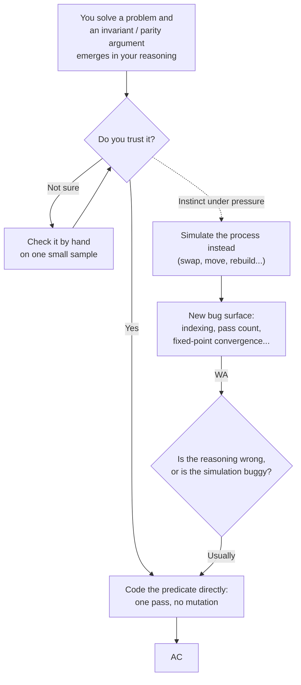

# Trust the Predicate: Stop Simulating What You've Already Proven

**Category:** Contest Strategy — Thinking Methodology  

**Use case:** Any problem where you've derived a closed-form, declarative condition for the answer (an invariant, a parity argument, a residue check, a reachability formula) but still feel the pull to verify it by simulating the underlying process.

---

## 1. The Trap

A lot of contest problems have two solutions living inside them at once:

1. **A predicate** — a condition you can check directly, in one pass, with no state and no mutation. "The answer is YES iff every element satisfies `X`."
2. **A simulation** — actually carrying out the process the problem describes (swapping, moving, building) and checking the result afterward.

When you first derive the predicate, it often doesn't feel finished. It feels like a claim, not a solution — so the instinct is to "double-check" it by writing the simulation too, or to just code the simulation directly because it feels safer than trusting an argument you made in your head thirty seconds ago.

This is usually a mistake, for a very specific reason: **the predicate and the simulation are not equally likely to be correct once implemented.** The predicate is typically one loop with one condition. The simulation has to get *everything* right — indexing conventions, which array holds values versus positions, whether one pass is enough or you need to iterate to a fixed point, whether an early exit is actually correct or just looks correct. Every one of those is a separate place to introduce a bug that has nothing to do with whether your original reasoning was right.

In other words: reverting to simulation doesn't make you safer. It just trades one risk (an unverified proof) for a different, usually larger, set of risks (implementation bugs in a more complex program) — and it's easy to walk away from a stack of wrong answers still believing the *reasoning* was the problem, when actually the reasoning was fine and the simulation was where things broke.



---

## 2. Why This Happens

A few things make this trap easy to fall into specifically under contest pressure:

- **A predicate feels too short to be a real solution.** If the whole check is `if (i - target(i)) % g != 0: NO`, it can feel like you must be missing something, so you look for more to write.
- **Simulation feels concrete.** Watching state change step by step feels like verification, even though it isn't — it only verifies that specific run, not the general claim.
- **A wrong answer is ambiguous about its own cause.** When simulation code fails, it's tempting to patch the simulation (add a condition, restrict a direction, loop again) rather than step back and ask whether the *reasoning* was already correct and the bug is purely mechanical.

---

## 3. The Discipline

- **If you've proven the predicate, code the predicate — not the simulation "just to be safe."** Trusting a correct proof is not a risk; it's the entire point of having proven it.
- **If you don't fully trust the predicate, the fix is to re-verify the proof, not to fall back on simulation.** Take one small sample case and check the predicate by hand, term by term. This is faster than debugging a simulation and it directly tests the thing you're actually unsure about.
- **If a simulation is failing, ask first whether a predicate exists that would make the simulation unnecessary.** Repeated wrong answers on a simulation are a good moment to step back one level, rather than adding another special case to the process you're mimicking.
- **Treat every added condition in a simulation with suspicion.** A clean predicate has no room for stray conditions. If you find yourself adding an `if` to a simulation that isn't obviously implied by your original reasoning, that's a signal the simulation has drifted from the proof, not that the problem needed the extra case.
- **A predicate that only checks, and never mutates, has fewer places to be wrong.** All else equal, prefer the version of your solution that reads input once and answers, over the version that reads input, changes it, and re-inspects it.

---

## 4. Mental Checklist

- [ ] If I'm about to simulate a process, have I asked what property is *invariant* across every operation — and whether comparing that property directly replaces the simulation entirely?
- [ ] Have I derived a condition that can be checked in one pass, with no state changes?
- [ ] If yes — am I coding that condition directly, or am I still writing a simulation "to be safe"?
- [ ] If I don't trust the condition, have I checked it by hand on a sample, rather than reaching for simulation?
- [ ] If a simulation is failing, have I asked whether a predicate would remove the need for it entirely?
- [ ] Does every condition inside my code trace back to something in my original reasoning, or did one get added just because the previous version failed?

---

## 5. Case Study: Marenol (Easy Version)

**Problem:** [Codeforces 2254C1 — Marenol (easy version)](https://codeforces.com/contest/2254/problem/C1)

Given two binary strings `a` and `b` of equal length, determine whether `a` can be turned into `b` using repeated swaps of the substrings `001↔100` and `110↔011`.

**Step 1 — Collapse the two operations into one.** Write out what each operation does to three consecutive characters: in every one of the four listed patterns (`001→100`, `100→001`, `110→011`, `011→110`), the middle character never changes, and the two outer characters swap. Since the string is binary, "the outer two differ" and "the pattern matches one of the four listed forms" are the same condition. So all four operations reduce to a single rule: **swap `a[i]` and `a[i+2]` whenever they're different.**

**Step 2 — The simulation instinct.** With that rule in hand, it's tempting to just carry it out: scan through the string, and wherever `a[i]` disagrees with `a[i+2]`, swap them to move `a` closer to `b`, then check whether the result equals `b`. An early attempt at exactly this — a single forward-then-backward sweep — got Wrong Answer, because one sweep in each direction isn't obviously enough to guarantee the string settles into every reachable arrangement. Looping the sweep to a fixed point (keep sweeping until nothing changes) fixed the immediate bug and reached Accepted — but it's still a simulation: it mutates state, and its correctness now depends on *how many times* it needs to loop, which was never actually proven, just tested until it stopped failing.

**Step 3 — The predicate that was there all along.** Position `i` and `i+2` always share the same parity (both even-indexed, or both odd-indexed), so the swap rule never moves a character across the even/odd divide — it only ever rearranges *within* one parity class. And "swap two adjacent-in-that-class elements whenever they differ" is enough to reach *any* ordering of that class (this is exactly bubble sort's swap rule, restricted to a binary alphabet). So the two parity classes of `a` can each be freely rearranged into any order, completely independently of each other, and nothing else is reachable.

That collapses the entire question to a single check: **does the count of `1`s (or `0`s) among `a`'s even positions match `b`'s, and likewise for the odd positions?** No swapping needs to happen at all — just two counts per string, compared directly:

```cpp
auto countZeros = [&n](string &s, int start) {
    int cnt{};
    for (int i{start}; i < n; i += 2)
        cnt += s[i] != '1';
    return cnt;
};

countZeros(a,0) != countZeros(b,0) || countZeros(a,1) != countZeros(b,1)
// true → NO, false → YES
```

This reads each string once, mutates nothing, and has no loop-count or convergence question to get wrong. See the final version: [submission 385821637](https://codeforces.com/contest/2254/submission/385821637).

**What actually changed between the WA and the AC-by-simulation.** Nothing about the underlying reasoning — the parity argument was true the entire time, independent of whether the code simulated it or not. What changed was patching the *mechanics* of the sweep (adding the fixed-point loop) until it happened to stop failing on the given tests. That's a fix to the simulation, not a proof of the simulation, and it's exactly the kind of "add a condition until it stops failing" pattern flagged in Section 3.

**Takeaway.** The first WA wasn't evidence that the reasoning about "swap = permute within parity class" was wrong — the reasoning was right from the start. The WA was evidence that turning correct reasoning into a *simulation* opens up bugs the reasoning itself never had. Going straight from "same parity ⇒ freely permutable ⇒ compare counts" to code — skipping the simulation attempts entirely — would have reached the same answer with less code and no convergence question to worry about.

---

*This principle applies across problem types — parity arguments, invariants, reachability formulas, and constructive existence checks all tend to produce a predicate that's cleaner and more trustworthy than the process it's describing.*  

*See the companion technique article, [GCD-Reachability Under Fixed-Step Moves](https://github.com/Mojahidul21/My-Competitive-Programming-Journey/blob/main/General%20Tricks%20%26%20Techniques/GCD/GCD-Reachability%20Under%20Fixed-Step%20Moves.md), for one concrete family of problems where this distinction matters.*
