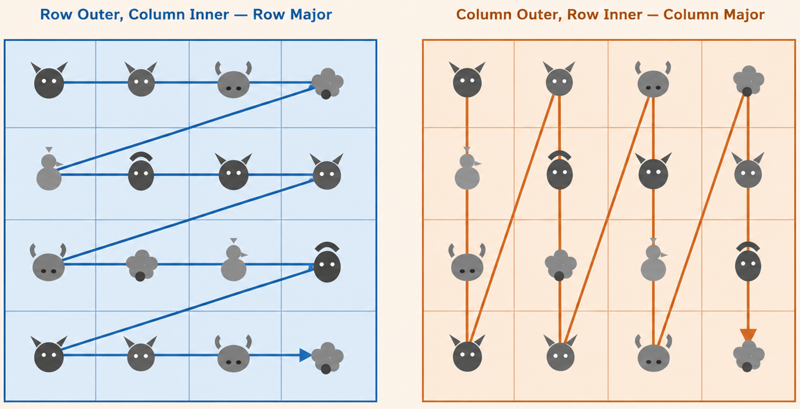
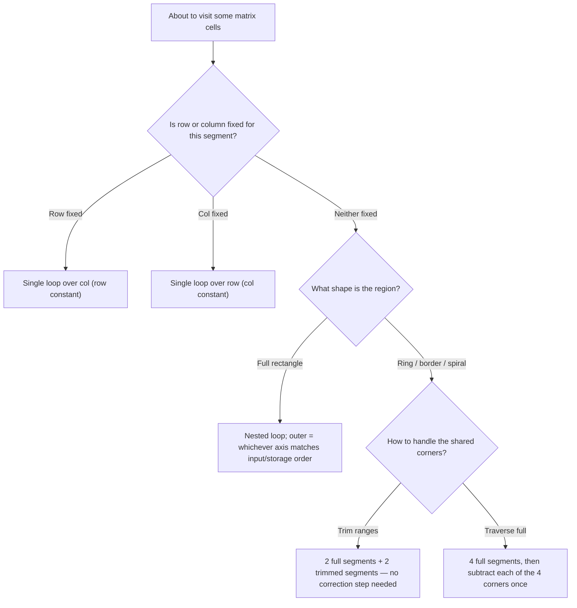

# Comfortable with Your Matrices — Fix an Axis, Drop a Loop


*Never traverse blindly!*

## The Core Idea

Before writing any loop over a matrix, ask one question first: **is a row or column already fixed for the segment I'm about to visit?**

- If **neither** is fixed → you're visiting a 2D region → you need two loops (one nested inside the other).
- If **one** is fixed → you're visiting a 1D line inside a 2D grid → you only need **one** loop, over the axis that varies.

This sounds obvious once stated, but it's easy to default to "matrix = nested loop" out of habit, even when a whole segment of the problem only ever moves along a single row or column. Recognizing the fixed axis early removes a loop, removes a bug surface, and usually removes the need for boundary-check conditionals inside the loop body.

## Two Ways to Map a Matrix to Nested Loops

When both axes genuinely vary, you still choose which one is outer:

| Outer loop | Inner loop | Natural when... |
|---|---|---|
| Row | Column | Input is read row by row; you process a row fully before moving to the next (row-major, matches C++ storage order — cache-friendly) |
| Column | Row | The problem groups data by column (e.g., column sums, column-wise queries), or the recursion/DP state is column-indexed |

  
*Loop-Row/Col Mapping*

Neither is "more correct" — pick whichever axis the problem's structure already treats as the outer grouping. What matters more is the next section.

## When a Row or Column is Already Fixed, One Loop Is Enough

If you know `row` is constant for the segment you're visiting, don't write:

```cpp
for (int r = row; r <= row; ++r)   // ❌ pointless outer loop, r never changes
    for (int c = lo; c < hi; ++c)
        // ...
```

Just drop the outer loop entirely:

```cpp
for (int c = lo; c < hi; ++c)      // ✅ row is fixed, only col varies
    // use row, c
```

Same logic mirrored for a fixed column: loop only over `row`, keep `col` constant.

## Worked Example: Peeling a Matrix into Rings

This is exactly the shape of [1873C - Target Practice](https://codeforces.com/problemset/problem/1873/C). A 10×10 grid decomposes into 5 concentric rings. Each ring is **not** one 2D region — it's four 1D segments, each with one axis fixed. Here's the [AC submission](https://codeforces.com/contest/1873/submission/386979138):

```cpp
#include<bits/stdc++.h>
using namespace std;
main(){
    int t;
    cin>>t;

    while(t--){
        vector<string>target(10);
        for(int i{};i<10;++i)
            cin>>target[i];

        int ans{};

        for(int ring{},row,col;ring<5;++ring){
            for(row=ring,col=ring;col<10-ring;++col)
                ans+=(target[row][col]!='.')*(ring+1);

            for(row=9-ring,col=ring;col<10-ring;++col)
                ans+=(target[row][col]!='.')*(ring+1);

            for(row=ring+1,col=ring;row<9-ring;++row)
                ans+=(target[row][col]!='.')*(ring+1);

            for(row=ring+1,col=9-ring;row<9-ring;++row)
                ans+=(target[row][col]!='.')*(ring+1);
        }
        
        cout<<ans<<endl;
    }
}
```

Four fixed-axis segments per ring, zero nested loops. Two details worth naming explicitly:

- **Top and bottom rows** run the *full* width (`col` from `ring` to `9-ring`) — they own the four corners of the ring.
- **Left and right columns** start at `row = ring + 1`, not `row = ring` — this deliberately skips the corner cell already counted by the top/bottom row pass, avoiding double-counting. Fixing the axis first makes this off-by-one decision visible instead of buried in a boundary condition inside a nested loop.
- The loop variable is named `ring`, not reused from a generic `i` — once row/col are spoken for as full words, `ring` is free to mean exactly what it says, so nothing needs to be inferred from context.

## Alternative: Traverse Full, Then Subtract the Doubled Corners

Trimming the left/right column ranges (`ring + 1` instead of `ring`) is correct but asks you to get an off-by-one right on two of the four segments. If that trim ever feels error-prone mid-contest, there's a more comfortable trade: let **all four** segments run full length, accept that the 4 corner cells get counted twice, then subtract the extra copy explicitly.

```cpp
for (int ring {}, row, col; ring < 5; ++ring) {
    for (row = ring, col = ring; col < 10 - ring; ++col)      // full top
        ans += (target[row][col] != '.') * (ring + 1);
    for (row = 9 - ring, col = ring; col < 10 - ring; ++col)  // full bottom
        ans += (target[row][col] != '.') * (ring + 1);
    for (col = ring, row = ring; row < 10 - ring; ++row)      // full left (corners again)
        ans += (target[row][col] != '.') * (ring + 1);
    for (col = 9 - ring, row = ring; row < 10 - ring; ++row)  // full right (corners again)
        ans += (target[row][col] != '.') * (ring + 1);

    // each of the 4 corners was counted twice above — remove one extra copy of each
    ans -= (target[ring][ring]     != '.') * (ring + 1);
    ans -= (target[ring][9-ring]   != '.') * (ring + 1);
    ans -= (target[9-ring][ring]   != '.') * (ring + 1);
    ans -= (target[9-ring][9-ring] != '.') * (ring + 1);
}
```

Neither version is strictly better — it's a trade between **where** the off-by-one care goes: baked into two loop bounds (trim version), or moved into an explicit, readable correction step at the end (subtract version). When a ring/border shape is more irregular and trimming isn't obviously symmetric, the "traverse full, subtract the overlap" pattern generalizes more comfortably than trying to work out trimmed bounds for every segment.

## Decision Tree



## Naming Convention

Keep the same variable vocabulary every time so row/column intent is legible at a glance:

- **Row axis:** `r`, `row`, `i`, `n`
- **Column axis:** `c`, `col`, `j`, `m`
- **A ring/layer counter, when present:** name it what it is — `ring` — rather than folding it into a generic `i`. That's what freed up `row`/`col` to stay unambiguous in the Target Practice code above.

> 💡 **Tip:** If you catch yourself writing `for (int r = row; r <= row; ++r)`, that's the signal — the axis is fixed, kill the outer loop.

## Common Mistakes

| ❌ Wrong | ✅ Right |
|---|---|
| `for(r=row;r<=row;++r) for(c=lo;c<hi;++c)` | `for(c=lo;c<hi;++c)` — drop the pointless outer loop |
| Ring pass counts all 4 corners twice with no correction | Either trim one axis's range on the segments that run second, **or** run everything full and subtract each corner once — pick one, don't half-do both |
| A generic `i` doing double duty as both ring index and, elsewhere, a row index | Reserve `i`/`row` for the axis; name a ring/layer counter `ring` (or `layer`, `k`) so it reads unambiguously |
| Defaulting to nested loop "because it's a matrix" | Ask first: is an axis already fixed for this segment? If yes, one loop |

## Practice Problem

| # | Problem | Short Description | Guidance |
|---|---|---|---|
| 1 | [1873C - Target Practice](https://codeforces.com/problemset/problem/1873/C) | Score a 10×10 target by point value per concentric ring. | _Hint:_ Peel the grid into 5 rings; each ring is 4 fixed-axis segments — either trim two of them or run all four full and subtract the corners (sections above). <br><br> _Solution:_ [⏎](https://codeforces.com/contest/1873/submission/386979138) |
