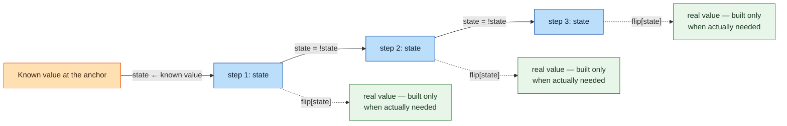
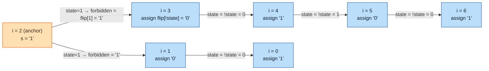

# Track the Reference Bit, Not the Target Value

## Introduction

Many problems need a sequence that alternates between exactly two states — `0`/`1`, two colors, two players' turns, two labels. At every position you need to know which of the two states belongs there. This article is about answering that cheaply: track a single toggling bit as the source of truth, and only turn it into the real value at the moment you actually need it.

## Possible Approaches

**Recomputing from index parity.** `(i % 2 == 0) ? a : b` only works when the alternation starts at index `0`. The moment the known value sits somewhere in the middle and you walk outward in both directions from it, you need `(i - anchor) % 2` instead — and in C++ that can go negative and silently break.

**Tracking the literal value.** Keep a variable holding the actual state and flip it each step:
```cpp
cur = (cur == A) ? B : A;
```
Correct, but every step now does a full comparison *and* a full reassignment of `cur`, even though the outcome was already known before the step ran. It also gets awkward at a position that hasn't been decided yet — there's nothing real there to compare `cur` against.

**A toggling reference bit + lookup.**
```cpp
string flip{"01"};              // flip[0] = '0', flip[1] = '1'
bool state = /* known at the anchor */;

for (/* step */; /* condition */; /* advance */, state = !state)
    /* use flip[state] wherever the current value is needed */;
```
`state` is a single bit that toggles with `!` — no branch, no comparison. `flip[state]` (or any 2-slot lookup) converts it to the real value only at the point of use. The anchor's own value seeds `state` once; every toggle after that is free and correct no matter where the anchor sits.

*Note on "efficient":* this doesn't lower the O(1)-per-step complexity — it removes a branch and a piece of state to reason about, which matters for correctness and clarity more than raw speed.



**When the two values are expensive.** The lookup table doesn't have to hold single characters — it can hold anything, including values that are costly to build or copy:
```cpp
vector<string> team{"Northside Falcons", "Southside Ravens"};
bool turn = false;

for (int round = 1; round <= n; ++round, turn = !turn) {
    // all per-round bookkeeping only touches `turn` — one byte
    if (round == n) cout << team[turn] << " wins the final round\n";
}
```
If the two states were long strings instead of `'0'`/`'1'`, the "track the literal value" approach would compare and reassign a long string every single step. Toggling a `bool` costs the same one instruction whether the two things it stands for are a single bit or a paragraph of text — the expensive value only gets built once, right where it's actually used.

## Work Out Example: Bulb Row

**Problem.** A row of `n` bulbs, each `ON` (`1`), `OFF` (`0`), or undecided (`?`), must have every two adjacent bulbs differ. One bulb is already fixed. Determine every bulb's state.

Take `n = 7`, `s = "??1????"` (0-indexed), bulb `2` fixed `ON`. Call position `2` the **anchor** — the one position whose value is already known. `state = (s[anchor]=='1')` is `true`, since the bulb next to the anchor is forbidden from repeating it.



| index | 0 | 1 | 2 | 3 | 4 | 5 | 6 |
|---|---|---|---|---|---|---|---|
| `s` before | `?` | `?` | `1` | `?` | `?` | `?` | `?` |
| `state` | 0 | 1 | *(anchor)* | 1 | 0 | 1 | 0 |
| assigned | `1` | `0` | `1` | `0` | `1` | `0` | `1` |

Result: `1010101`.

```cpp
string flip{"01"};
bool valid = true;
bool state = (s[anchor] == '1');

for (int i = anchor + 1; i < n; ++i, state = !state) {
    if (s[i] == flip[state]) { valid = false; break; }  // conflicts with a fixed bulb
    if (s[i] == '?') s[i] = flip[!state];               // the only allowed value
}

state = (s[anchor] == '1');
for (int i = anchor - 1; i >= 0; --i, state = !state) {
    if (s[i] == flip[state]) { valid = false; break; }
    if (s[i] == '?') s[i] = flip[!state];
}
```

## Examples to Practice

| # | Problem | Short Description | Hint |
|---|---|---|---|
| 1 | [CF 2256B — Domino Tiles](https://codeforces.com/contest/2256/problem/B) | Count completions of a partially-filled binary string so every two consecutive domino weights differ. | The constraint collapses to `s_i ≠ s_{i+2}`; walk outward from a fixed digit with a toggling reference bit. |
| 2 | [CF 1807C — Find and Replace](https://codeforces.com/problemset/problem/1807/C) | Decide if every occurrence of each letter can map to `0`/`1` so the result is alternating. | A letter's occurrences must all sit on positions of the same parity; check them against a toggling target instead of recomputing per character. |
| 3 | [CF 1437B — Reverse Binary Strings](https://codeforces.com/problemset/problem/1437/B) | Given an equal-count binary string, find the minimum substring reversals to make it alternating. | Compare against both toggling target patterns (`0101...` and `1010...`); count mismatches rather than tracking values. |
| 4 | [CF 2225B — Alternating String](https://codeforces.com/problemset/problem/2225/B) | Decide if one substring reversal (with optional inversion) can make a two-letter string alternating. | Find where the string breaks from each toggling target pattern; the fixable region is bounded by those breakpoints. |

## Related

[Parity Chain](../../Miscellaneous/CP%20Vocabulary/Programming%20%26%20Problem-Solving%20Vocabulary.md#parity-chain) covers *which* positions constrain each other; this article covers *how* to track the alternating value once you know.
