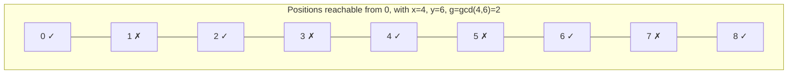

# GCD-Reachability Under Fixed-Step Moves

**Category:** Tricks & Techniques — Number Theory  
**Use case:** You're allowed an operation defined by one or more *fixed distances* (swap two indices at distance `x`, jump `+x`/`-x` on a line, move a token by `x` or `y` steps, ...), applicable any number of times in any order, and you need to decide which positions or states are mutually reachable.


_**Note**: At the first reading, you many not be able to clear the total concept.
At the second reading, connecting with the Practice Problem Set (Section 7), hope the total concept will be cleared._   

---
## 1. How to Recognize This Pattern

Suspect gcd-reachability when a problem has this shape:

- The operation is defined by one or more **fixed step sizes** (e.g. "swap indices `i, j` if `|i - j| = x` or `|i - j| = y`"), and can be applied **any number of times**.
- The question is **reachability**: can you sort this, can you reach that state, is this pair connected — not "what's the minimum number of operations" or "output the sequence of moves."
- The step sizes are given as **parameters** rather than fixed constants. Parameters that only enter the answer through an algebraic combination are a strong hint that the combination is a `gcd`.
- The constraints contain a bound that looks like it exists purely for input validity (e.g. `x + y ≤ n`) but is actually load-bearing for the reasoning.

---

## 2. The Core Identity

If a single move changes your position by `+x` or `-x`, then any sequence of moves nets a displacement of `a·x` for some integer `a` — trivially, all reachable displacements are multiples of `x`.

If you have **two** step sizes `x` and `y`, and moves in both directions are allowed (`+x`, `-x`, `+y`, `-y`), then a sequence of moves nets a displacement of the form

```
a·x + b·y      (a, b any integers, positive, negative, or zero)
```

**Bézout's identity** says exactly this set — `{a·x + b·y : a, b ∈ ℤ}` — equals the set of all integer multiples of `gcd(x, y)`. This generalizes to any number of step sizes: the reachable set of net displacements is exactly the multiples of the `gcd` of all of them.

So: **two positions are reachable from each other iff their difference is a multiple of `g = gcd(step sizes)`.** This single fact is what the rest of the technique is built on. Once you see it, "can I get from position `i` to position `j` using these moves" stops being a search problem and becomes a one-line residue check: `(i - j) % g == 0`.


---

## 3. Two Different Questions Hiding in One Problem

It's easy to stop at the identity above and assume you're done. There are actually two separate questions, and only the first is answered by Bézout's identity:

1. **Algebraic reachability** — ignoring the array's boundaries entirely, what displacements can be built by combining the moves? *(Answered: multiples of `g`.)*
2. **Physical feasibility** — given the actual bounds of the array/board, can a displacement of `g` (or any multiple of it) really be executed as a legal sequence of moves that never steps outside the valid range along the way?

These coincide almost everywhere in the middle of a large array, but can fail near the edges. This is exactly what a constraint like `x + y ≤ n` is usually there to guarantee: enough room exists at *every* position to perform one outward move of size `x` (or `y`) and one inward move of the other size without leaving `[1, n]`, which is enough to realize a net step of `g` in either direction from anywhere.

**Do not skip checking this.** The clean residue formula from Step 2 is only valid because the problem's constraints license it. If the bound were tighter (say `x + y ≤ n / 2`), positions near the edges could be algebraically reachable but not physically reachable, and the simple `% g` check would overcount.

---

## 4. Turning It Into a Single Predicate

Once reachability is confirmed to reduce to "difference is a multiple of `g`," most yes/no questions built on top of it collapse into one pass with no simulation required:

```
compute g = gcd of all step sizes
for each position i:
    if (i - target_position(i)) % g != 0:
        answer is NO
answer is YES
```

No swaps, no state mutation, no need to track intermediate configurations — the whole question is answered by checking a fixed condition once per element.

---

## 5. Step-by-Step Procedure

| Step | What to do |
|---|---|
| 1. Identify the move set | List every fixed step size the operation allows, in both directions. |
| 2. Compute `g` | `g = gcd` of all step sizes. |
| 3. State the algebraic reachable set | Two positions are connected iff their difference is a multiple of `g` (Bézout). |
| 4. Check physical feasibility | Look for a constraint that guarantees enough room near the boundaries to realize a net step of `g` from any position. If no such constraint exists, feasibility needs separate justification — don't assume it. |
| 5. Rewrite the problem's condition as a residue check | Replace "can this be rearranged/reached" with "does every required displacement satisfy `% g == 0`." |
| 6. Verify by hand on a sample | Compute `g` and check the residue condition manually against one sample case before trusting the formula, especially to catch `0`-indexed vs. `1`-indexed mistakes. |

---

## 6. Mental Checklist

- [ ] Is the operation a **fixed-distance** move, usable any number of times, in any order?
- [ ] Is the question **reachability** (yes/no), not optimization or reconstruction?
- [ ] Have I computed `g = gcd` of every step size involved?
- [ ] Have I found the constraint that guarantees algebraic reachability equals physical feasibility — or confirmed I need to prove it myself?
- [ ] Can I state the final answer as a **single per-element residue check**, with no simulation needed?

---

## 7. Practice Problem Set

| # | Problem | Short Description | Hint | Solution |
|---|---|---|---|---|
| 1 | [B. Permutation Swap](https://codeforces.com/problemset/problem/1828/B) | Find the *maximum* `k` such that a permutation is sortable using swaps at index-distance exactly `k`. | Same reachability rule, run in reverse: instead of testing one given `k`, you're searching for the largest valid one. Which single quantity, computed once from the array, bounds every valid `k`? | [Solution](https://codeforces.com/contest/1828/submission/294714137) |
| 2 | [B. Sort the Array](https://codeforces.com/problemset/problem/1823/B) | Sort a permutation using swaps at index-distance exactly `k`, plus one free preliminary swap of any two elements before the distance-`k` swaps begin. | The single-step-size special case of this pattern. Derive the pure residue condition first, then reason about what one free swap can repair. | [Solution](https://codeforces.com/contest/1823/submission/298048621) |
| 3 | [C. Stepan and Permutation](https://codeforces.com/contest/2244/problem/C) | Sort a permutation using swaps at index-distance exactly `x` or exactly `y`, any number of times. | Compute `g = gcd(x, y)`, then ask what `x + y ≤ n` is actually guaranteeing at the boundary. | [Solution](https://codeforces.com/contest/2244/submission/382732681) |
