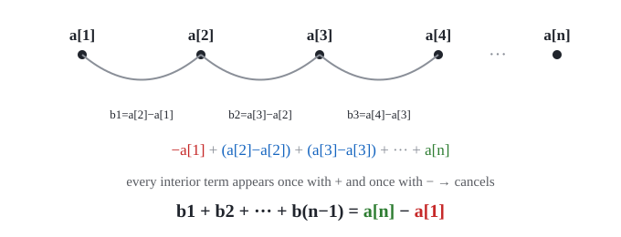
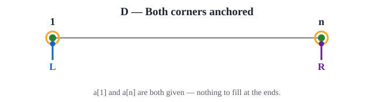
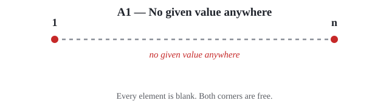
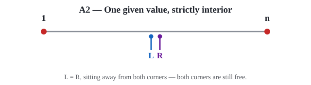
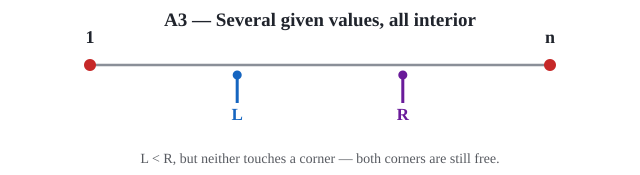
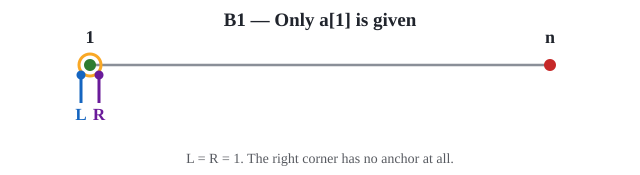
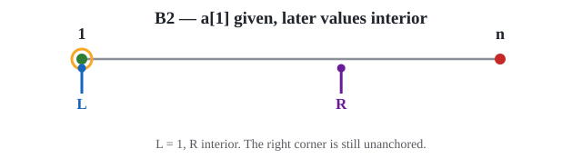
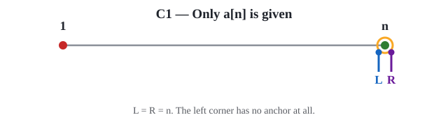
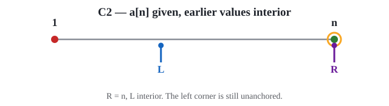
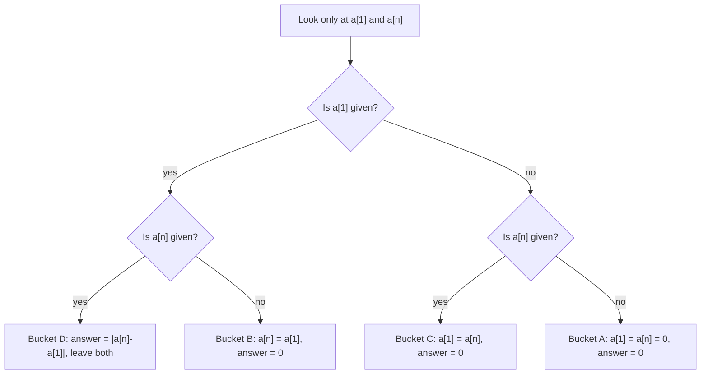

# The Corner-Anchor Pattern
🔭 *Why a telescoping sum only ever cares about two positions — no matter how big the array is.*

---

> 🖋️ Dedicated to [Mir Md. Kawsur](https://www.linkedin.com/in/mir-md-kawsur-a036b068/), sir — who always finds time to check my work and give feedback, even during his busiest days, and even when what I've made is just a childish game.


> 📖 Before reading on, it helps to read the problem statement first — **not the solution** — for [2171B: Yuu Koito and Minimum Absolute Sum](https://codeforces.com/contest/2171/problem/B). The rest of this article assumes you've seen the setup.

## Definition

**Corner Anchoring** is the observation that whenever a problem's objective *telescopes* — i.e. collapses algebraically to `f(a[n]) − f(a[1])` — the only positions that can ever affect the answer are the two array **corners**, `a[1]` and `a[n]`. Every interior element is a free variable: it can be set to whatever is convenient (usually the smallest legal value, for lexicographic tie-breaking) without touching the answer at all.

The pattern turns a filling/reconstruction problem into a tiny case analysis on exactly one question per corner:

> **Is this corner *anchored* (a real, given value) or *free* (blank / your choice)?**

Two corners, two states each, gives four buckets — and once you see it that way, the answer and the fill strategy are almost mechanical.

---

## Why it arises

Take an array `a[1..n]` and its difference array `b[i] = a[i+1] − a[i]`. Sum the differences out:

```
b1 + b2 + ... + b(n-1)
  = (a[2]-a[1]) + (a[3]-a[2]) + (a[4]-a[3]) + ... + (a[n]-a[n-1])
```

Every interior term appears exactly twice with opposite sign — once as a "+" when it's the *later* index of one difference, once as a "−" when it's the *earlier* index of the next. They all cancel:



```
b1 + b2 + ... + b(n-1) = a[n] − a[1]
```

That's the whole mechanism. `a[2], a[3], ..., a[n-1]` — given or blank, doesn't matter — **never appear in the final answer**. The only thing left to decide is what `a[1]` and `a[n]` should be, and that decision only has four shapes.

> 💡 This is a special case of a much more common CP move: whenever you see a sum of consecutive differences, ratios, or XORs, check whether it telescopes before you write a single loop. It frequently does, and it usually means most of your array is irrelevant to the answer.

---

## The four corner states

| Left corner (`a[1]`) | Right corner (`a[n]`) | Best achievable \|answer\| | Fill rule |
|---|---|---|---|
| given | given | `\|a[n] − a[1]\|` (fixed, can't improve) | leave both as-is |
| given | blank | `0` | set `a[n] = a[1]` |
| blank | given | `0` | set `a[1] = a[n]` |
| blank | blank | `0` | set both to `0` (smallest legal value) |

Every interior blank, regardless of bucket, is set to `0` — it's free, and `0` is the lexicographically smallest nonnegative integer.

> ⚠️ The bucket depends **only** on whether `a[1]` and `a[n]` themselves are given — not on where the *nearest* given value happens to sit in the interior. That distinction feels like it should matter (it's tempting to reach for "closest known neighbor" logic), but the telescoping proof above shows the interior is entirely inert. Any solution that branches on interior structure is doing extra, unnecessary work.

---

## The eight cases, drawn out

Here's the catch: it's very easy to *arrive* at the correct fill rule by case-bashing on `L` = index of the first given value and `R` = index of the last given value, without ever noticing that only `L == 1` and `R == n` matter. That's exactly what happened during development of this pattern — the first working solution enumerated **eight** sub-cases by hand before the telescoping shortcut was obvious in hindsight. They're worth drawing out once, because collapsing them yourself is the whole lesson.

**Bucket D — both corners anchored** (the baseline: nothing to fill)



**Bucket A — neither corner anchored** (three ways `L`/`R` can sit, all with the same outcome)





**Bucket B — left corner anchored, right corner free**




**Bucket C — right corner anchored, left corner free**




Notice: A1, A2, A3 all produce the *same* fill rule. So do B1/B2, and so do C1/C2. The sub-cases only differ in **where the interior flags sit** — which the proof already told us is irrelevant. Eight visual cases, four real decisions.



---

## Case-bashed vs. corner-anchored: the same problem, two solutions

Worked example: **[2171B — Yuu Koito and Minimum Absolute Sum](https://codeforces.com/contest/2171/problem/B)**. Fill blanks (`-1`) in `a[1..n]` to minimize `|b1 + ... + b(n-1)|` where `b[i] = a[i+1]-a[i]`, tie-broken lexicographically smallest.

### 🐢 Case-bashing on the nearest given value

This is the shape a first working solution tends to take: track `L`/`R` = first/last non-blank index anywhere in the array, then branch on how they sit relative to `0` and `n-1`.

```cpp
int l = -1, r = n;
for (int i = 0; i < n; ++i) if (a[i] > -1) { l = i; break; }
for (int i = n - 1; i > -1; --i) if (a[i] > -1) { r = i; break; }

if ((l == -1 && r == n) ||
    (0 < l && l == r && r < n - 1) ||
    (0 < l && l < r && r < n - 1))
    a[0] = a[n - 1] = 0;
else if ((l == 0 && r == 0) ||
         (l == 0 && l < r && r < n - 1))
    a[n - 1] = a[0];
else if ((l == n - 1 && r == l) ||
         (0 < l && l < r && r == n - 1))
    a[0] = a[n - 1];

cout << abs(a[0] - a[n - 1]) << '\n';
for (auto &x : a) cout << (x < 0 ? 0 : x) << ' ';
```

It's correct — it passes every test — but it does real work (a full left-to-right and right-to-left scan) to answer a question that only needed two array lookups.

### ✅ Corner-anchored

```cpp
int n; cin >> n;
vector<int> a(n);
for (auto &x : a) cin >> x;

int L = a[0], R = a[n - 1];
if (L == -1 && R == -1)      L = R = 0;
else if (L == -1)            L = R;
else if (R == -1)            R = L;

cout << abs(R - L) << '\n';
a[0] = L; a[n - 1] = R;
for (int i = 1; i < n - 1; ++i) if (a[i] == -1) a[i] = 0;
for (auto &x : a) cout << x << ' ';
```

No scanning for `L`/`R` at all — `a[0]` and `a[n-1]` *are* the only inputs that matter. Same output, one linear pass instead of two, and the branching maps directly onto the four-bucket table instead of eight ad-hoc conditions.

---

## How to recognize this pattern

- The objective is a **sum of consecutive differences** (or anything that telescopes: consecutive ratios taken as logs, consecutive XORs on a linear chain, etc.).
- You're asked to **fill blanks** or **choose free values** under that objective, often with a secondary lexicographic tie-break.
- Your first instinct is to track "the nearest known value" — a sentinel-scanning approach. That instinct is usually a sign the interior doesn't actually matter and you can jump straight to the corners.

> 💡 Related idea in the vault: this is a cousin of [Sentinel](https://github.com/Mojahidul21/My-Competitive-Programming-Journey/blob/main/Miscellaneous/CP%20Vocabulary/Programming%20%26%20Problem-Solving%20Vocabulary.md#sentinel) usage (`-1` as a not-given marker) crossed with a telescoping-sum simplification — worth cross-referencing both when this pattern shows up again.

---

## Practice problems

| Problem | Tag/Rating | Note |
|---|---|---|
| [2171B — Yuu Koito and Minimum Absolute Sum](https://codeforces.com/contest/2171/problem/B) | math/900 | The motivating example above |

---

## Related

- `Related code:` — a `corner-anchor-fill` snippet in [Code Templates](../Code%20Templates/) would generalize the ✅ block above; not yet created, cross-link pending.
- [Programming & Problem-Solving Vocabulary.md](Programming%20%26%20Problem-Solving%20Vocabulary.md) — see **Sentinel**, **Off-by-one**.
