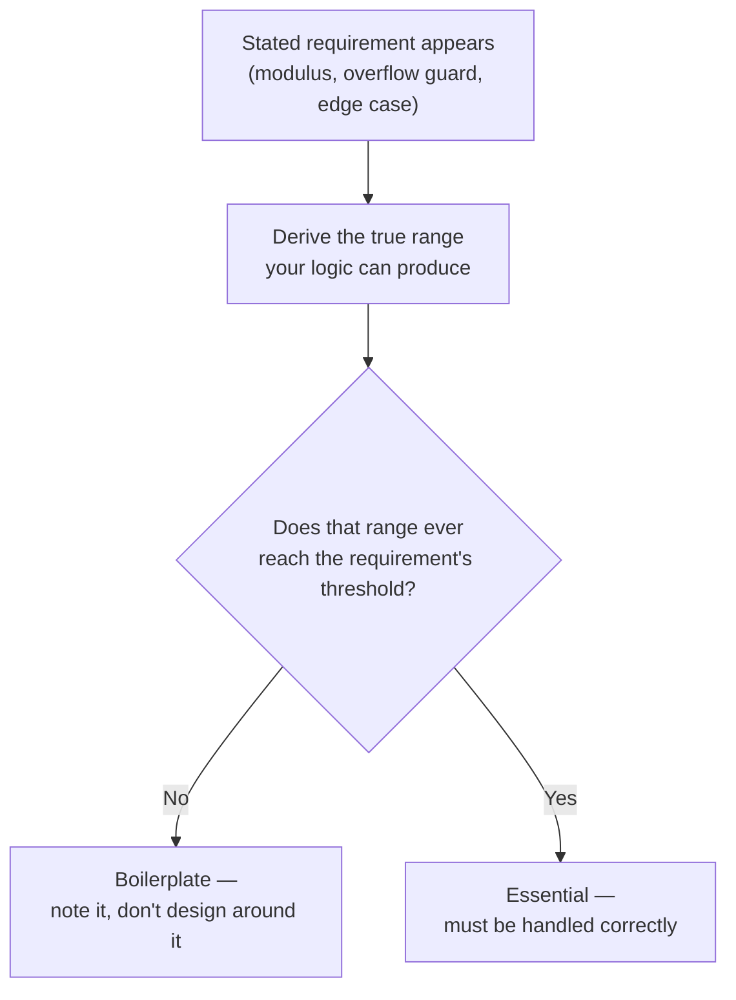
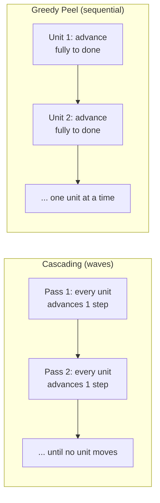
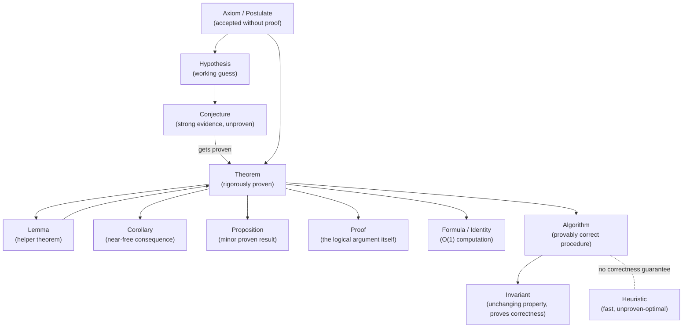
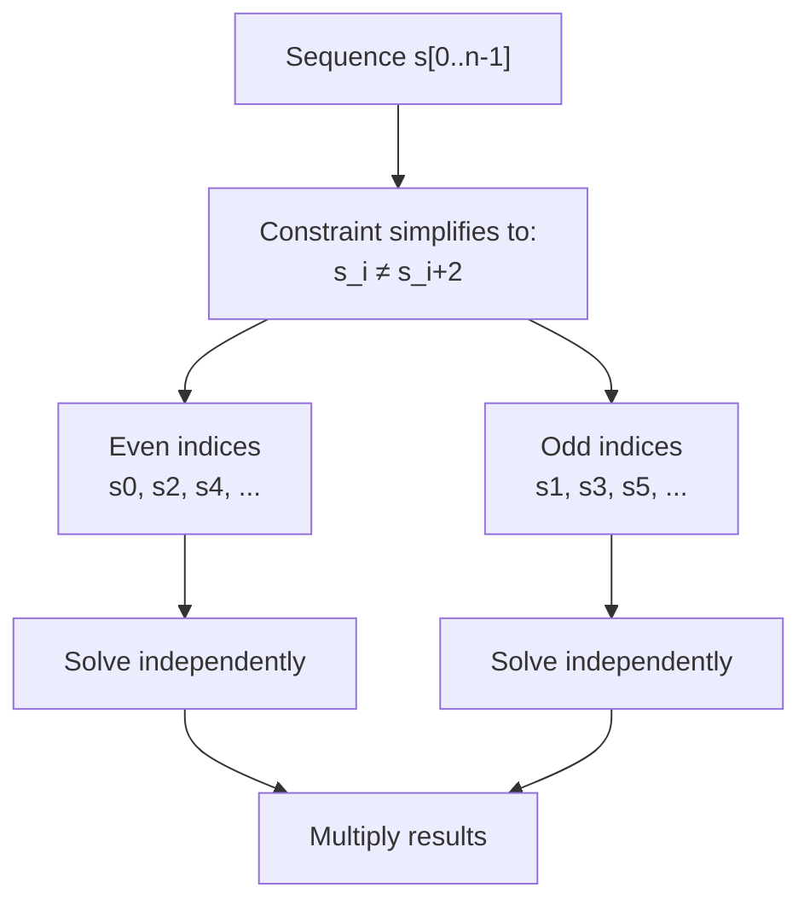
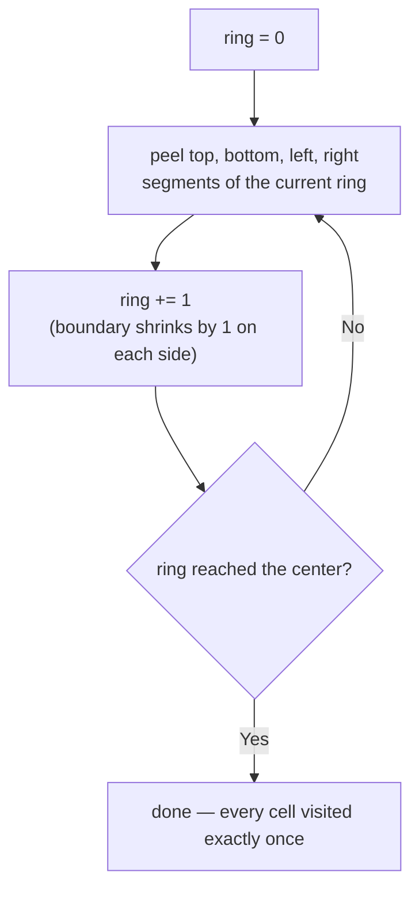
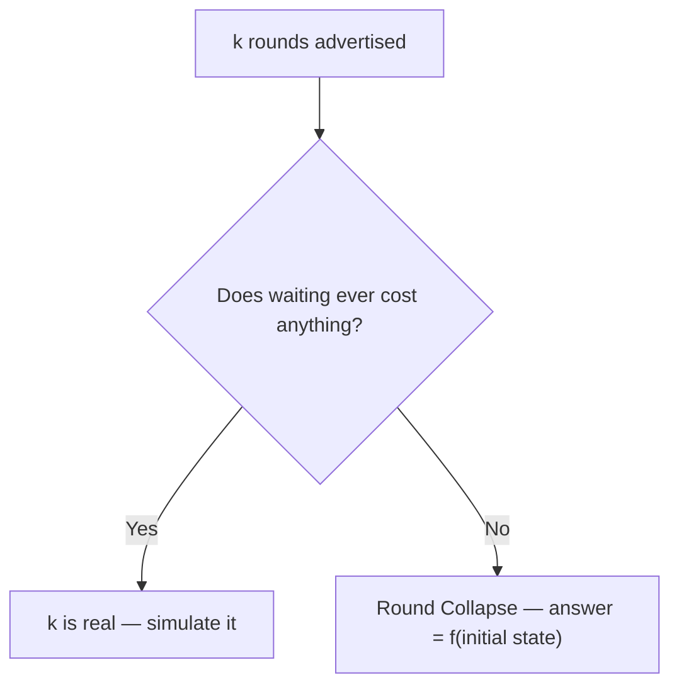

# Programming & Problem-Solving Vocabulary

A living reference of terms used in competitive programming, debugging, and algorithmic thinking. Each entry includes a definition, real-world analogy (where helpful), and C++ code illustration. New entries will be added as those are encountered further.

---

## Table of Contents
Lexical ordered.
- [Admissible](#admissible)
- [Ancestor](#ancestor)
- [Anchor](#anchor)
- [Boilerplate](#boilerplate)
- [Boundary Ghost Values](#boundary-ghost-values)
- [Canonical Sequence (Special Judge)](#canonical-sequence-special-judge)
- [Cascading (Wave Propagation)](#cascading-wave-propagation)
- [Chain Decomposition (Independent Component Grouping)](#chain-decomposition-independent-component-grouping)
- [Closed-Form Formula](#closed-form-formula)
- [Contiguous / Contiguous Block](#contiguous--contiguous-block)
- [Coprime (Relatively Prime)](#coprime-relatively-prime)
- [Deduplication (Dedup)](#deduplication-dedup)
- [Descendant](#descendant)
- [Directed Acyclic Graph (DAG)](#directed-acyclic-graph-dag)
- [Double Counting](#double-counting)
- [Edge Case](#edge-case)
- [Empirical](#empirical)
- [Foundational Terms & Algorithmic Cousins](#foundational-terms--algorithmic-cousins)
- [Fragile Code](#fragile-code)
- [Freeze Flag (Fixed-Point Iteration)](#freeze-flag-fixed-point-iteration)
- [Greedy Peel](#greedy-peel)
- [Guard / Guard Clause](#guard--guard-clause)
- [Invariant](#invariant)
- [Irreducible Fraction](#irreducible-fraction)
- [Lambda (Lambda Function)](#lambda-lambda-function)
- [Latent Bug](#latent-bug)
- [Markov Chain](#markov-chain)
- [Monotonic](#monotonic)
- [Off-by-one](#off-by-one)
- [Overhead](#overhead)
- [Parity Chain](#parity-chain)
- [Probably](#probably)
- [Provably](#provably)
- [Reduction](#reduction)
- [Ring Peeling](#ring-peeling)
- [Robust Code](#robust-code)
- [Round Collapse](#round-collapse)
- [Sentinel](#sentinel)
- [Sentinel Padding](#sentinel-padding)
- [Short-Circuit Evaluation](#short-circuit-evaluation)
- [TSP (Traveling Salesman Problem)](#tsp-traveling-salesman-problem)
- [Uncapped](#uncapped)
- [Undefined Behavior (UB)](#undefined-behavior-ub)
---

## Admissible

**Definition:**
A heuristic `h(n)` is *admissible* if it never overestimates the true cost from node `n` to the goal — `h(n) ≤ actual_cost(n, goal)` always holds.

**Why it arises:**
Admissibility is the correctness condition for A* search. If `h` is admissible, A* is guaranteed to find the optimal path. If `h` overestimates even once on the search space, A* can close off a node too early and settle on a suboptimal answer without ever detecting the mistake.

**Example from practice:**
```cpp
// Grid pathfinding: Manhattan distance is admissible when movement is
// restricted to 4 directions, because it never exceeds the true step count.
int heuristic(int x1, int y1, int x2, int y2) {
    return abs(x1 - x2) + abs(y1 - y2); // never overestimates
}
```
If diagonal movement were allowed instead, Manhattan distance would *overestimate* some paths and stop being admissible — Chebyshev or Euclidean distance would be needed there.

**Analogy:**
A GPS estimate that always says "at least this far to go," never "less than this far." An optimistic-but-never-wrong lower bound.

**Related:**
* [Monotonic](#monotonic) — a stronger property (consistency) some admissible heuristics also satisfy.

---

## Ancestor
**Definition:**
Any node you pass through when moving UP from a node to the Root. (`Parent → Grandparent → Root`).

**Rule:**
Move against the edge direction.

**Excludes:**
The node itself.

> Short Visual: A ladder. You are on the bottom rung. Ancestors are all the rungs above you.  
> Animation Flash: Golden line travels upward from `Target → Parent → Root`. All flash yellow.  
> Text: `Ancestors = Upward path`.

**Example:**
```
         [Root]  <-- Ancestor of everyone
         /    \
     [Parent]  [Uncle] <-- Uncle is NOT an ancestor of Child
      /   \
  [Child]  [Sibling] <-- Sibling is NOT an ancestor of Child
   /    \
[Leaf1] [Leaf2]  <-- Leaf1 & Leaf2 are Descendants of Child
```
**Related:** [Descendant](#descendant)

---

## Anchor

**Definition:**
A fixed reference point around which the rest of the logic is built. Choosing an anchor eliminates degrees of freedom and simplifies the problem.

**Example from practice:**
```cpp
// s[0] is the anchor: we fix the target pattern to agree with s[0]
// This eliminates the need to check both "ab..." and "ba..." patterns
string sss{s[0] != 'a' ? "ba" : "ab"};
```
Because `sss[0] == s[0]` always, index 0 is never a mismatch — the anchor holds the pattern in place.

**Other examples of anchoring in CP:**
- Fix the first element and determine the rest (greedy)
- Fix the root in tree DP
- Fix one endpoint of a range and binary search the other

---

## Boilerplate

**Definition:**
A requirement, constraint, or code pattern present for uniformity or convention across a class of problems, rather than because the specific instance in front of you actually needs it. Recognizing boilerplate means computing the true range of what your solution can produce and checking whether the stated requirement — a modulus, an overflow guard, a defensive branch — ever gets exercised within that range.

**Why it arises:**
Problem setters standardize output format and constraints across many problems in a set — `% 998244353` gets attached to counting problems by default, `long long` gets used defensively by default. None of this is wrong to include, but treating every stated constraint as load-bearing can waste analysis time or hide the fact that a much simpler bound already holds.

**Example from practice:**
- [CF 2256B — Domino Tiles](https://codeforces.com/contest/2256/problem/B) asks for the answer modulo `998244353`. But the answer is a product of two independent [Parity Chain](#parity-chain) counts, each at most `2` — so the maximum possible answer is `4`:

```cpp
// evenfree/oddfree each contribute a factor of at most 2
// max possible answer = 2 * 2 = 4 — the modulo never actually triggers
cout<<(!valid?0:efree&&ofree?4:efree||ofree?2:1)<<endl;
```

The modulo is inherited from the general shape of "count something" problems, not a signal that the answer can grow large here.


- [Die Roll (CF 9A)](https://codeforces.com/problemset/problem/9/A) statement says, "If the required probability equals to zero, output 0/1." But look at the math (in the [Solution](https://codeforces.com/contest/9/submission/387213488)): n = 7 - max(y,w), and since max(y,w) is always in [1,6], n is always in [1,6] — it can never be zero. The 0/1 case the statement warns about is structurally unreachable given the constraints.

**How to recognize one:**
Before implementing a safeguard the statement seems to demand, derive the actual bound your logic produces. If that bound sits comfortably below what the safeguard exists to protect against, it's boilerplate — mention it if writing up the solution, but don't spend design effort defending against it.

**Analogy:**
A restaurant's fire-suppression system is required by code for every kitchen, even ones that only reheat pre-cooked food. Its presence doesn't mean that kitchen is at high risk of fire — the requirement was written for kitchens in general, not for this one specifically.

**Related:**
* [Parity Chain](#parity-chain) — the Domino Tiles reduction that first surfaced this: once the ≤2-per-chain bound was found, the stated modulo turned out to be boilerplate.
* [Round Collapse](#round-collapse) — same instinct, applied to a round count instead of a numeric constraint.

---

## Boundary Ghost Values

**Definition:**
A technique where a missing neighbor at the *start* of a scan (there's no `a[-1]`) is given a virtual, out-of-range value held only in a loop variable — never physically inserted into the container — so the comparison logic that runs for every other index also works correctly on the very first one.

**Why it arises:**
A scan comparing each element to its predecessor (`a[i]` vs `a[i-1]`) is undefined at `i = 0`. The usual fix is an `if (i == 0)` guard that skips or special-cases the first iteration, which adds a branch that only ever fires once but has to be read and reasoned about every time. If you instead seed the "previous value" variable, before the loop starts, with a value guaranteed to violate the comparison — an out-of-range "ghost" that was never really in the data — the first real element is compared against something, and the comparison naturally comes out the way you want, with no branch needed.

**Example from practice:**
CF 2185C "Shifted MEX" — the run-length scan initializes its tracking variable like this:
```cpp
// https://codeforces.com/contest/2185/submission/388972520

for(int pre{b.front()-2},cur,i{};i<(int)b.size();++i,pre=cur){
    cur=b[i];
    if(cur-pre>1)
        emb(c,i);
}
```
`b.front()-2` is never pushed into `b` — it only ever exists as the starting value of `pre`. It's 2 less than the true first element, so `cur - pre > 1` is guaranteed true on the first iteration, correctly marking index 0 as the start of a run — without an `if (i == 0)` check anywhere in the loop.

**How to recognize:**
You're about to write `if (i == 0) { ... } else { compare a[i] to a[i-1] }`. Ask: instead of branching, can I just initialize the "previous" tracking variable, before the loop, to a value that's guaranteed to make the comparison come out the way index 0 needs it to?

**Analogy:**
Like telling a runner "pretend the race started one meter behind the actual line" — you don't need to paint anything on the track; the runner just carries that mental starting point in their head, and the first real stride behaves exactly like every other stride.

**Related:**
- Sentinel Padding — same goal, but the sentinel is physically appended to the container rather than held only in a variable
- Anchor-and-Derive — also removes special-case machinery, but by choosing a structural starting point rather than padding a scan

---

## Canonical Sequence (Special Judge)

**Definition:**
In problems with a *special judge* (checker), the jury's sample answer is just **one valid output**, not the required one. Any output satisfying the problem's constraints is accepted — matching the jury's exact sequence is not the goal.

**Why it arises:**
Construction/greedy problems ("output *a* valid sequence of operations") almost always have many correct answers. Comparing your output line-by-line against the sample and treating a mismatch as a bug is a common false alarm.

**How to recognize one:**
Statement says "print *any* valid..." or the judge explicitly runs a checker rather than exact-match. A different-but-same-length output that still gets Accepted confirms it.

**Related:** [Boilerplate](#boilerplate) — same instinct: don't over-trust a specific reference detail (a modulus, a sample answer) as more binding than it actually is.

---

## Cascading (Wave Propagation)

**Definition:**
Solving a problem by repeated full passes over all units, each pass pushing every eligible unit forward by one step, until a pass makes no changes. Progress spreads outward in waves rather than finishing one unit at a time.

**Why it arises:**
Natural when a unit's eligibility to move depends on *other* units' current state (e.g. capacity freed up elsewhere), so you can't safely fully resolve one unit before checking the others.

**Contrast:** [Greedy Peel](#greedy-peel) — the sequential alternative.



**Related:** [Freeze Flag](#freeze-flag-fixed-point-iteration) — the termination mechanism cascading relies on.

---

## Chain Decomposition (Independent Component Grouping)

**Definition:**
The general strategy of grouping indices (or elements) into independent components based on *which ones can actually interact*, then solving/counting each component separately and combining results at the end (usually by multiplying counts or checking each independently). [Parity Chain](#parity-chain) is one specific instance of this — chains formed by a fixed distance-2 relation. Chains can also form from other relations entirely: multiplicative structure, graph connectivity, union-find components, etc. What makes something a "chain decomposition" isn't the shape of the grouping rule — it's that once grouped, the components are provably non-interacting.

**Why it arises:**
Whenever an operation or constraint only ever links certain indices together — never all pairs — the full problem of size `n` is actually several smaller, unrelated problems in disguise. Solving the whole thing directly (treating all `n` elements as jointly constrained) is often harder or slower than first identifying the grouping rule and then solving each group on its own.

**How to recognize one:**
Ask: "does this operation/constraint ever connect two elements that aren't in some fixed relation to each other?" If the answer is no — only pairs satisfying a specific relation (distance 2, power of 2, shared factor, graph edge) are ever linked — the index set splits into independent components. Two subtle instances of the same underlying idea:

1. **Parity Chain** — constraint links `i` and `i+2` (additive, fixed distance). Splits into exactly 2 components: even indices, odd indices.
2. **Multiplicative chains** — operation links `i` and `2i` (multiplicative). Splits into `O(n)` components, one per odd root `m`, each containing `{m, 2m, 4m, 8m, ...}`.

**Example from practice:**
[CF 2195B — Heapify 1](https://codeforces.com/contest/2195/problem/B) allows swapping `a_i` and `a_{2i}`. This links every index to its power-of-2 multiples and divisors, so grouping by "divide by 2 until odd" produces the independent components. Within a component, adjacent transpositions along the chain can realize any permutation of that component — so the array is sortable iff, for every component, the value that belongs at each position already lives somewhere in that same component:

```cpp
// For each index i, walk its multiplicative chain (i, 2i, 4i, ...)
// looking for the target value i — this checks reachability within
// i's own independent component, never crossing into another one.
bool found;
for (int i = 1; i <= n; ++i) {
    found = false;
    for (int j = i; j <= n; j *= 2) {
        if (a[j] == i) {
            swap(a[i], a[j]);
            found = true;
            break;
        }
    }
    if (!found) break;
}
```

Contrast with [CF 2256B — Domino Tiles](https://codeforces.com/contest/2256/problem/B) (see [Parity Chain](#parity-chain)), where the linking relation is additive (`i` and `i+2`) instead of multiplicative, producing exactly 2 components instead of `O(n)` of them. Different relation, same underlying strategy.

**Analogy:**
Sorting mail into delivery routes before a single postal worker touches any of it. Once you know which addresses share a route, each route can be planned independently — nothing on Route A ever needs to coordinate with Route B. The routing rule (geographic proximity, zip code, etc.) determines the grouping; the independence is what lets you solve each group alone.

**Related:**
* [Parity Chain](#parity-chain) — the fixed-distance-2 special case of this general strategy.
* [Reduction](#reduction) — chain decomposition is itself a reduction: an `n`-sized problem becomes several smaller, independent ones.
* [Invariant](#invariant) — within a single component, the property being checked (parity alternation, value reachability) is often expressed as an invariant.

---

## Closed-Form Formula

**Definition:**
An expression that computes a result directly from its inputs in a fixed number of operations — no loops, recursion, or iterative approximation involved.

**Why it arises:**
Recognizing a closed form is what turns an O(n) or O(n²) simulation into O(1) or O(log n). It's the difference between *computing* an answer and *deriving* it — often the entire point of the math layer in a CP problem sits in finding this formula before writing any code.

**Example from practice:**
```cpp
// Sum of first n natural numbers: no loop needed

// closed-form, O(1)
long long sumN(long long n) {
    return n * (n + 1) / 2;
}

// iterative version, O(n)
/*
long long sumN(long long n) {
     long long s{};
     for (long long i{1}; i <= n; ++i) s += i;
     return s;
}
*/
```

**How to recognize one:**
Ask whether the quantity you're accumulating follows a known pattern (arithmetic series, geometric series, combinatorial count) rather than depending on runtime branching. If the recurrence has no data-dependent conditionals, a closed form usually exists.

**Related:**
* [Reduction](#reduction) — closed forms are often *found* by reducing a problem to a known sequence or identity.

---

## Contiguous / Contiguous Block

**Definition:**
A sequence of elements occupying consecutive positions with no gaps between them.

**In the context of indices:**
A set of indices `{i1, i2, ..., ik}` (sorted) is contiguous if and only if:
```
i_k - i_1 == k - 1
```
Equivalently: `back - front == size - 1`, or `back - front - size + 1 == 0`.

**Example from practice:**
```cpp
// Check if mismatch indices form a contiguous block
// If yes: one substring operation covers all of them → YES
// If no: gaps exist between mismatches → NO single operation suffices
indices.back() - indices.front() - (int)indices.size() + 1
// == 0 → contiguous (YES)
// > 0 → gaps exist (NO)
```

**Analogy:**
A row of broken tiles on a floor — if all broken tiles are side by side, one repair strip covers them all. If they're scattered, you need multiple strips.

---

## Coprime (Relatively Prime)

**Definition:** Two integers `a` and `b` are coprime if `gcd(a, b) = 1` — they share no common prime factor. Coprimality is pairwise unless stated otherwise; "a set is coprime" usually means every pair in it is coprime, which is stronger than the gcd of the whole set being 1.

**Why it arises:** Coprimality shows up whenever a problem cares about *independence* between quantities — modular inverses only exist when the number is coprime to the modulus, fractions are in lowest terms exactly when numerator and denominator are coprime, and counting problems (Euler's totient, Stern-Brocot tree, cycle lengths under modular arithmetic) all hinge on it. It's the boundary condition that decides whether an operation (division mod m, reduction, step-skipping) behaves cleanly or breaks.

**Quick check:**
```cpp
bool isCoprime(long long a, long long b) {
    return __gcd(a, b) == 1;
}
```

**Common trap:** `gcd(a, b, c) == 1` does NOT mean `a`, `b`, `c` are pairwise coprime — e.g. `gcd(6, 10, 15) = 1` but no two of them are coprime. Don't conflate "coprime as a set" with "pairwise coprime."

**Related:**
- [Irreducible Fraction](#irreducible-fraction) — direct application: a fraction is irreducible iff numerator and denominator are coprime
- GCD

---

## Deduplication (Dedup)

**Definition:**
The process of removing duplicate elements from a collection, leaving only unique values behind. "Dedup" is informal shorthand for "deduplication" — both refer to the same thing.

**Why it matters in CP:**
Many problems require counting distinct values, compressing coordinates, or cleaning up a container that accumulated repeated entries (e.g., repeated sentinel/placeholder values, or values that satisfy multiple filter conditions and get flagged more than once).

**Common ways to dedup in C++:**

```cpp
// 1. Pour into a set — dedups automatically via its no-duplicate invariant
vector<int> a{4, 1, 4, 2, 1, 3};
set<int> s(a.begin(), a.end());
// s = {1, 2, 3, 4} — order changes to sorted, type changes to set

// 2. sort + unique + erase — dedups while keeping it a vector
vector<int> a{4, 1, 4, 2, 1, 3};
sort(a.begin(), a.end());
a.erase(unique(a.begin(), a.end()), a.end());
// a = {1, 2, 3, 4} — stays a vector, but requires sorting first
// (unique() only removes ADJACENT duplicates)

// 3. C++20: erase_if with a set — dedup + filter in one step
set<int> s{4, 1, 4, 2, 1, 3};
erase_if(s, [](int x){ return x % 2 == 0; });
// s = {1, 3}
```

**Choosing between them:**
- Need the result as a `set` (sorted, no duplicates, `O(log n)` lookup) → pour into a `set` directly.
- Need the result to stay a `vector` (contiguous memory, index access) → `sort` + `unique` + `erase`.
- Already have a `set`/`map` and want to filter by condition → `erase_if`.

**Analogy:**
A guest list with repeated names — deduping is crossing out every repeat so each guest appears exactly once, regardless of how many times they were originally written down.

**Related:**  
See [Invariant](#invariant) — a `set`'s "no two elements are equal" rule is itself an invariant, which is *why* pouring values into a `set` dedups them for free.  
See [Overhead](#overhead) — the three approaches above have different time/space tradeoffs worth being aware of under tight limits.

---

## Descendant

**Definition:** Any node you can reach by moving DOWN from a node to its leaves (`Children → Grandchildren → Leaves`).

**Rule:** Move with the edge direction.

**Excludes:** The node itself.

> Short Visual: A waterfall. You are at the top. Descendants are all the water drops that flow down below you.  
> Animation Flash: Green pulse spreads downward from `Root → Children → Leaves`. All flash green.  
> Text: `Descendants = Entire sub-tree below`.

**Example:**
```
         [Root]  <-- Ancestor of everyone
         /    \
     [Parent]  [Uncle] <-- Uncle is NOT an ancestor of Child
      /   \
  [Child]  [Sibling] <-- Sibling is NOT an ancestor of Child
   /    \
[Leaf1] [Leaf2]  <-- Leaf1 & Leaf2 are Descendants of Child
```
**Related:** [Ancestor](#ancestor)

---

## Directed Acyclic Graph (DAG)

A graph where every edge points in one direction, and no matter which edges you follow, you can never make your way back to a vertex you already visited. "Acyclic" is the key word: there are no cycles anywhere in the graph, directed or otherwise. A rooted tree is one common example of a DAG — every edge points from parent to child (or child to parent, depending on convention), and you can never loop back to an ancestor. DAGs show up constantly outside trees too: dependency graphs (task B needs task A done first), version histories, scheduling problems — anywhere "this must come before that" is the whole point, and a cycle would mean a contradiction (X depends on Y depends on X).


---

## Double Counting

**Definition:**
Counting the same element, case, or contribution more than once while accumulating a total, which inflates the result unless corrected.

**Why it arises:**
Most often at a shared boundary between two ranges, loops, or cases that overlap — two segments of a shape sharing an edge cell, or two conditions in a counting formula that aren't actually mutually exclusive.

**Example from practice:**
Peeling a matrix ring into four full-length segments (top, bottom, left, right) revisits all 4 corner cells twice — once from the row pass, once from the column pass:

  
*Peeling Matrix*

Two ways to fix it: trim the row range on the left/right passes to `ring+1` so they never touch a corner already owned by the top/bottom passes, or leave every pass full and subtract each of the 4 corners once at the end. See [_Practice Problem_](https://github.com/Mojahidul21/My-Competitive-Programming-Journey/blob/main/General%20Tricks%20%26%20Techniques/Decide%20Traverse%20Direction/Comfortable%20with%20Your%20Matrices%20%E2%80%94%20Fix%20an%20Axis%2C%20Drop%20a%20Loop.md#practice-problem) for double counting compensation in code implementation.

**Analogy:**
Counting party guests as "people wearing hats" plus "people wearing glasses" — anyone wearing both gets counted twice unless you subtract the overlap.

  
*Hat & Glass - Double Counting*

**Related:**
* [Ring Peeling](#ring-peeling) — the corner cells are exactly where this shows up when peeling a matrix.
* [Off-by-one](#off-by-one) — double counting is frequently the downstream symptom of a range boundary that's off by one.

---

## Edge Case

**Definition:**
An input at the extreme boundary of the constraints where typical logic behaves differently or breaks entirely.

**Common edge cases in CP:**

| Scenario | Example |
|---|---|
| Empty container | `n = 0`, empty string |
| Single element | `n = 1` |
| All elements equal | `[5, 5, 5, 5]` |
| Maximum constraints | `n = 2 * 10^5` |
| Already sorted | `[1, 2, 3, 4]` |
| Reverse sorted | `[4, 3, 2, 1]` |
| All same character | `"aaaa"` |
| Answer is zero or negative | Result = 0, -1 |

**Example from practice:**
```cpp
// Edge case: indices is empty means s is already alternating
if (indices.empty()) { cout<<"yes"; }
else { indices.back() - indices.front() - (int)indices.size() + 1 ? cout<<"no" : cout<<"yes"; }
```

**Habit to build:** Before submitting, mentally run through: what if `n = 1`? What if all elements are the same? What if the answer is 0?

---

## Empirical

**Definition:**
Based on observation or testing rather than proof. An empirical claim about a solution ("this runs fast enough," "this greedy seems to work") comes from running it, not from analyzing it.

**Why it arises:**
Stress testing, sample-case checking, and submitting-to-see are all empirical processes — they build confidence but never constitute a correctness guarantee. The gap between "empirically correct" and "provably correct" is exactly where solutions that pass samples but fail on hack/adversarial tests come from.

**Example from practice:**
```cpp
// Stress test: empirical evidence a greedy matches brute force
// on random small inputs — NOT a proof the greedy is correct.
for (int t = 0; t < 100000; t++) {
    auto inp = genRandomInput();
    assert(greedySolve(inp) == bruteForce(inp)); // builds confidence, doesn't prove
}
```

**Related:**
* [Provably](#provably) — the standard empirical testing falls short of.
* [Boilerplate](#boilerplate) — another case where surface-level confidence (a stated constraint, a passing sample) can mislead without deeper analysis.

---

## Foundational Terms & Algorithmic Cousins

**What is a "Foundational Term"?**
These are the basic building-block words of mathematics and algorithmic reasoning — the vocabulary used to describe *how* a claim is proposed, tested, proven, and eventually turned into a working procedure. Knowing them precisely matters because CP editorials and proofs use them interchangeably-sounding but *not* interchangeable (e.g., a "conjecture" and a "theorem" can describe the exact same statement, just at different stages of certainty). This section maps out that vocabulary as a hierarchy: from an unproven guess, through rigorous proof, to the algorithms and formulas built on top of proven results — split into two parts below.



### Part 1 — Foundational Terms

<details>
<summary><b>Axiom / Postulate</b></summary>

A statement accepted as true without proof — the starting bricks of a mathematical system. Everything else (theorems, lemmas, corollaries) is built by proving things *from* axioms, never the other way around.
> Example 1: Euclid's Fifth Postulate (parallel lines never meet).  
> Example 2: The Well-Ordering Principle (every non-empty set of positive integers has a least element) — the base of most induction proofs used in CP correctness arguments.  
> Example 3: Peano Axioms — the accepted rules that define what natural numbers even *are*.

</details>

<details>
<summary><b>Hypothesis</b></summary>

A proposed explanation or claim made *before* it's tested — the starting guess of an investigation. It's expected to be checked against evidence, not assumed true.
> Example 1: "My hypothesis is that a greedy pick-the-largest strategy solves this problem" — before you've proven or disproven it.  
> Example 2: In a null-hypothesis-testing sense (stats-flavored CP problems): "H₀: the coin is fair" — tested against sample data.  
> Example 3: "I hypothesize the answer is always `n - k` based on the first three test cases" — a hunch to be stress-tested next.  
> **Distinct from Conjecture:** a hypothesis is usually a local, working guess for the problem at hand; a conjecture is a more formal, often long-standing claim in the wider mathematical community.

</details>

<details>
<summary><b>Conjecture</b></summary>

A mathematical statement that is believed to be true based on strong evidence (many verified cases, pattern-matching, partial proofs) but has **not** been formally proven.
> Example 1: Goldbach's Conjecture — every even integer > 2 is the sum of two primes. Verified for enormous ranges, never proven.  
> Example 2: The Collatz Conjecture — repeatedly applying `n/2` (even) or `3n+1` (odd) always reaches 1. True for every tested number, still unproven in general.  
> Example 3: In CP: noticing that `f(n) = f(n-1) + f(n-2)` for the first 10 terms and conjecturing it holds for all `n` — dangerous until proven or exhaustively verified for the given constraints.

</details>

<details>
<summary><b>Theorem</b></summary>

A statement that **has** been rigorously proven true, using logic, from axioms and/or previously established theorems. The highest tier of mathematical certainty.
> Example 1: Fermat's Little Theorem — used constantly in CP for modular inverse under a prime modulus.  
> Example 2: The Pigeonhole Principle — if you place `n+1` items into `n` boxes, some box has ≥2 items; underlies many existence-proof CP problems.  
> Example 3: The Master Theorem — gives closed-form time complexity for divide-and-conquer recurrences.  
> **Distinct from Conjecture:** the moment a conjecture is proven, it graduates into a theorem (e.g., Fermat's Last *Theorem* was a *conjecture* for ~358 years before Andrew Wiles proved it in 1994).

</details>

<details>
<summary><b>Lemma</b></summary>

A "helper theorem" — a proven statement whose main purpose is to support the proof of a larger, more important theorem. Not significant on its own, but a necessary stepping stone.
> Example 1: Bézout's Lemma — supports the proof of correctness for the Extended Euclidean Algorithm.  
> Example 2: In CP editorials: "Lemma: the array can always be split into two non-decreasing halves" — proven briefly, then used to justify the main greedy strategy.  
> Example 3: Euclid's Lemma (if a prime `p` divides `ab`, it divides `a` or `b`) — a stepping stone toward the Fundamental Theorem of Arithmetic.

</details>

<details>
<summary><b>Corollary</b></summary>

A statement that follows *almost immediately* from a theorem (or lemma) already proven — little to no extra work needed.
> Example 1: If a triangle's angles sum to 180° (theorem), a corollary is that a triangle can have at most one right angle.  
> Example 2: From Fermat's Little Theorem: a corollary is the formula for modular inverse `a⁻¹ ≡ a^(p-2) (mod p)` when `p` is prime — used directly in CP modular arithmetic.  
> Example 3: From the Pigeonhole Principle: a corollary is that any sequence of `n²+1` distinct real numbers has an increasing or decreasing subsequence of length `n+1` (Erdős–Szekeres).  
> **Chain:** Axiom → (proof) → Theorem → (near-free consequence) → Corollary.

</details>

<details>
<summary><b>Proposition</b></summary>

A statement being put forward as true, generally proven, but considered less central or "important" than a theorem — often a smaller or more routine result.
> Example 1: "Proposition: the sum of two even numbers is even" — true, proven, but too minor to be called a "theorem."  
> Example 2: Many textbook results are labeled "Proposition 3.2" — solid and used later, but not landmark results.  
> Rough hierarchy of importance: Theorem > Proposition > Lemma/Corollary (though usage varies by source and is somewhat informal).

</details>

<details>
<summary><b>Proof</b></summary>

A logical, step-by-step argument that establishes a statement's truth beyond doubt, built strictly from axioms, definitions, and previously proven results.
> Example 1: Proof by induction — prove the base case, then prove `P(k) ⟹ P(k+1)`.  
> Example 2: Proof by contradiction — assume the claim is false, derive a logical impossibility.  
> Example 3: Exchange argument — the standard CP proof technique for greedy correctness: show swapping any two elements out of greedy order never improves the result.  
> In CP, "prove your greedy/DP transition" means constructing one of these — not just testing it on samples.

</details>

### Part 2 — Algorithmic Cousins

<details>
<summary><b>Formula</b></summary>

A concise symbolic expression that computes a value directly from given inputs — no iteration or search required, just substitution.
> Example 1: $n(n+1)/2$ for the sum of the first $n$ natural numbers.  
> Example 2: $nCr = n! / (r!(n-r)!)$ for combinations.  
> Example 3: The quadratic formula $x = \frac{-b \pm \sqrt{b^2-4ac}}{2a}$.  
> A closed-form formula is effectively the fastest possible "algorithm": $O(1)$.  

</details>

<details>
<summary><b>Identity</b></summary>

An equation that holds true for **all** values of its variables (not just specific cases) — a formula-level truth rather than a solved instance.
> Example 1: $a^2 - b^2 = (a-b)(a+b)$ — difference of squares, used to avoid overflow-prone squaring in CP.  
> Example 2: $\sum_{i=1}^{n} i^3 = \left(\frac{n(n+1)}{2}\right)^2$ — sum of cubes equals the square of the sum.  
> Example 3: Pascal's Identity: $\binom{n}{k} = \binom{n-1}{k-1} + \binom{n-1}{k}$ — the recurrence underlying Pascal's Triangle / combinatorics DP.

</details>

<details>
<summary><b>Algorithm</b></summary>

A finite, well-defined, step-by-step procedure that transforms an input into an output — guaranteed to terminate and produce a correct result (unlike a heuristic).
> Example 1: Merge Sort — deterministic, provably $O(n \log n)$, always correct.  
> Example 2: Dijkstra's Algorithm — provably finds shortest paths given non-negative weights.  
> Example 3: Binary Search — provably $O(\log n)$ given a sorted/monotonic search space.  
> **Distinct from Formula:** a formula is a single evaluable expression; an algorithm may involve loops, branching, and state — a formula is really just an $O(1)$-time algorithm.

</details>

<details>
<summary><b>Heuristic</b></summary>

A practical, rule-of-thumb approach that tends to give good (often near-optimal) results quickly, but offers **no guarantee** of correctness or optimality.
> Example 1: Nearest-neighbor heuristic for TSP — fast, usually decent, but can be arbitrarily wrong on adversarial input.  
> Example 2: A* search's heuristic function — speeds up pathfinding but must be "admissible" to keep correctness; a bad heuristic just gives a bad (though fast) answer.  
> Example 3: Greedy "always pick the largest coin" for coin change — works for standard currency systems, silently fails for arbitrary denominations.  
> **Distinct from Algorithm:** an algorithm is provably correct; a heuristic is empirically useful. Never submit a heuristic where the problem demands an exact answer, unless it's explicitly an approximation/optimization task.

</details>

<details>
<summary><b>Invariant</b></summary>

Already covered as a standalone entry in this vault — see **[Invariant](#invariant)** further down. Included here only to complete the Axiom → Algorithm hierarchy: an invariant is the property that lets an *algorithm* be proven correct, the same way a *proof* lets a *theorem* be trusted.

</details>

---

## Fragile Code

**Definition:**
Code that produces the correct output for current inputs but breaks under slightly different conditions — correct by accident, not by design. There is no clear reason it should work; it just happens to.

**Signs of fragility:**
- Works on given test cases but has no proof of correctness
- Relies on constraints that aren't explicitly guaranteed
- A small change in input breaks it

**Example:**
```cpp
// Fragile: assumes the vector is always non-empty
cout << v.back();

// What happens if v is empty? UB / crash
```

```cpp
// Fragile: assumes sorted input, but sort wasn't called
int mn = a[0]; // wrong if the first element is not really the minimum
```

**Contrast with robust code:** Fragile code passes; robust code passes *and* you can prove why.

**In contest context:**
A solution is fragile if it passes the given examples and even the judge, but you cannot explain *why* it's correct. It may fail on a future problem with similar structure but slightly different constraints.

---

## Freeze Flag (Fixed-Point Iteration)

**Definition:**
A boolean set to `true` at the start of each pass and flipped to `false` the moment *any* change happens. If it's still `true` after a full pass, nothing moved — the state has stabilized ("frozen") and the loop can stop.

**Why it arises:**
Any algorithm that repeats passes until no more progress can be made (worklist algorithms, dataflow analysis, cascading propagation) needs a way to detect "we've reached a fixed point" without knowing in advance how many passes that takes.

```cpp
bool freeze{false};
while (!freeze) {
    freeze = true;
    for (auto &unit : units)
        if (tryAdvance(unit))
            freeze = false;   // something moved -> not stable yet
}
```

**Related:** [Cascading](#cascading-wave-propagation) — the pattern this flag typically terminates. [Invariant](#invariant) — "no more valid moves exist" is the invariant being tested each pass.

---

## Greedy Peel

**Definition:**
Fully resolving one unit — pushing it through every step to its final state in one uninterrupted sequence — before touching the next unit. Simpler to prove correct than [Cascading](#cascading-wave-propagation) because only one unit's state changes at a time.

**Why it arises:**
Safe whenever a unit's eligibility to advance doesn't depend on *other* units also being mid-advance — e.g. clearing capacity top-down so nothing downstream is ever blocked.

**Analogy:** Emptying one bucket completely before starting the next, vs. topping all buckets up by an inch each round.

**Related:** [Ring Peeling](#ring-peeling) — same "peel" idea applied geometrically rather than sequentially. [Cascading](#cascading-wave-propagation) — the interleaved alternative.

---

## Guard / Guard Clause

**Definition:**
A check placed before potentially unsafe or incorrect code to ensure preconditions are met before execution proceeds.

**Purpose:** Prevent UB, wrong answers, or crashes caused by operating on invalid state.

**Patterns:**
```cpp
// Guard with early return
if (v.empty()) return;
cout << v.back(); // safe now

// Guard with short-circuit in expression
v.size() && v.back() == target

// Guard with early output (CP style)
if (indices.empty()) { cout<<"yes"; }
else { /* safe to use front/back */ }
```

**Analogy:**
A safety lock — you check the condition before pulling the trigger. The gun (code) is fine; the guard ensures you don't fire when you shouldn't.

---

## Invariant

**Definition:**
A condition that is guaranteed to remain true throughout an algorithm's execution. You reason about the algorithm by identifying and relying on invariants at each step.

**Why it matters:**
Invariants are the backbone of correctness proofs. If you can state an invariant clearly, you can trust the code.

**Example:**
```cpp
// Invariant: indices is always in increasing order
// because we insert left-to-right (i = 0, 1, 2, ...)
for (int i{}; i < n; ++i)
    if (s[i] != ss[i])
        indices.emplace_back(i);

// Because of this invariant, front() = min, back() = max — always.
```

**Classic invariants in CP:**
- Binary search: the answer always lies within [lo, hi] at every step
- Two pointers: left pointer never passes right pointer

---
## Irreducible Fraction

**Definition:**
A fraction `a/b` where `gcd(a, b) = 1` — numerator and denominator share no common factor greater than 1, so the fraction cannot be simplified further.

**Why it arises:**
Many CP problems ask for an answer as a ratio or probability formatted as `a/b`, and require the fraction be in lowest terms specifically — an unreduced but numerically correct fraction (e.g. `2/4` instead of `1/2`) is judged **wrong**, not just unsimplified.

**How to produce one:**
```cpp
int g{gcd(n, d)};
n /= g;
d /= g;
// n/d is now irreducible
```
`std::gcd` (from `<numeric>`) handles this directly — no manual Euclidean algorithm needed.

**Example from practice:**
[Codeforces Beta Round 9 — A. Die Roll](https://codeforces.com/problemset/problem/9/A) asks for a win-probability as an irreducible `A/B`. The raw fraction is `n/6` where `n` is a count of favorable outcomes — reducing it requires dividing both by `gcd(n, 6)`:
```cpp
int g{gcd(n, d)};
cout<<n/g<<'/'<<d/g;
```

**Edge cases to watch:**
- `gcd(0, d) = d`, so `0/d` reduces correctly to `0/1` — matches the common convention of representing "zero probability" as `0/1` rather than `0/anything`.
- `gcd(n, n) = n`, so `n/n` reduces correctly to `1/1`.
- If `d = 0` is possible in your problem's domain, guard before calling `gcd` — dividing by a `gcd` derived from `d = 0` is not meaningful and needs separate handling.

**Analogy:**
A recipe written as "2 cups per 4 servings" versus "1 cup per 2 servings" — both are correct, but only the second is in its simplest, unambiguous form. A checker expecting the simplest form will reject the first even though the ratio is identical.


**Related:**
* [Boilerplate](#boilerplate) — in Die Roll, the problem statement's explicit `0/1` instruction for a zero probability is boilerplate-adjacent: it falls out naturally from `gcd(0,d)=d`, it doesn't need special-casing in code.
* [Coprime (Relatively Prime)](#coprime-relatively-prime) — two integers are coprime if hey share no common prime factor.
---

## Lambda (Lambda Function)

**Definition:**
An anonymous, inline function — defined at the point of use, with no name and no separate declaration elsewhere. Syntax: `[capture](parameters) { body }`.

**Why prefer a lambda over a standard (named) function:**

A standard function is declared once, globally, and cannot see any local variables from the scope it's called in — every value it needs must be passed explicitly as a parameter, even ones that never change and are a bit tedious to keep re-passing. A lambda, by contrast, can **capture** local variables directly from its surrounding scope (`[x]` by value, `[&x]` by reference, `[&]`/`[=]` for "capture everything used"). This is most useful when:

- A helper needs a **local value that stays constant across all its calls** (e.g. an input size read once per test case) — capturing it once avoids repeating it as an argument at every call site.
- The logic is **only needed within this one function/scope** — writing a separate named function elsewhere breaks the flow of reading the solution and adds a name to remember and reason about, for something that's essentially disposable.
- The helper is needed **inside `main()`**, where nested *named* function definitions are not legal C++ syntax at all — a lambda is the only inline option available there.

**Worked example:**
Suppose you read `n` once per test case, then need a small helper called multiple times that depends on `n` — e.g. counting how many characters at a given starting offset (stepping by 2) satisfy some condition, up to length `n`. Written as a lambda, `n` is captured once and every call site stays clean:

```cpp
int n;
cin >> n;

auto countMatch = [&n](string &s, int start) {
    int cnt{};
    for (int i{start}; i < n; i += 2)
        cnt += s[i] == '0';
    return cnt;
};

// n never appears again at the call site — it's already captured
countMatch(a, 0);
countMatch(b, 1);
```

A standalone named function would need a third parameter (`int n`) repeated at every call, or would have to rely on `n` being global — neither as clean as capturing it once where the helper is defined.

For a real contest example of this pattern, see this [solution](https://codeforces.com/contest/2254/submission/385821637).

**Common pitfall:**
Nested *named* function syntax is illegal inside another function body — writing something like `int helper(int x){ ... }` inside `main()` will not compile. Only lambda syntax (`auto helper = [](int x){ ... };`) is valid there.

**Analogy:**
A sticky note you write and use once at your desk, versus filing a form in a shared cabinet (a named global function). The sticky note can reference whatever's already on your desk (capture); the filed form can only see what you hand it (parameters).

**Related:**
See [Overhead](#overhead) — a capture-less lambda (`[]`) costs about the same as a plain function call at runtime; capturing by value or reference adds no real overhead for simple types like `int`.

---

## Latent Bug

**Definition:**
A bug that exists in the code but does not trigger on current test cases. It is hidden until a specific input or environment exposes it.

**Why it's dangerous:**
It gets AC on the judge, passes code review, and is committed — then fails silently in a different context (stress test, different OS, compiler with different padding behavior).

**Example from practice:**
Reading one element past a heap-allocated vector's end:
```cpp
vector<int> v(n);
cout << v[n]; // UB — may silently return garbage, 0, or crash depending on the environment
```
This passes all valid test cases because the memory region happens to contain benign values in that environment — not guaranteed elsewhere. The bug is latent — real, but invisible.

**How to find latent bugs:**
- Stress testing against a brute force
- Running with sanitizers: `-fsanitize=address,undefined`
- Manually testing edge cases

---
## Markov Chain

**Definition:** A sequence of states where the probability of moving to the next state depends only on the *current* state — not on how you got there (the "memoryless" / Markov property).

**Usage in CP:** Underlies "expected value / probability" DP. If a problem's future outcome depends only on the current state (position, remaining tries, current score) and not on history, you can write `E[state] = Σ P(transition) · (cost + E[next state])`. Self-referential equations (state can transition back to itself) require algebraic isolation of `E`, not naive forward simulation.

**Example:** "Expected number of coin flips until you get heads" — state = {not yet flipped heads}, transition probability 1/2 to terminal state, 1/2 back to itself. `E = 1 + 0.5·E` → `E = 2`.

**Related:** Probabilities, Dynamic Programming

---

## Monotonic

**Definition:**
A sequence or function that moves in only one direction — non-decreasing or non-increasing, never both.

**Why it arises:**
Monotonicity is the enabling condition for two of the most common CP techniques: the monotonic stack/queue (maintaining an always-increasing or always-decreasing sequence to answer next-greater/next-smaller queries in O(n)), and binary search, which is only valid over a predicate that is monotonic (all false, then all true, or vice versa).

**Example from practice:**
```cpp
// Monotonic stack: next greater element in O(n)
vector<int> nextGreater(vector<int>& a) {
    int n = a.size();
    vector<int> res(n, -1);
    stack<int> st; // holds indices, values strictly decreasing bottom-to-top
    for (int i = 0; i < n; i++) {
        while (!st.empty() && a[st.top()] < a[i]) {
            res[st.top()] = a[i];
            st.pop();
        }
        st.push(i);
    }
    return res;
}
```

**Common trap:**
Binary search on an unsorted or non-monotonic predicate silently returns a wrong answer rather than erroring — always verify monotonicity before reaching for `lower_bound` logic on a custom condition.

**Related:**
* [Admissible](#admissible) — consistency (a form of monotonicity) is a stronger companion property in heuristic search.

---

## Off-by-one

**Definition:**
An error where a loop bound, range, or index is exactly one position too far or too short — the boundary is wrong by precisely 1, not by some arbitrary amount.

**Why it arises:**
At the seams: where a range starts, ends, wraps around, or hands off to an adjacent range. `<` vs `<=`, `n` vs `n-1`, a missing `+1` on a wrap-around, starting a loop at `ring` instead of `ring + 1`.

**Example from practice:**
In ring-peeling a matrix, the left/right column passes deliberately start at `row = ring + 1`, not `row = ring` — a one-off adjustment made on purpose to skip a corner the row passes already counted:
```cpp
// deliberate: skips the corner cell the top-row pass already counted
for (row = ring + 1, col = ring; row < 9 - ring; ++row)
    ans += (target[row][col] != '.') * (ring + 1);

// the bug version: starting at `ring` instead of `ring + 1`
// silently re-visits that corner — an accidental off-by-one
```
The full picture can be observed here in [_Practice Problem_](https://github.com/Mojahidul21/My-Competitive-Programming-Journey/blob/main/General%20Tricks%20%26%20Techniques/Decide%20Traverse%20Direction/Comfortable%20with%20Your%20Matrices%20%E2%80%94%20Fix%20an%20Axis%2C%20Drop%20a%20Loop.md#practice-problem).

  
  The [Contiguous / Contiguous Block](#contiguous--contiguous-block) check (`back - front - size + 1 == 0`) is built with the `+1` specifically to avoid an off-by-one in that comparison.

**Analogy:**
Fence posts vs fence sections — a straight fence of length `n` needs `n + 1` posts, not `n`. Forgetting the `+1` is the textbook off-by-one.  

  
*Off-by-one Concept in Fence*  

**Related:**
* [Double Counting](#double-counting) — a range that runs one cell too far is one of the most common causes.
* [Contiguous / Contiguous Block](#contiguous--contiguous-block) — its defining formula exists specifically to get this right.

---

## Overhead

**Definition:**
Extra time, memory, or code complexity beyond the minimum required to solve the problem.

**In CP:** Overhead matters when you're close to the time or memory limit.

**Examples:**
```cpp
// O(log n) overhead per insertion — set maintains sorted order
set<int> s;
s.insert(x);

// O(1) amortized — no overhead from sorting/balancing
vector<int> v;
v.push_back(x);
```

```cpp
// Overhead from unnecessary copy
void f(vector<int> v) { ... }   // copies entire vector

// No overhead — pass by const reference
void f(const vector<int>& v) { ... }
```

**Types of overhead:**
- **Time overhead:** Extra operations that increase runtime (e.g., unnecessary sorting, repeated computation)
- **Memory overhead:** Extra space used beyond what's needed (e.g., storing full strings when only lengths are needed)
- **Code overhead:** Unnecessary complexity that makes code harder to read and debug

---

## Parity Chain

**Definition:**
A decomposition of a sequence into two independent subsequences — elements at even indices and elements at odd indices — used when a constraint only relates elements that are exactly 2 apart. Each chain can then be reasoned about (and counted) completely separately, because nothing links the two.

**Why it arises:**
Many constraints of the form "compare position `i` to position `i+1`" collapse, after algebraic simplification, into a constraint on `i` vs `i+2` instead. Once that happens, the even-indexed and odd-indexed positions stop interacting entirely — you're no longer solving one problem of size `n`, you're solving two smaller, unrelated problems.

**Example from practice:**
[CF 2256B — Domino Tiles](https://codeforces.com/contest/2256/problem/B) — the domino-weight condition `s_i + s_{i+1} ≠ s_{i+1} + s_{i+2}` simplifies to `s_i ≠ s_{i+2}`. This means even indices form one alternating chain, odd indices form another, and the two chains never constrain each other:

```cpp
// Each parity chain is independently either:
// - all '?'      -> 2 ways
// - fixed + valid -> 1 way
// - fixed + invalid -> 0 ways
// Total answer = (ways for even chain) * (ways for odd chain)
```

My [AC submission](https://codeforces.com/contest/2256/submission/386425561) for this problem.

**How to recognize one:**
Look for a constraint that, after simplification, only ever compares `i` to `i+2` (never to `i+1`). That's the signal the sequence has split into two non-interacting halves.

**Analogy:**
- Example-1: Two separate queues at a fair — people in the "even" queue never interact with people in the "odd" queue, so you can serve (or count) each queue on its own and just multiply the outcomes at the end.


- Example-2: Reds (even positions) and blues (odd positions) never need to be compared against their neighbor — each color's weight is summed on its own, then the two totals are compared. Same decomposition as the parity-chain pattern.


**Related:**
* [Invariant](#invariant) — within a single chain, the alternation (`s_i ≠ s_{i+2}` propagated outward) is the invariant you're checking.
* [Reduction](#reduction) — recognizing a parity chain is itself a reduction: a size-`n` problem becomes two independent smaller problems.
* [Round Collapse](#round-collapse) — a sibling pattern: there a `k`-round process collapses into one step; here an `n`-length sequence collapses into two halves.
* [Chain Decomposition (Independent Component Grouping)](#chain-decomposition-independent-component-grouping) — the general strategy Parity Chain is a specific (distance-2, additive) instance of.

---

## Probably

**Definition:**
Expresses likelihood without certainty — a claim believed true but not yet backed by a rigorous argument.

**Why it arises:**
Editorial and discussion language often hedges this way: "this greedy is probably optimal." It's a flag that the claim still needs a proof (exchange argument, induction, contradiction) before it can be trusted on adversarial or hacked test cases, not just on the samples.

**Example from practice:**
```cpp
// "This local swap probably doesn't hurt the answer" —
// an unproven assumption is exactly where a greedy silently breaks:
if (a[i] > a[i+1]) swap(a[i], a[i+1]); // correct only if swapping adjacent
                                        // inversions is provably safe here
```

**Related:**
* [Provably](#provably) — the resolution this hedge is waiting on.
* [Empirical](#empirical) — testing can raise confidence in a "probably" claim without ever closing the gap to proof.

---

## Provably

**Definition:**
Backed by a rigorous proof — not just observed to work, but formally shown to be correct (via exchange argument, induction, contradiction, invariant, etc.).

**Why it arises:**
"Provably optimal" is the bar a correct CP solution needs to clear, distinct from "empirically fast" or "probably right." The gap between an unproven greedy and a provably correct one is exactly where wrong-answer submissions on hidden or adversarial tests come from — a solution that passes every sample can still fail if its correctness was never proven, only assumed.

**Example from practice:**
```cpp
// Provably correct via exchange argument: sorting by finish time
// is optimal for interval scheduling — any other order can be
// transformed into this one without decreasing the count selected.
sort(intervals.begin(), intervals.end(),
     [](auto& a, auto& b) { return a.second < b.second; });
```

**Related:**
* [Probably](#probably) — the unproven state this term resolves.
* [Invariant](#invariant) — a common tool used to construct these proofs.

---

## Reduction

**Definition:**
Transforming a complex or unfamiliar problem into a simpler or already-solved one, so that solving the simpler problem solves the original.

**Why it's powerful:**
Instead of solving a hard problem directly, you recognize it as a disguised version of something you already know.

**Example from practice:**
There are exactly two alternating strings over `{a, b}`. Instead of checking both, anchor on `s[0]` to reduce to one check:
```cpp
// Reduction: 2 pattern checks → 1, by anchoring on s[0]
string sss{s[0] != 'a' ? "ba" : "ab"};
```
`s[0]` is guaranteed to match `sss[0]`, so no mismatch at index 0 — and only one pattern needs checking.

**Classic CP reductions:**
- "Can we make all elements equal?" → prefix sum / parity check
- "Minimum swaps to sort" → cycle detection in permutation graph
- "Longest common substring" → suffix array / LCP array

---

## Ring Peeling

**Definition:**
A matrix traversal technique that processes the outer boundary ("ring") of the remaining unvisited cells, then shrinks the boundary inward and repeats until nothing is left. Each ring is visited as several 1D fixed-axis segments, not as one 2D region.

**Why it arises:**
Whenever a matrix property depends on distance from the border — concentric layers that share a value, a weight, or a transformation (target-scoring boards, spiral output, layer-dependent point values).

**Example from practice:**
[Target Practice (CF 1873C)](https://codeforces.com/problemset/problem/1873/C) is a 10×10 board decomposes into 5 rings, each ring split into four fixed-axis segments:

  
_Ring Peeling_

```cpp
for (row = ring,   col = ring; col < 10-ring; ++col) ans += (target[row][col]!='.')*(ring+1); // top
for (row = 9-ring, col = ring; col < 10-ring; ++col) ans += (target[row][col]!='.')*(ring+1); // bottom
for (row = ring+1, col = ring; row < 9-ring; ++row)  ans += (target[row][col]!='.')*(ring+1); // left
for (row = ring+1, col = 9-ring; row < 9-ring; ++row) ans += (target[row][col]!='.')*(ring+1); // right
```
We can see the process once again as below:
  
_Ring Peeling_



**Analogy:**
Peeling an onion — you remove the outermost skin entirely before you can see or touch the layer beneath it.  

  
_Peeling an Onion_

**Related:**
* [Double Counting](#double-counting) — the corner cells of each ring are exactly where this bites if the four segments aren't handled carefully.
* [Off-by-one](#off-by-one) — the `ring + 1` trim on the side segments is a deliberate instance of this.
* Full technique write-up: [Comfortable with Your Matrices — Fix an Axis, Drop a Loop](../../General%20Tricks%20&%20Techniques/Decide%20Traverse%20Direction/Comfortable%20with%20Your%20Matrices%20%E2%80%94%20Fix%20an%20Axis,%20Drop%20a%20Loop.md)

---

## Robust Code

**Definition:**
Code that is correct for all valid inputs, including edge cases, because it is built on a clear, provable reason — not coincidence.

**Example:**
```cpp
// Robust: guarded before access
if (!v.empty()) cout << v.back();
```

```cpp
// Robust: works regardless of whether indices is empty
if (indices.empty()) { cout << "YES\n"; }
else {
    bool contiguous = indices.back() - indices.front() == (int)indices.size() - 1;
    cout << (contiguous ? "YES" : "NO") << '\n';
}
```

**Goal in CP:** Even under contest time pressure, prefer robust over fragile whenever the proof of correctness is simple.

---

## Round Collapse

**Definition:**
A multi-round process where the final answer doesn't depend on the round count `k`, because every agent's dominant strategy is to defer any risky action until the last possible round. Once that holds, the whole process collapses into a single decisive round applied to the initial state.

**Why it arises:**
A statement advertises a large `k` (often up to `10^9`) to look like it needs step-by-step simulation. That's only true if some agent gains by acting early. If delaying costs nothing and acting early risks a worse outcome later, nobody commits early — the round count stops mattering.

**How to recognize one:**
`k` is large relative to the input, each agent's state is small (act / don't act), and whatever an agent would act on only changes through that agent's own move. Ask: "do I lose anything by waiting one more round?" If no, for every agent, the process is really one round in disguise.



**Analogy:**
Poker: folding is free at any point, but a placed bet can't be undone — so every player plays each round as though it's already the last, and the outcome depends only on the cards dealt, never on how many betting rounds the table allows.

**Example from practice:**
[CF 2256C — Hot Potatoes at the Fairy Warehouse](https://codeforces.com/contest/2256/problem/C) is a clean instance: holding a potato is free, passing early risks receiving one back with no time left to pass it on, so everyone waits for the last round and the `k`-round game collapses into one pass over the input. [AC submission](https://codeforces.com/contest/2256/submission/386578511) reads `k` and discards it immediately, since it never affects the answer.

**Related:**
* [Parity Chain](#parity-chain) — same surprise, different mechanism: a many-step process collapses to one check per element.
* [Boilerplate](#boilerplate) — both are about an advertised dimension turning out not to be load-bearing.

---

## Sentinel

**Definition:**
A fake or placeholder value inserted into a data structure specifically to represent a boundary condition, so normal logic can run unmodified instead of needing a special-case branch.

**Example from practice:**
An "unlimited" capacity slot represented as an ordinary array cell set to a value that can never be exceeded (e.g. `n`), so the same capacity-check code works for both capped and [uncapped](#uncapped) slots without an `if`:
```cpp
vector<int> capacity(k + 2);
capacity[k + 1] = n;   // sentinel: "no real limit" encoded as n
```

**Analogy:** A "closed" sign in an empty parking spot — you don't need a separate rule for "this spot doesn't exist," the sign just makes the normal rule ("don't park here") apply automatically.

**Related:** [Uncapped](#uncapped) — the condition a sentinel often exists to encode. [Guard / Guard Clause](#guard--guard-clause) — sentinels frequently *remove* the need for a guard clause elsewhere.

---

## Sentinel Padding

**Definition:**
A technique where you physically append an artificial, out-of-range element to a container *before* scanning it, so that the loop body doesn't need a special case to handle what happens at the last (or first) real index.

**Why it arises:**
Scans that track "did the current group/run just end" often need to check, after processing the last real element, whether that last group should be recorded. Writing this as a post-loop flush duplicates the recording logic in two places (inside the loop, and again after it) and is easy to get wrong when the last element belongs to an unfinished group. Physically pushing one extra element onto the end of the container — chosen so it can never belong to the same group as anything real — makes the loop body itself detect the end of the last group as an ordinary "gap," with no separate flush step.

**Example from practice:**
CF 2185C "Shifted MEX" — after deduplicating and sorting, the answer is the longest run of consecutive values. Before scanning, the solution does:
```cpp
https://codeforces.com/contest/2185/submission/388972520

vector<int>b(all(a)),c;
emb(b,b.back()+2);
```
`b.back()+2` is appended directly into the container `b`. Because it's 2 more than the true last element, it can never be adjacent (difference of 1) to anything real, so the scan naturally records the end of the final run without any post-loop special case.

**How to recognize:**
You're scanning a container and find you need a step *after* the loop to "flush" or "finalize" whatever was being tracked when the loop ended. Ask: can I append one extra element to the container itself, chosen to guarantee it breaks the condition being tested, so the loop's normal logic closes things out on its own?

**Analogy:**
Like a "STOP" sign physically placed one block past the last real intersection, so a driver following turn-by-turn instructions doesn't need a separate rule for "what if there's no next intersection" — they just obey the sign like any other.

**Related:**
- Boundary Ghost Values — same goal, but the sentinel is never inserted into the container; it exists only as an initial variable value
- Anchor-and-Derive — also removes special-case machinery, but by choosing a structural starting point rather than padding a scan

---

## Short-Circuit Evaluation

**Definition:**
In a logical expression (`&&` or `||`), if the result is already determined by the left operand, the right operand is never evaluated — not even executed.

- `A && B` → if `A` is false, `B` is skipped (result is already false)
- `A || B` → if `A` is true, `B` is skipped (result is already true)

**Why it matters in CP:**
The right operand may cause UB, a crash, or expensive computation. Short-circuiting lets you guard against it in a single expression.

**Example from practice:**
```cpp
// If indices is empty, .back() and .front() are never called — no UB
indices.size() && indices.back() - indices.front() - (int)indices.size() + 1
```

```cpp
// Standard guard pattern with short-circuit
if (!v.empty() && v[0] == target) { ... }
// If v is empty, v[0] is never accessed
```

```cpp
// OR short-circuit: if first condition is true, second is skipped
if (n == 0 || arr[0] == -1) return;
```

**Analogy:**
A security check at a gate — if the first guard says "no entry", the second guard is never even consulted.

---

## TSP (Traveling Salesman Problem)

**Definition:**
The problem of finding the shortest possible route that visits every node in a graph exactly once and returns to the starting node.

**Why it arises:**
TSP is the canonical NP-hard problem in CP — it shows up whenever a problem asks for an optimal visiting order over a small set of points (delivery routes, circuit board drilling, tour planning). Because brute-force permutation checking is O(n!), and even NP-hardness doesn't rule out a smarter exponential algorithm, TSP is the standard motivating example for bitmask DP.

**Example from practice:**
```cpp
// Bitmask DP TSP: O(2^n * n^2), dp[mask][i] = min cost to have visited
// the set `mask` of cities, ending at city i
const int INF = 1e9;
int dp[1 << 20][20];
int tsp(vector<vector<int>>& dist, int n) {
    for (auto& row : dp) fill(row, row + n, INF);
    dp[1][0] = 0; // start at city 0, only city 0 visited
    for (int mask = 1; mask < (1 << n); mask++) {
        for (int i = 0; i < n; i++) {
            if (!(mask & (1 << i)) || dp[mask][i] == INF) continue;
            for (int j = 0; j < n; j++) {
                if (mask & (1 << j)) continue;
                int nmask = mask | (1 << j);
                dp[nmask][j] = min(dp[nmask][j], dp[mask][i] + dist[i][j]);
            }
        }
    }
    int ans = INF;
    for (int i = 0; i < n; i++)
        ans = min(ans, dp[(1 << n) - 1][i] + dist[i][0]); // return to start
    return ans;
}
```

**Why the O(2ⁿ · n²) bound matters:**
It's exponential but far better than O(n!) — this caps brute-force-viable TSP at roughly n ≤ 20 in a competitive time limit, which is why TSP-flavored problems almost always constrain n to that range.

**Related:**
* [Closed-Form Formula](#closed-form-formula) — the opposite end of the spectrum: no closed form exists for TSP, forcing the exponential DP fallback.

---

## Uncapped

**Definition:**
A resource, level, or bucket with no upper limit — distinct from every other tiered/capped counterpart in the same problem. Worth flagging explicitly, since forgetting it's unlimited leads to writing (or debugging) a capacity check that should never trigger.

**Why it arises:**
Problems with tiered capacities (levels, bins, priority classes) often make the *last* tier unlimited by design, since everything has to end up somewhere.

**Related:** [Sentinel](#sentinel) — the usual implementation trick for representing this in code.

---

## Undefined Behavior (UB)

**Definition:**
Code for which the C++ standard makes *no guarantees*. The program may crash, give wrong output, appear to work, corrupt memory, or do anything else — the compiler is allowed to assume UB never happens and may optimize accordingly in dangerous ways.

**Common sources in CP:**
```cpp
vector<int> v;
v.back();              // UB — empty vector
v[5];                  // UB — out of bounds (no bounds check with [])

int x = INT_MAX;
x + 1;                 // UB — signed integer overflow (use long long)

int a[5];
a[5] = 0;              // UB — one past the end

int* p = nullptr;
*p = 1;                // UB — null pointer dereference
```

**Dangerous property:**
UB may not crash or give wrong answers on your machine or on valid test cases — it can be a latent bug that surfaces only in specific conditions (different OS, compiler version, or input).

**Rule of thumb:** If you're not 100% sure an access is in bounds, guard it.

---
