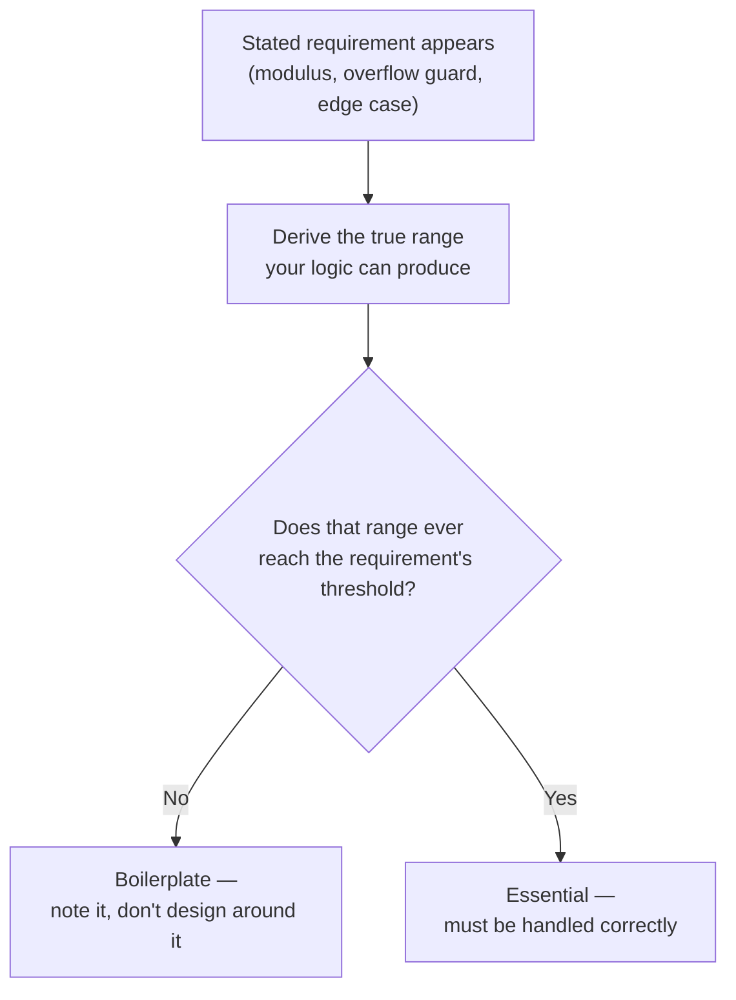
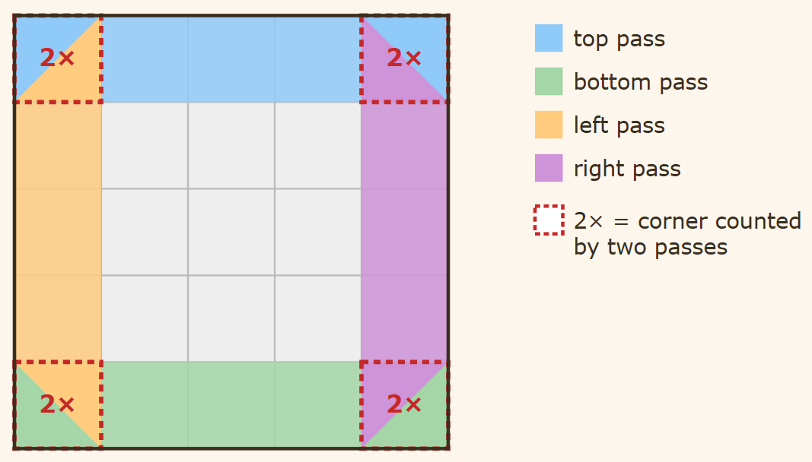
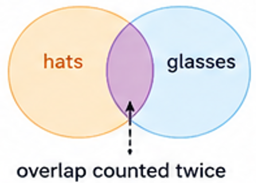
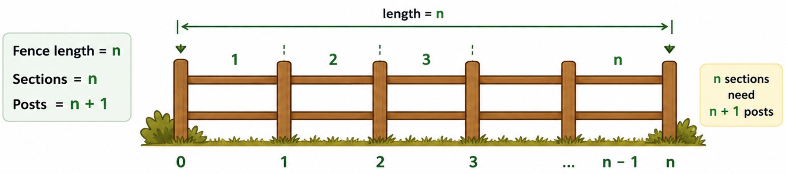
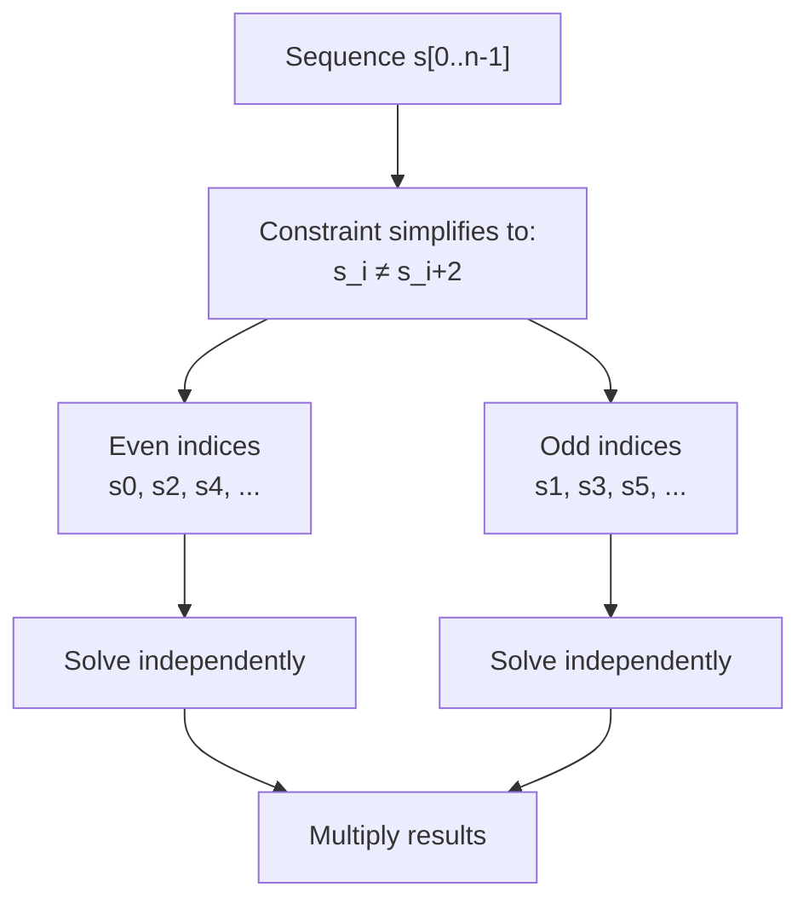
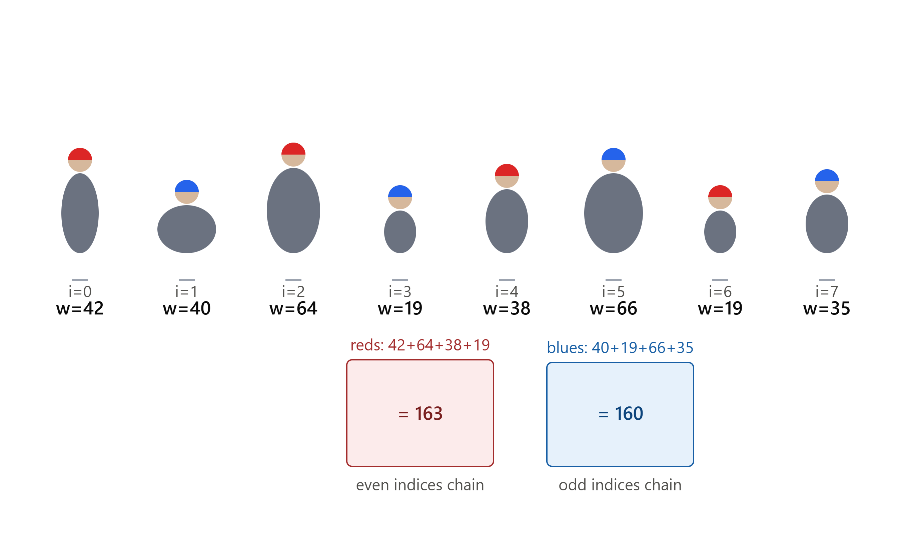
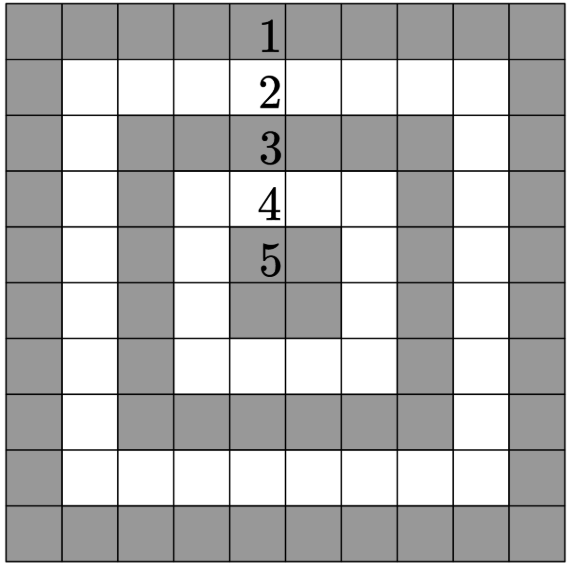
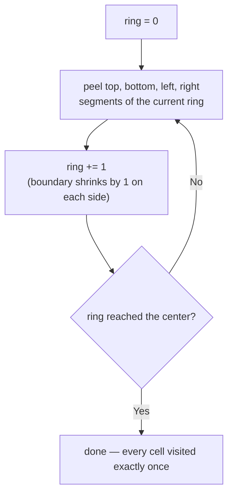
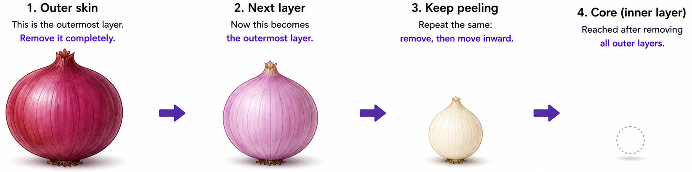
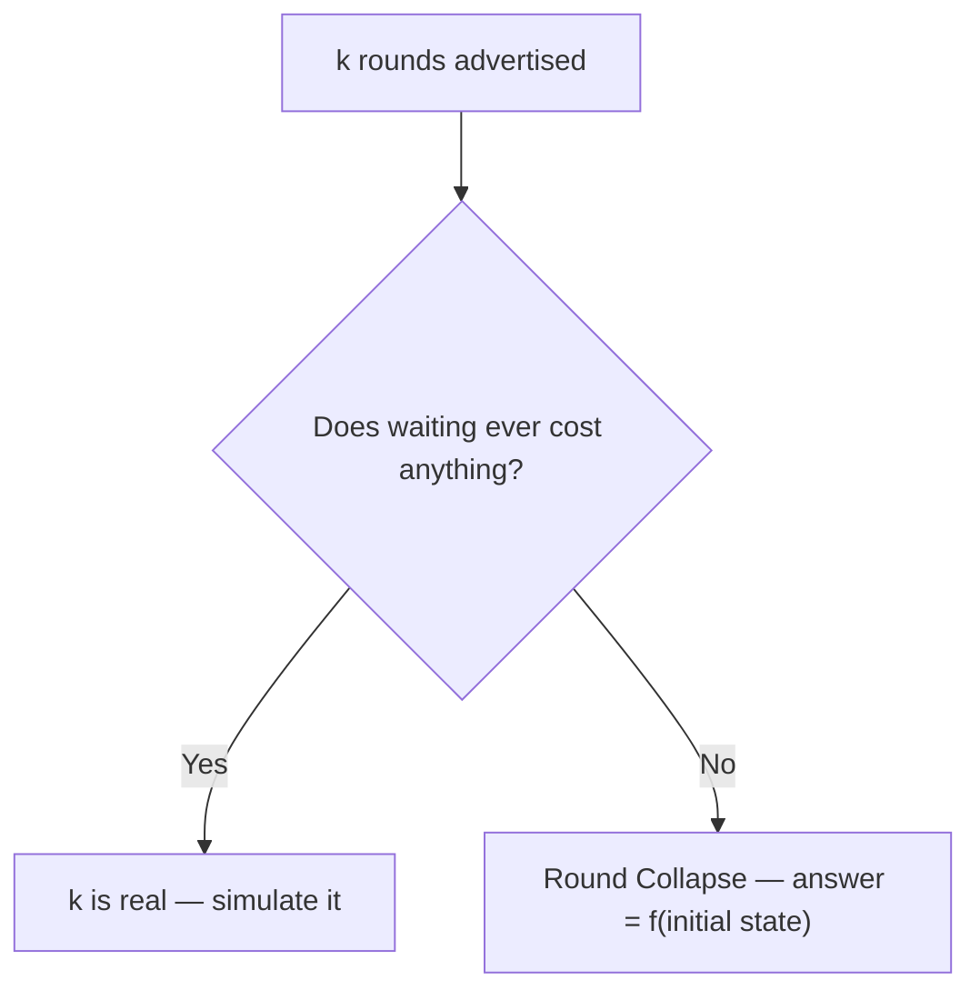

# Programming & Problem-Solving Vocabulary

A living reference of terms used in competitive programming, debugging, and algorithmic thinking. Each entry includes a definition, real-world analogy (where helpful), and C++ code illustration. New entries will be added as those are encountered further.

---

## Table of Contents
Lexical ordered.
- [Ancestor](#ancestor)
- [Anchor](#anchor)
- [Boilerplate](#boilerplate)
- [Contiguous / Contiguous Block](#contiguous--contiguous-block)
- [Deduplication (Dedup)](#deduplication-dedup)
- [Directed Acyclic Graph (DAG)](#directed-acyclic-graph-dag)
- [Double Counting](#double-counting)
- [Edge Case](#edge-case)
- [Fragile Code](#fragile-code)
- [Guard / Guard Clause](#guard--guard-clause)
- [Invariant](#invariant)
- [Irreducible Fraction](#irreducible-fraction)
- [Lambda (Lambda Function)](#lambda-lambda-function)
- [Latent Bug](#latent-bug)
- [Off-by-one](#off-by-one)
- [Overhead](#overhead)
- [Parity Chain](#parity-chain)
- [Reduction](#reduction)
- [Ring Peeling](#ring-peeling)
- [Robust Code](#robust-code)
- [Round Collapse](#round-collapse)
- [Short-Circuit Evaluation](#short-circuit-evaluation)
- [Undefined Behavior (UB)](#undefined-behavior-ub)
---

## Ancestor
**Definition:**
Any node you pass through when moving UP from a node to the Root. (`Parent → Grandparent → Root`).

**Rule:**
Move against the edge direction.

**Excludes:**
The node itself.

> Short Visual: A ladder. You are on the bottom rung. Ancestors are all the rungs above you.  
> Animation Flash: Golden line travels upward from `Target → Parent → Root`. All flash yellow.  
> Text: Ancestors = Upward path.

**Example:**
```
         [Root]  <-- Ancestor of everyone
         /    \
     [Parent]  [Uncle] <-- Uncle is NOT an ancestor of Child
      /   \
  [Child]  [Sibling] <-- Sibling is NOT an ancestor of Child
   /    \
[Leaf1] [Leaf2]  <-- Leaf1 & Leaf2 are Descendants of Child
```
**Related:** [Descendant]()

---

## Anchor

**Definition:**
A fixed reference point around which the rest of the logic is built. Choosing an anchor eliminates degrees of freedom and simplifies the problem.

**Example from practice:**
```cpp
// s[0] is the anchor: we fix the target pattern to agree with s[0]
// This eliminates the need to check both "ab..." and "ba..." patterns
string sss{s[0] != 'a' ? "ba" : "ab"};
```
Because `sss[0] == s[0]` always, index 0 is never a mismatch — the anchor holds the pattern in place.

**Other examples of anchoring in CP:**
- Fix the first element and determine the rest (greedy)
- Fix the root in tree DP
- Fix one endpoint of a range and binary search the other

---

## Boilerplate

**Definition:**
A requirement, constraint, or code pattern present for uniformity or convention across a class of problems, rather than because the specific instance in front of you actually needs it. Recognizing boilerplate means computing the true range of what your solution can produce and checking whether the stated requirement — a modulus, an overflow guard, a defensive branch — ever gets exercised within that range.

**Why it arises:**
Problem setters standardize output format and constraints across many problems in a set — `% 998244353` gets attached to counting problems by default, `long long` gets used defensively by default. None of this is wrong to include, but treating every stated constraint as load-bearing can waste analysis time or hide the fact that a much simpler bound already holds.

**Example from practice:**
- [CF 2256B — Domino Tiles](https://codeforces.com/contest/2256/problem/B) asks for the answer modulo `998244353`. But the answer is a product of two independent [Parity Chain](#parity-chain) counts, each at most `2` — so the maximum possible answer is `4`:

```cpp
// evenfree/oddfree each contribute a factor of at most 2
// max possible answer = 2 * 2 = 4 — the modulo never actually triggers
cout<<(!valid?0:efree&&ofree?4:efree||ofree?2:1)<<endl;
```

The modulo is inherited from the general shape of "count something" problems, not a signal that the answer can grow large here.


- [Die Roll (CF 9A)](https://codeforces.com/problemset/problem/9/A) statement says, "If the required probability equals to zero, output 0/1." But look at the math (in the [Solution](https://codeforces.com/contest/9/submission/387213488)): n = 7 - max(y,w), and since max(y,w) is always in [1,6], n is always in [1,6] — it can never be zero. The 0/1 case the statement warns about is structurally unreachable given the constraints.

**How to recognize one:**
Before implementing a safeguard the statement seems to demand, derive the actual bound your logic produces. If that bound sits comfortably below what the safeguard exists to protect against, it's boilerplate — mention it if writing up the solution, but don't spend design effort defending against it.

**Analogy:**
A restaurant's fire-suppression system is required by code for every kitchen, even ones that only reheat pre-cooked food. Its presence doesn't mean that kitchen is at high risk of fire — the requirement was written for kitchens in general, not for this one specifically.

**Related:**
* [Parity Chain](#parity-chain) — the Domino Tiles reduction that first surfaced this: once the ≤2-per-chain bound was found, the stated modulo turned out to be boilerplate.
* [Round Collapse](#round-collapse) — same instinct, applied to a round count instead of a numeric constraint.

---

## Contiguous / Contiguous Block

**Definition:**
A sequence of elements occupying consecutive positions with no gaps between them.

**In the context of indices:**
A set of indices `{i1, i2, ..., ik}` (sorted) is contiguous if and only if:
```
i_k - i_1 == k - 1
```
Equivalently: `back - front == size - 1`, or `back - front - size + 1 == 0`.

**Example from practice:**
```cpp
// Check if mismatch indices form a contiguous block
// If yes: one substring operation covers all of them → YES
// If no: gaps exist between mismatches → NO single operation suffices
indices.back() - indices.front() - (int)indices.size() + 1
// == 0 → contiguous (YES)
// > 0 → gaps exist (NO)
```

**Analogy:**
A row of broken tiles on a floor — if all broken tiles are side by side, one repair strip covers them all. If they're scattered, you need multiple strips.

---

## Deduplication (Dedup)

**Definition:**
The process of removing duplicate elements from a collection, leaving only unique values behind. "Dedup" is informal shorthand for "deduplication" — both refer to the same thing.

**Why it matters in CP:**
Many problems require counting distinct values, compressing coordinates, or cleaning up a container that accumulated repeated entries (e.g., repeated sentinel/placeholder values, or values that satisfy multiple filter conditions and get flagged more than once).

**Common ways to dedup in C++:**

```cpp
// 1. Pour into a set — dedups automatically via its no-duplicate invariant
vector<int> a{4, 1, 4, 2, 1, 3};
set<int> s(a.begin(), a.end());
// s = {1, 2, 3, 4} — order changes to sorted, type changes to set

// 2. sort + unique + erase — dedups while keeping it a vector
vector<int> a{4, 1, 4, 2, 1, 3};
sort(a.begin(), a.end());
a.erase(unique(a.begin(), a.end()), a.end());
// a = {1, 2, 3, 4} — stays a vector, but requires sorting first
// (unique() only removes ADJACENT duplicates)

// 3. C++20: erase_if with a set — dedup + filter in one step
set<int> s{4, 1, 4, 2, 1, 3};
erase_if(s, [](int x){ return x % 2 == 0; });
// s = {1, 3}
```

**Choosing between them:**
- Need the result as a `set` (sorted, no duplicates, `O(log n)` lookup) → pour into a `set` directly.
- Need the result to stay a `vector` (contiguous memory, index access) → `sort` + `unique` + `erase`.
- Already have a `set`/`map` and want to filter by condition → `erase_if`.

**Analogy:**
A guest list with repeated names — deduping is crossing out every repeat so each guest appears exactly once, regardless of how many times they were originally written down.

**Related:**  
See [Invariant](#invariant) — a `set`'s "no two elements are equal" rule is itself an invariant, which is *why* pouring values into a `set` dedups them for free.  
See [Overhead](#overhead) — the three approaches above have different time/space tradeoffs worth being aware of under tight limits.

---

## Directed Acyclic Graph (DAG)

A graph where every edge points in one direction, and no matter which edges you follow, you can never make your way back to a vertex you already visited. "Acyclic" is the key word: there are no cycles anywhere in the graph, directed or otherwise. A rooted tree is one common example of a DAG — every edge points from parent to child (or child to parent, depending on convention), and you can never loop back to an ancestor. DAGs show up constantly outside trees too: dependency graphs (task B needs task A done first), version histories, scheduling problems — anywhere "this must come before that" is the whole point, and a cycle would mean a contradiction (X depends on Y depends on X).


---

## Double Counting

**Definition:**
Counting the same element, case, or contribution more than once while accumulating a total, which inflates the result unless corrected.

**Why it arises:**
Most often at a shared boundary between two ranges, loops, or cases that overlap — two segments of a shape sharing an edge cell, or two conditions in a counting formula that aren't actually mutually exclusive.

**Example from practice:**
Peeling a matrix ring into four full-length segments (top, bottom, left, right) revisits all 4 corner cells twice — once from the row pass, once from the column pass:

  
*Peeling Matrix*

Two ways to fix it: trim the row range on the left/right passes to `ring+1` so they never touch a corner already owned by the top/bottom passes, or leave every pass full and subtract each of the 4 corners once at the end. See [_Practice Problem_](https://github.com/Mojahidul21/My-Competitive-Programming-Journey/blob/main/General%20Tricks%20%26%20Techniques/Decide%20Traverse%20Direction/Comfortable%20with%20Your%20Matrices%20%E2%80%94%20Fix%20an%20Axis%2C%20Drop%20a%20Loop.md#practice-problem) for double counting compensation in code implementation.

**Analogy:**
Counting party guests as "people wearing hats" plus "people wearing glasses" — anyone wearing both gets counted twice unless you subtract the overlap.

  
*Hat & Glass - Double Counting*

**Related:**
* [Ring Peeling](#ring-peeling) — the corner cells are exactly where this shows up when peeling a matrix.
* [Off-by-one](#off-by-one) — double counting is frequently the downstream symptom of a range boundary that's off by one.

---

## Edge Case

**Definition:**
An input at the extreme boundary of the constraints where typical logic behaves differently or breaks entirely.

**Common edge cases in CP:**

| Scenario | Example |
|---|---|
| Empty container | `n = 0`, empty string |
| Single element | `n = 1` |
| All elements equal | `[5, 5, 5, 5]` |
| Maximum constraints | `n = 2 * 10^5` |
| Already sorted | `[1, 2, 3, 4]` |
| Reverse sorted | `[4, 3, 2, 1]` |
| All same character | `"aaaa"` |
| Answer is zero or negative | Result = 0, -1 |

**Example from practice:**
```cpp
// Edge case: indices is empty means s is already alternating
if (indices.empty()) { cout<<"yes"; }
else { indices.back() - indices.front() - (int)indices.size() + 1 ? cout<<"no" : cout<<"yes"; }
```

**Habit to build:** Before submitting, mentally run through: what if `n = 1`? What if all elements are the same? What if the answer is 0?

---

## Fragile Code

**Definition:**
Code that produces the correct output for current inputs but breaks under slightly different conditions — correct by accident, not by design. There is no clear reason it should work; it just happens to.

**Signs of fragility:**
- Works on given test cases but has no proof of correctness
- Relies on constraints that aren't explicitly guaranteed
- A small change in input breaks it

**Example:**
```cpp
// Fragile: assumes the vector is always non-empty
cout << v.back();

// What happens if v is empty? UB / crash
```

```cpp
// Fragile: assumes sorted input, but sort wasn't called
int mn = a[0]; // wrong if the first element is not really the minimum
```

**Contrast with robust code:** Fragile code passes; robust code passes *and* you can prove why.

**In contest context:**
A solution is fragile if it passes the given examples and even the judge, but you cannot explain *why* it's correct. It may fail on a future problem with similar structure but slightly different constraints.

---

## Guard / Guard Clause

**Definition:**
A check placed before potentially unsafe or incorrect code to ensure preconditions are met before execution proceeds.

**Purpose:** Prevent UB, wrong answers, or crashes caused by operating on invalid state.

**Patterns:**
```cpp
// Guard with early return
if (v.empty()) return;
cout << v.back(); // safe now

// Guard with short-circuit in expression
v.size() && v.back() == target

// Guard with early output (CP style)
if (indices.empty()) { cout<<"yes"; }
else { /* safe to use front/back */ }
```

**Analogy:**
A safety lock — you check the condition before pulling the trigger. The gun (code) is fine; the guard ensures you don't fire when you shouldn't.

---

## Invariant

**Definition:**
A condition that is guaranteed to remain true throughout an algorithm's execution. You reason about the algorithm by identifying and relying on invariants at each step.

**Why it matters:**
Invariants are the backbone of correctness proofs. If you can state an invariant clearly, you can trust the code.

**Example:**
```cpp
// Invariant: indices is always in increasing order
// because we insert left-to-right (i = 0, 1, 2, ...)
for (int i{}; i < n; ++i)
    if (s[i] != ss[i])
        indices.emplace_back(i);

// Because of this invariant, front() = min, back() = max — always.
```

**Classic invariants in CP:**
- Binary search: the answer always lies within [lo, hi] at every step
- Two pointers: left pointer never passes right pointer

---
## Irreducible Fraction

**Definition:**
A fraction `a/b` where `gcd(a, b) = 1` — numerator and denominator share no common factor greater than 1, so the fraction cannot be simplified further.

**Why it arises:**
Many CP problems ask for an answer as a ratio or probability formatted as `a/b`, and require the fraction be in lowest terms specifically — an unreduced but numerically correct fraction (e.g. `2/4` instead of `1/2`) is judged **wrong**, not just unsimplified.

**How to produce one:**
```cpp
int g{gcd(n, d)};
n /= g;
d /= g;
// n/d is now irreducible
```
`std::gcd` (from `<numeric>`) handles this directly — no manual Euclidean algorithm needed.

**Example from practice:**
[Codeforces Beta Round 9 — A. Die Roll](https://codeforces.com/problemset/problem/9/A) asks for a win-probability as an irreducible `A/B`. The raw fraction is `n/6` where `n` is a count of favorable outcomes — reducing it requires dividing both by `gcd(n, 6)`:
```cpp
int g{gcd(n, d)};
cout<<n/g<<'/'<<d/g;
```

**Edge cases to watch:**
- `gcd(0, d) = d`, so `0/d` reduces correctly to `0/1` — matches the common convention of representing "zero probability" as `0/1` rather than `0/anything`.
- `gcd(n, n) = n`, so `n/n` reduces correctly to `1/1`.
- If `d = 0` is possible in your problem's domain, guard before calling `gcd` — dividing by a `gcd` derived from `d = 0` is not meaningful and needs separate handling.

**Analogy:**
A recipe written as "2 cups per 4 servings" versus "1 cup per 2 servings" — both are correct, but only the second is in its simplest, unambiguous form. A checker expecting the simplest form will reject the first even though the ratio is identical.


**Related:**
* [Boilerplate](#boilerplate) — in Die Roll, the problem statement's explicit `0/1` instruction for a zero probability is boilerplate-adjacent: it falls out naturally from `gcd(0,d)=d`, it doesn't need special-casing in code.
---

## Lambda (Lambda Function)

**Definition:**
An anonymous, inline function — defined at the point of use, with no name and no separate declaration elsewhere. Syntax: `[capture](parameters) { body }`.

**Why prefer a lambda over a standard (named) function:**

A standard function is declared once, globally, and cannot see any local variables from the scope it's called in — every value it needs must be passed explicitly as a parameter, even ones that never change and are a bit tedious to keep re-passing. A lambda, by contrast, can **capture** local variables directly from its surrounding scope (`[x]` by value, `[&x]` by reference, `[&]`/`[=]` for "capture everything used"). This is most useful when:

- A helper needs a **local value that stays constant across all its calls** (e.g. an input size read once per test case) — capturing it once avoids repeating it as an argument at every call site.
- The logic is **only needed within this one function/scope** — writing a separate named function elsewhere breaks the flow of reading the solution and adds a name to remember and reason about, for something that's essentially disposable.
- The helper is needed **inside `main()`**, where nested *named* function definitions are not legal C++ syntax at all — a lambda is the only inline option available there.

**Worked example:**
Suppose you read `n` once per test case, then need a small helper called multiple times that depends on `n` — e.g. counting how many characters at a given starting offset (stepping by 2) satisfy some condition, up to length `n`. Written as a lambda, `n` is captured once and every call site stays clean:

```cpp
int n;
cin >> n;

auto countMatch = [&n](string &s, int start) {
    int cnt{};
    for (int i{start}; i < n; i += 2)
        cnt += s[i] == '0';
    return cnt;
};

// n never appears again at the call site — it's already captured
countMatch(a, 0);
countMatch(b, 1);
```

A standalone named function would need a third parameter (`int n`) repeated at every call, or would have to rely on `n` being global — neither as clean as capturing it once where the helper is defined.

For a real contest example of this pattern, see this [solution](https://codeforces.com/contest/2254/submission/385821637).

**Common pitfall:**
Nested *named* function syntax is illegal inside another function body — writing something like `int helper(int x){ ... }` inside `main()` will not compile. Only lambda syntax (`auto helper = [](int x){ ... };`) is valid there.

**Analogy:**
A sticky note you write and use once at your desk, versus filing a form in a shared cabinet (a named global function). The sticky note can reference whatever's already on your desk (capture); the filed form can only see what you hand it (parameters).

**Related:**
See [Overhead](#overhead) — a capture-less lambda (`[]`) costs about the same as a plain function call at runtime; capturing by value or reference adds no real overhead for simple types like `int`.

---

## Latent Bug

**Definition:**
A bug that exists in the code but does not trigger on current test cases. It is hidden until a specific input or environment exposes it.

**Why it's dangerous:**
It gets AC on the judge, passes code review, and is committed — then fails silently in a different context (stress test, different OS, compiler with different padding behavior).

**Example from practice:**
Reading one element past a heap-allocated vector's end:
```cpp
vector<int> v(n);
cout << v[n]; // UB — may silently return garbage, 0, or crash depending on the environment
```
This passes all valid test cases because the memory region happens to contain benign values in that environment — not guaranteed elsewhere. The bug is latent — real, but invisible.

**How to find latent bugs:**
- Stress testing against a brute force
- Running with sanitizers: `-fsanitize=address,undefined`
- Manually testing edge cases

---

## Off-by-one

**Definition:**
An error where a loop bound, range, or index is exactly one position too far or too short — the boundary is wrong by precisely 1, not by some arbitrary amount.

**Why it arises:**
At the seams: where a range starts, ends, wraps around, or hands off to an adjacent range. `<` vs `<=`, `n` vs `n-1`, a missing `+1` on a wrap-around, starting a loop at `ring` instead of `ring + 1`.

**Example from practice:**
In ring-peeling a matrix, the left/right column passes deliberately start at `row = ring + 1`, not `row = ring` — a one-off adjustment made on purpose to skip a corner the row passes already counted:
```cpp
// deliberate: skips the corner cell the top-row pass already counted
for (row = ring + 1, col = ring; row < 9 - ring; ++row)
    ans += (target[row][col] != '.') * (ring + 1);

// the bug version: starting at `ring` instead of `ring + 1`
// silently re-visits that corner — an accidental off-by-one
```
The full picture can be observed here in [_Practice Problem_](https://github.com/Mojahidul21/My-Competitive-Programming-Journey/blob/main/General%20Tricks%20%26%20Techniques/Decide%20Traverse%20Direction/Comfortable%20with%20Your%20Matrices%20%E2%80%94%20Fix%20an%20Axis%2C%20Drop%20a%20Loop.md#practice-problem).

  
  The [Contiguous / Contiguous Block](#contiguous--contiguous-block) check (`back - front - size + 1 == 0`) is built with the `+1` specifically to avoid an off-by-one in that comparison.

**Analogy:**
Fence posts vs fence sections — a straight fence of length `n` needs `n + 1` posts, not `n`. Forgetting the `+1` is the textbook off-by-one.  

  
*Off-by-one Concept in Fence*  

**Related:**
* [Double Counting](#double-counting) — a range that runs one cell too far is one of the most common causes.
* [Contiguous / Contiguous Block](#contiguous--contiguous-block) — its defining formula exists specifically to get this right.

---

## Overhead

**Definition:**
Extra time, memory, or code complexity beyond the minimum required to solve the problem.

**In CP:** Overhead matters when you're close to the time or memory limit.

**Examples:**
```cpp
// O(log n) overhead per insertion — set maintains sorted order
set<int> s;
s.insert(x);

// O(1) amortized — no overhead from sorting/balancing
vector<int> v;
v.push_back(x);
```

```cpp
// Overhead from unnecessary copy
void f(vector<int> v) { ... }   // copies entire vector

// No overhead — pass by const reference
void f(const vector<int>& v) { ... }
```

**Types of overhead:**
- **Time overhead:** Extra operations that increase runtime (e.g., unnecessary sorting, repeated computation)
- **Memory overhead:** Extra space used beyond what's needed (e.g., storing full strings when only lengths are needed)
- **Code overhead:** Unnecessary complexity that makes code harder to read and debug

---

## Parity Chain

**Definition:**
A decomposition of a sequence into two independent subsequences — elements at even indices and elements at odd indices — used when a constraint only relates elements that are exactly 2 apart. Each chain can then be reasoned about (and counted) completely separately, because nothing links the two.

**Why it arises:**
Many constraints of the form "compare position `i` to position `i+1`" collapse, after algebraic simplification, into a constraint on `i` vs `i+2` instead. Once that happens, the even-indexed and odd-indexed positions stop interacting entirely — you're no longer solving one problem of size `n`, you're solving two smaller, unrelated problems.

**Example from practice:**
[CF 2256B — Domino Tiles](https://codeforces.com/contest/2256/problem/B) — the domino-weight condition `s_i + s_{i+1} ≠ s_{i+1} + s_{i+2}` simplifies to `s_i ≠ s_{i+2}`. This means even indices form one alternating chain, odd indices form another, and the two chains never constrain each other:

```cpp
// Each parity chain is independently either:
// - all '?'      -> 2 ways
// - fixed + valid -> 1 way
// - fixed + invalid -> 0 ways
// Total answer = (ways for even chain) * (ways for odd chain)
```

My [AC submission](https://codeforces.com/contest/2256/submission/386425561) for this problem.

**How to recognize one:**
Look for a constraint that, after simplification, only ever compares `i` to `i+2` (never to `i+1`). That's the signal the sequence has split into two non-interacting halves.

**Analogy:**
- Example-1: Two separate queues at a fair — people in the "even" queue never interact with people in the "odd" queue, so you can serve (or count) each queue on its own and just multiply the outcomes at the end.


- Example-2: Reds (even positions) and blues (odd positions) never need to be compared against their neighbor — each color's weight is summed on its own, then the two totals are compared. Same decomposition as the parity-chain pattern.


**Related:**
* [Invariant](#invariant) — within a single chain, the alternation (`s_i ≠ s_{i+2}` propagated outward) is the invariant you're checking.
* [Reduction](#reduction) — recognizing a parity chain is itself a reduction: a size-`n` problem becomes two independent smaller problems.
* [Round Collapse](#round-collapse) — a sibling pattern: there a `k`-round process collapses into one step; here an `n`-length sequence collapses into two halves.

---

## Reduction

**Definition:**
Transforming a complex or unfamiliar problem into a simpler or already-solved one, so that solving the simpler problem solves the original.

**Why it's powerful:**
Instead of solving a hard problem directly, you recognize it as a disguised version of something you already know.

**Example from practice:**
There are exactly two alternating strings over `{a, b}`. Instead of checking both, anchor on `s[0]` to reduce to one check:
```cpp
// Reduction: 2 pattern checks → 1, by anchoring on s[0]
string sss{s[0] != 'a' ? "ba" : "ab"};
```
`s[0]` is guaranteed to match `sss[0]`, so no mismatch at index 0 — and only one pattern needs checking.

**Classic CP reductions:**
- "Can we make all elements equal?" → prefix sum / parity check
- "Minimum swaps to sort" → cycle detection in permutation graph
- "Longest common substring" → suffix array / LCP array

---

## Ring Peeling

**Definition:**
A matrix traversal technique that processes the outer boundary ("ring") of the remaining unvisited cells, then shrinks the boundary inward and repeats until nothing is left. Each ring is visited as several 1D fixed-axis segments, not as one 2D region.

**Why it arises:**
Whenever a matrix property depends on distance from the border — concentric layers that share a value, a weight, or a transformation (target-scoring boards, spiral output, layer-dependent point values).

**Example from practice:**
[Target Practice (CF 1873C)](https://codeforces.com/problemset/problem/1873/C) is a 10×10 board decomposes into 5 rings, each ring split into four fixed-axis segments:

  
_Ring Peeling_

```cpp
for (row = ring,   col = ring; col < 10-ring; ++col) ans += (target[row][col]!='.')*(ring+1); // top
for (row = 9-ring, col = ring; col < 10-ring; ++col) ans += (target[row][col]!='.')*(ring+1); // bottom
for (row = ring+1, col = ring; row < 9-ring; ++row)  ans += (target[row][col]!='.')*(ring+1); // left
for (row = ring+1, col = 9-ring; row < 9-ring; ++row) ans += (target[row][col]!='.')*(ring+1); // right
```
We can see the process once again as below:
  
_Ring Peeling_



**Analogy:**
Peeling an onion — you remove the outermost skin entirely before you can see or touch the layer beneath it.  

  
_Peeling an Onion_

**Related:**
* [Double Counting](#double-counting) — the corner cells of each ring are exactly where this bites if the four segments aren't handled carefully.
* [Off-by-one](#off-by-one) — the `ring + 1` trim on the side segments is a deliberate instance of this.
* Full technique write-up: [Comfortable with Your Matrices — Fix an Axis, Drop a Loop](../../General%20Tricks%20&%20Techniques/Decide%20Traverse%20Direction/Comfortable%20with%20Your%20Matrices%20%E2%80%94%20Fix%20an%20Axis,%20Drop%20a%20Loop.md)

---

## Robust Code

**Definition:**
Code that is correct for all valid inputs, including edge cases, because it is built on a clear, provable reason — not coincidence.

**Example:**
```cpp
// Robust: guarded before access
if (!v.empty()) cout << v.back();
```

```cpp
// Robust: works regardless of whether indices is empty
if (indices.empty()) { cout << "YES\n"; }
else {
    bool contiguous = indices.back() - indices.front() == (int)indices.size() - 1;
    cout << (contiguous ? "YES" : "NO") << '\n';
}
```

**Goal in CP:** Even under contest time pressure, prefer robust over fragile whenever the proof of correctness is simple.

---
## Round Collapse

**Definition:**
A multi-round process where the final answer doesn't depend on the round count `k`, because every agent's dominant strategy is to defer any risky action until the last possible round. Once that holds, the whole process collapses into a single decisive round applied to the initial state.

**Why it arises:**
A statement advertises a large `k` (often up to `10^9`) to look like it needs step-by-step simulation. That's only true if some agent gains by acting early. If delaying costs nothing and acting early risks a worse outcome later, nobody commits early — the round count stops mattering.

**How to recognize one:**
`k` is large relative to the input, each agent's state is small (act / don't act), and whatever an agent would act on only changes through that agent's own move. Ask: "do I lose anything by waiting one more round?" If no, for every agent, the process is really one round in disguise.



**Analogy:**
Poker: folding is free at any point, but a placed bet can't be undone — so every player plays each round as though it's already the last, and the outcome depends only on the cards dealt, never on how many betting rounds the table allows.

**Example from practice:**
[CF 2256C — Hot Potatoes at the Fairy Warehouse](https://codeforces.com/contest/2256/problem/C) is a clean instance: holding a potato is free, passing early risks receiving one back with no time left to pass it on, so everyone waits for the last round and the `k`-round game collapses into one pass over the input. [AC submission](https://codeforces.com/contest/2256/submission/386578511) reads `k` and discards it immediately, since it never affects the answer.

**Related:**
* [Parity Chain](#parity-chain) — same surprise, different mechanism: a many-step process collapses to one check per element.
* [Boilerplate](#boilerplate) — both are about an advertised dimension turning out not to be load-bearing.

---

## Short-Circuit Evaluation

**Definition:**
In a logical expression (`&&` or `||`), if the result is already determined by the left operand, the right operand is never evaluated — not even executed.

- `A && B` → if `A` is false, `B` is skipped (result is already false)
- `A || B` → if `A` is true, `B` is skipped (result is already true)

**Why it matters in CP:**
The right operand may cause UB, a crash, or expensive computation. Short-circuiting lets you guard against it in a single expression.

**Example from practice:**
```cpp
// If indices is empty, .back() and .front() are never called — no UB
indices.size() && indices.back() - indices.front() - (int)indices.size() + 1
```

```cpp
// Standard guard pattern with short-circuit
if (!v.empty() && v[0] == target) { ... }
// If v is empty, v[0] is never accessed
```

```cpp
// OR short-circuit: if first condition is true, second is skipped
if (n == 0 || arr[0] == -1) return;
```

**Analogy:**
A security check at a gate — if the first guard says "no entry", the second guard is never even consulted.

---

## Undefined Behavior (UB)

**Definition:**
Code for which the C++ standard makes *no guarantees*. The program may crash, give wrong output, appear to work, corrupt memory, or do anything else — the compiler is allowed to assume UB never happens and may optimize accordingly in dangerous ways.

**Common sources in CP:**
```cpp
vector<int> v;
v.back();              // UB — empty vector
v[5];                  // UB — out of bounds (no bounds check with [])

int x = INT_MAX;
x + 1;                 // UB — signed integer overflow (use long long)

int a[5];
a[5] = 0;              // UB — one past the end

int* p = nullptr;
*p = 1;                // UB — null pointer dereference
```

**Dangerous property:**
UB may not crash or give wrong answers on your machine or on valid test cases — it can be a latent bug that surfaces only in specific conditions (different OS, compiler version, or input).

**Rule of thumb:** If you're not 100% sure an access is in bounds, guard it.

---

