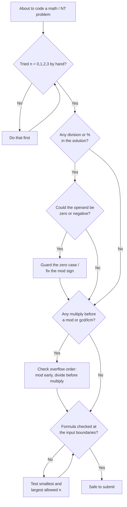

# Ask Yourself: A Pre-Attempt Checklist for Math & Number Theory Problems

## Definition
A fixed set of questions run mentally before — and while — coding a math or number-theory problem, aimed at catching entire classes of bugs (sign errors, division by zero, overflow, off-by-one at boundaries) before they cost a submission. The checklist doesn't solve the problem for you; it clears the landmines around the solution so the logic you *do* write survives contact with hidden test cases.

## Why it arises
Math/NT problems rarely fail on logic — they fail on the assumptions quietly baked into that logic. A formula that's correct for n ≥ 2 breaks silently at n = 0. A `%` that's correct for positive operands returns a negative remainder in C++ the moment an operand goes negative. A `long long` that's correct until two `int`s get multiplied one line before the cast. None of these show up in the sample tests, all of them show up in the hidden ones. Running a short, memorized checklist trades a few seconds of friction up front for skipping the WA → re-read → re-submit loop later.

> 💡 The checklist is not a proof technique — it's a filter. It doesn't tell you *how* to solve the problem, only which ways your solution is likely to be wrong.

## The checklist

### Small-scale reasoning
- Have you worked out n = 0, 1, 2, 3 by hand before writing any code?
- Does a brute-force loop agree with your formula for every tiny n you can check?

### Parity
- Does even/odd split the problem into two genuinely different cases?
- If you built a case split, did you check **both** branches against a hand example, not just the one you thought of first?

### Zero, sign, and division
- Are zero, negative, positive, and non-negative numbers each handled — or did you only think about positive ones?
- Is there a division or `%` anywhere that could hit a zero operand?
- If any operand can be negative, does your `%` do what you think it does? (C++'s `%` returns a remainder with the sign of the dividend, not a true mathematical modulo.)

### GCD / LCM / divisibility
- Does the problem reduce to a GCD or LCM question in disguise?
- If you need `a * b`, does the multiplication happen **before** or **after** you divide by the gcd? Order changes overflow risk.
- Is [Bezout's Identity](https://github.com/Mojahidul21/My-Competitive-Programming-Journey/blob/main/Theorem/Bezout's%20Identity.md) relevant — i.e., are you really asking "does `ax + by = c` have a solution"?

### Overflow
- Could any intermediate product or sum exceed `int` range, even if the final answer fits?
- Are you multiplying two values *before* taking `% MOD`, or after? (Overflow happens before the mod saves you.)
- Does the constraint table's upper bound, multiplied by itself, still fit in `long long`? Do you need `__int128` even once?

### Boundaries
- Is the range in the problem inclusive or exclusive — and does your loop bound match?
- Does your formula still hold exactly at the smallest and largest allowed input, not just in the middle?

### Monotonicity
- Is the answer monotonic in some variable? If yes, binary search may replace a search/simulation entirely.



## Code comparisons

**Negative operands and `%`**

```cpp
// ❌ assumes % always returns a non-negative remainder
int r = a % m;               // wrong when a < 0: e.g. -1 % 5 == -1 in C++, not 4

// ✅ force a true mathematical modulo
int r = ((a % m) + m) % m;   // always in [0, m)
```

**Overflow order in LCM**

```cpp
// ❌ multiplies first — can overflow even when the final lcm fits
long long lcm = (a * b) / gcd(a, b);

// ✅ divide before multiplying — shrinks the intermediate value first
long long lcm = (a / gcd(a, b)) * b;
```

## Example from practice
> ⚠️ *TBA*

| Problem | Link | Notes |
|---|---|---|
| | | |

## How to recognize when to run it
- The problem statement includes words like "modulo", "divisors", "gcd", "remainder", or gives constraints down to 0 or negative values.
- Your solution has any `/`, `%`, or multiplication feeding into a modulus.
- Constraints go up to 10⁹ or higher and your intermediate math involves a product of two such values.
- You've gotten a WA with no visible logic error — the checklist is the first thing to run before re-reading the algorithm.

## Analogy
A pilot doesn't trust memory for takeoff — they run the same short checklist every time, regardless of how many hours they've flown, because the failures that matter are rare, silent, and expensive. The checklist isn't about skill; it's about not letting a good solution get shot down by a detail it never occurred to you to check.


## Related
- [Anchor-and-Derive](https://github.com/Mojahidul21/My-Competitive-Programming-Journey/blob/main/General%20Tricks%20&%20Techniques/Contest%20Strategy/Anchor%20and%20Derive.md) — once the checklist confirms an invariant (e.g. parity) is safe to use, Anchor-and-Derive is often the construction it unlocks.
- [Bezout's Identity](https://github.com/Mojahidul21/My-Competitive-Programming-Journey/blob/main/Theorem/Bezout's%20Identity.md) — the theorem behind the GCD/LCM checklist item.
- [Trust the Predicate: Stop Simulating What You've Already Proven](https://github.com/Mojahidul21/My-Competitive-Programming-Journey/blob/main/General%20Tricks%20&%20Techniques/Contest%20Strategy/Trust%20the%20Predicate%3A%20Stop%20Simulating%20What%20You've%20Already%20Proven.md) — the checklist runs *before* trusting a predicate; this article covers what to do *once* it's trusted.
- [GCD-Reachability Under Fixed-Step Moves](https://github.com/Mojahidul21/My-Competitive-Programming-Journey/blob/main/General%20Tricks%20&%20Techniques/GCD/GCD-Reachability%20Under%20Fixed-Step%20Moves.md) — a worked example of the GCD checklist item in action.
