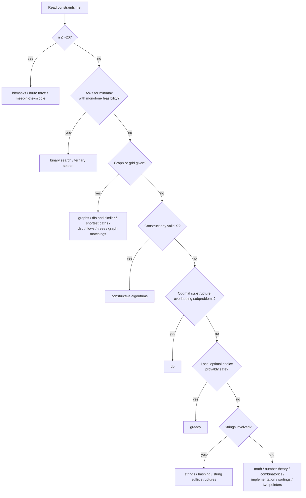
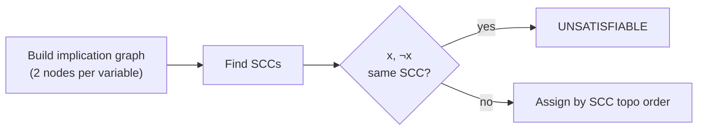
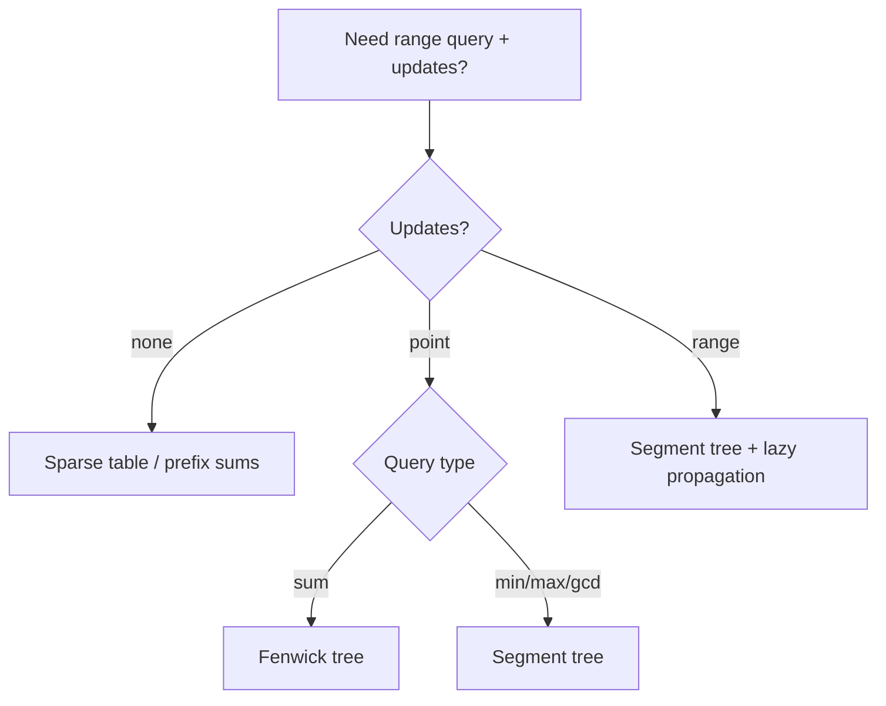
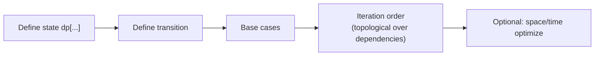
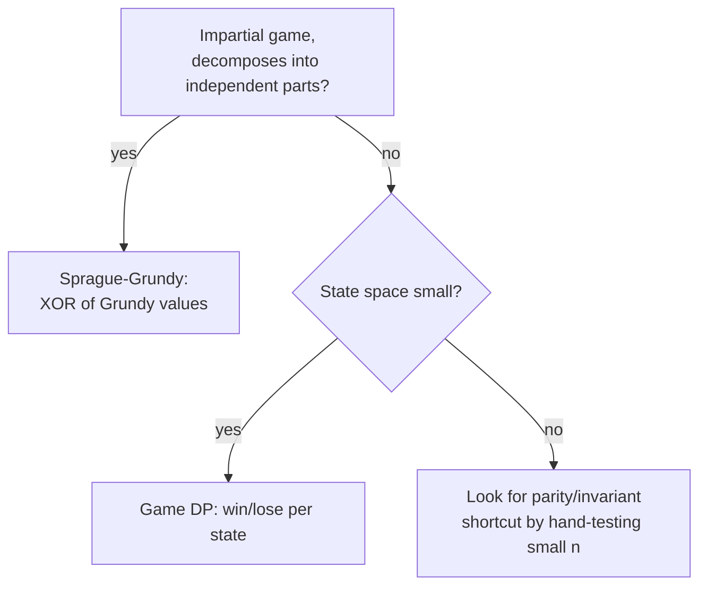
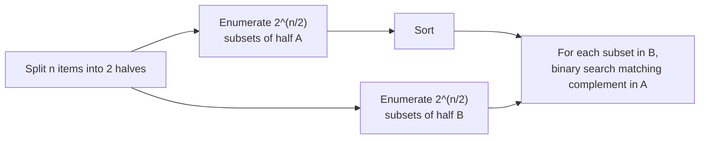
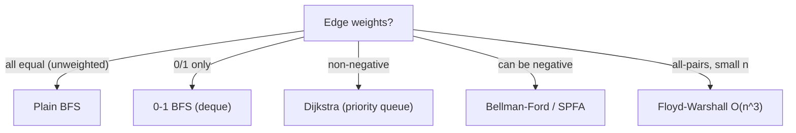
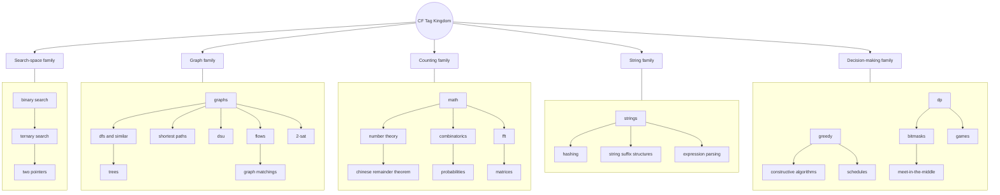

# The CF Tag Atlas — Recognizing & Attacking Every Codeforces Tag
> **Purpose:** *A field guide*.  
> 37 tags, one document. For each tag: what it means, how to *smell* it in a fresh problem statement, what to reach for, and where people bleed points. Every section is folded by default — click to expand. Internal links are anchors, so this file is self-contained; no external dependency to navigate it.

---

## How to use this atlas
1. Read a problem. Don't look at its tags.
2. Run it through the [**Triage Tree**](#triage-tree) below.
3. Jump to the matching section(s) via the [**Table of Contents**](#toc).
4. Check **Recognition Signals** — if ≥2 match, you've likely found the right bucket.
5. After solving a problem, document it in your own vault. To request an update to this article, post a suggestion in the Discussions section of this repository.

<a name="practice-principle"></a>
> **📌 Standing Rule**  
> Every Practice table starts empty, marked `—`. It's only ever updated with a personally verified, accepted-submission link — never a guessed or fabricated Codeforces URL.

<a name="finding-tags-on-cf"></a>
> **💡 Finding Tag-based Problems on Codeforces**
> - **Browse by tag:** [Problemset](https://codeforces.com/problemset) → **Filter Problems** → **Add tag**. Two settings worth toggling alongside this:
>   - *Show tags for unsolved problems* — reveals tags before you've solved them (off by default, since seeing the tag can spoil the approach).
>   - *Hide solved problems* — filters your own AC'd problems out of the list.
>   - **Difficulty: From — To** — narrows results to a rating band, so you can pair "tag X" with "rating ~1400–1600" for targeted practice.
> - **See a specific problem's tags:** open the problem page → scroll to **Problem tags** (usually near the bottom, alongside the difficulty rating).
---
<a name="triage-tree"></a>
## Triage Tree (first 15 seconds with a problem)

---

<a name="toc"></a>
## Table of Contents (lexical order)

| # | Tag | | # | Tag |
|---|---|---|---|---|
| 1 | [2-sat](#tag-2sat) | | 20 | [graphs](#tag-graphs) |
| 2 | [binary search](#tag-binary-search) | | 21 | [greedy](#tag-greedy) |
| 3 | [bitmasks](#tag-bitmasks) | | 22 | [hashing](#tag-hashing) |
| 4 | [brute force](#tag-brute-force) | | 23 | [implementation](#tag-implementation) |
| 5 | [chinese remainder theorem](#tag-crt) | | 24 | [interactive](#tag-interactive) |
| 6 | [combinatorics](#tag-combinatorics) | | 25 | [math](#tag-math) |
| 7 | [communication](#tag-communication) | | 26 | [matrices](#tag-matrices) |
| 8 | [constructive algorithms](#tag-constructive) | | 27 | [meet-in-the-middle](#tag-mitm) |
| 9 | [data structures](#tag-ds) | | 28 | [number theory](#tag-number-theory) |
| 10 | [dfs and similar](#tag-dfs) | | 29 | [probabilities](#tag-probabilities) |
| 11 | [divide and conquer](#tag-dc) | | 30 | [schedules](#tag-schedules) |
| 12 | [dp](#tag-dp) | | 31 | [shortest paths](#tag-shortest-paths) |
| 13 | [dsu](#tag-dsu) | | 32 | [sortings](#tag-sortings) |
| 14 | [expression parsing](#tag-expr-parsing) | | 33 | [string suffix structures](#tag-suffix) |
| 15 | [fft](#tag-fft) | | 34 | [strings](#tag-strings) |
| 16 | [flows](#tag-flows) | | 35 | [ternary search](#tag-ternary) |
| 17 | [games](#tag-games) | | 36 | [trees](#tag-trees) |
| 18 | [geometry](#tag-geometry) | | 37 | [two pointers](#tag-two-pointers) |
| 19 | [graph matchings](#tag-matchings) | 4 | | | | |

---

<a name="tag-2sat"></a>
### 1. `2-sat`
<details><summary><b>Expand</b></summary>

**What it is**  
A restricted Boolean satisfiability problem: each clause has exactly 2 literals, `(a ∨ b)`. Solvable in linear time via implication graphs + SCC, unlike general SAT (NP-hard).

**Recognition signals**
- Statement gives **binary choices** per item ("each element is either A or B / on or off / left or right").
- Constraints are pairwise: *"if you pick X, you must also pick/forbid Y"*.
- Asks: "is a valid assignment possible?" or "find any valid assignment", with n, m up to ~10⁵–10⁶.

**General approach**
1. Model each variable `x` as two nodes: `x` (true) and `¬x` (false).
2. Clause `(a ∨ b)` → edges `¬a → b` and `¬b → a` (if not a, then b must hold, and vice versa).
3. Run Tarjan/Kosaraju SCC on the implication graph.
4. **Unsatisfiable** iff some `x` and `¬x` land in the same SCC.
5. Otherwise assign `x = true` iff `SCC(x)` comes **after** `SCC(¬x)` in topological order (Tarjan's reverse-postorder gives this directly).



**Precautions**
- Off-by-one in node indexing (`2*i` / `2*i+1` scheme) is the #1 bug source.
- Remember implications must be added in **both directions** for each clause.
- Don't confuse "at least one" clauses with "exactly one" — the latter needs an extra pairwise-conflict encoding.
- Watch recursion depth on Tarjan's DFS for large n — use iterative SCC.

**Practice**
| Problem | Notes | Link |
|---|---|---|
| — | classic "assign each pair one of two values, avoid conflicts" | — |

**Related**  
[graphs](#tag-graphs) · [dfs and similar](#tag-dfs) · [constructive algorithms](#tag-constructive)
</details>

---

<a name="tag-binary-search"></a>
### 2. `binary search`
<details><summary><b>Expand</b></summary>

**What it is**  
Halving a search space that has a **monotone predicate** — a boolean condition that's `false...false true...true` (or the reverse) across the domain.

**Recognition signals**
- "Find the **minimum** X such that [condition]" / "**maximum** X such that [condition]".
- The condition, if true for value `v`, stays true for all `v' > v` (or `<`) — monotonicity.
- Answer itself isn't obviously computable, but **checking a candidate answer** is easy (often O(n) or O(n log n)).
- "Binary search on the answer" — the search space isn't the array; it's the *answer value*.

**General approach**
```cpp
ll lo = LOW, hi = HIGH; // valid range, hi = infeasible boundary or +1 past feasible
while (lo < hi) {
    ll mid = lo + (hi - lo) / 2;
    if (check(mid)) hi = mid;   // mid works -> shrink upper bound
    else lo = mid + 1;
}
// lo == hi == answer
```
`check()` is the real problem — building it correctly is 90% of the difficulty.

**Precautions**
- ❌ `mid = (lo+hi)/2` can overflow for large bounds → ✅ `lo + (hi-lo)/2`.
- Verify monotonicity **explicitly** before coding — a common wrong-answer source is assuming monotonicity that doesn't hold.
- Decide loop invariant (`lo <= ans <= hi` vs `lo < ans <= hi`) up front and stay consistent — mixing `<=`/`<` conventions causes infinite loops.
- Binary search on **real numbers** (geometry, ternary-adjacent) needs a fixed iteration count (~100) instead of an equality check, due to floating point.
- Don't forget: binary search doesn't require a sorted array — only a monotone predicate.

**Practice**
| Problem | Notes | Link |
|---|---|---|
| — | "min days to finish X" pattern | — |

**Related**  
[ternary search](#tag-ternary) · [greedy](#tag-greedy) (checker often greedy) · [two pointers](#tag-two-pointers)
</details>

---

<a name="tag-bitmasks"></a>
### 3. `bitmasks`
<details><summary><b>Expand</b></summary>

**What it is**  
Representing a subset / state of small size (`n ≤ ~22`) as bits of an integer, enabling O(1) subset operations and DP over subsets.

**Recognition signals**
- `n` is suspiciously small (≤ 20–22) while other constraints are large — classic bitmask-DP tell.
- Talk of "subsets", "assign each item one of few states", "choose a subset satisfying pairwise constraints".
- Problem wants **all subsets** enumerated or DP indexed by subset (`dp[mask]`).

**General approach**
- Enumerate subsets: `for (int mask = 0; mask < (1<<n); mask++)`.
- Iterate submasks of `mask`: `for (int sub = mask; sub; sub = (sub-1)&mask)` — O(3ⁿ) total across all masks.
- Bitmask DP: `dp[mask]` = best way to have processed/chosen exactly the set `mask`.
- Common ops: `mask & (mask-1)` (drop lowest set bit), `__builtin_popcount(mask)`, `mask | (1<<i)`, `mask & ~(1<<i)`.

**Precautions**
- `1 << n` overflows `int` for n ≥ 31 — use `1LL << n` or `unsigned`.
- O(2ⁿ · n) or O(3ⁿ) blows up fast — sanity-check n before committing to a mask DP.
- Careless submask enumeration order can silently miss `mask = 0` (loop condition `sub` truthiness).
- Don't reinvent — `__builtin_popcount`, `__builtin_ctz`, `__builtin_clz` are fast and battle-tested (see your Code Templates).

**Practice**
| Problem | Notes | Link |
|---|---|---|
| — | assignment / matching with n ≤ 20 | — |

**Related**  
[dp](#tag-dp) · [meet-in-the-middle](#tag-mitm) · [brute force](#tag-brute-force)
</details>

---

<a name="tag-brute-force"></a>
### 4. `brute force`
<details><summary><b>Expand</b></summary>

**What it is**  
Trying all candidates directly — no cleverness, just exhaustive enumeration within the time limit.

**Recognition signals**
- Tiny constraints (`n ≤ 100`, sometimes ≤ 1000 with O(n²)) relative to typical CF limits.
- "Check all pairs / all substrings / all permutations" is *feasible* given the limits — do the arithmetic: `n=8` → `8! = 40320`, fine; `n=20` → too big for permutations, but fine for `2ⁿ` ([bitmasks](#tag-bitmasks)).
- Often paired with another tag — brute force is frequently the **fallback subtask** or **the whole solution** on easy Div2 A/B problems.

**General approach**
1. Compute the total number of candidates from constraints.
2. If it fits comfortably under ~10⁸ operations, just enumerate.
3. Structure the loop to prune early (break as soon as invalid) — cheap wins.

**Precautions**
- **Always compute the operation count on paper first** — "brute force" that's actually O(n³) with n=10⁵ is not brute force, it's TLE.
- Nested loops hiding a hidden multiplicative factor (e.g., string comparison inside a double loop = O(n²·L)) is the classic trap.
- Don't brute-force when a cleaner O(n log n) is obvious — brute force is a tool for *small* search spaces, not a default.

**Practice**
| Problem | Notes | Link |
|---|---|---|
| — | small-n exhaustive check | — |

**Related**  
[bitmasks](#tag-bitmasks) · [meet-in-the-middle](#tag-mitm) · [implementation](#tag-implementation)
</details>

---

<a name="tag-crt"></a>
### 5. `chinese remainder theorem`
<details><summary><b>Expand</b></summary>

**What it is**  
A theorem/algorithm for solving systems of simultaneous congruences `x ≡ a₁ (mod m₁)`, `x ≡ a₂ (mod m₂)`, ... When the `mᵢ` are pairwise coprime, there's a unique solution mod `Πmᵢ`.

**Recognition signals**
- Multiple modular conditions given simultaneously on one unknown.
- "Find smallest x such that x mod a = p and x mod b = q" style statements.
- Periodic/cyclic events with different periods that must align (scheduling-flavored, but really CRT).

**General approach**
- Pairwise coprime case: combine two congruences at a time using extended Euclid to find the combined modulus/residue, fold left to right.
- General (non-coprime) case: use the **generalized CRT**, which requires `gcd(m₁,m₂) | (a₁-a₂)` for a solution to exist; combined modulus becomes `lcm(m₁,m₂)`.
- Core primitive: extended GCD to find modular inverse.

**Precautions**
- Products of moduli overflow fast — use `__int128` or modmul (binary multiplication) for the combine step.
- Non-coprime moduli need the generalized version — plain CRT formulas silently give wrong answers otherwise.
- Verify **existence** before computing — check the compatibility condition first.

**Practice**
| Problem | Notes | Link |
|---|---|---|
| — | combine 2+ congruences | — |

**Related**  
[number theory](#tag-number-theory) · [math](#tag-math)
</details>

---

<a name="tag-combinatorics"></a>
### 6. `combinatorics`
<details><summary><b>Expand</b></summary>

**What it is**  
Counting the number of ways something can happen, without enumerating them — permutations, combinations, inclusion-exclusion, stars-and-bars, etc.

**Recognition signals**
- "How many ways to ...", "count the number of arrangements/subsets/sequences satisfying ...".
- Answer required **mod a prime** (typically `1e9+7`) — near-guaranteed combinatorics tell.
- Structure decomposes into independent choices multiplied together, or overlapping conditions suggesting inclusion-exclusion.

**General approach**
- Precompute factorials + inverse factorials mod p for O(1) `nCr`.
- Stars and bars for "distribute n identical items into k bins": `C(n+k-1, k-1)`.
- Inclusion-exclusion for "count satisfying at least one of several bad conditions": alternate sum over subsets of conditions.
- Double counting (count the same set two different ways to derive a formula) is a common derivation trick — see your vault entry.

**Precautions**
- Always reduce mod p **after every multiplication**, not just at the end — overflow otherwise.
- `nCr` with negative or out-of-range arguments should return 0, not crash/UB — guard explicitly.
- Distinguish **ordered** vs **unordered** counting early; mixing them is the #1 wrong-answer cause here.
- Watch for **overcounting** symmetric configurations (divide by symmetry factor, or count canonical representatives only).

**Practice**
| Problem | Notes | Link |
|---|---|---|
| — | count arrangements mod 1e9+7 | — |

**Related**  
[math](#tag-math) · [probabilities](#tag-probabilities) · [number theory](#tag-number-theory)
</details>

---

<a name="tag-communication"></a>
### 7. `communication`
<details><summary><b>Expand</b></summary>

**What it is**  
A rare tag: two programs (often "Alice" and "Bob") each see partial information and must coordinate to solve a task by exchanging limited messages/bits — related to communication complexity theory.

**Recognition signals**
- Statement literally describes two+ parties with **different, partial views** of the input.
- Constraints on **how many bits/values** may be exchanged.
- Often paired with `interactive` since it's implemented as a two-way protocol.

**General approach**
- Design an encoding scheme minimizing information exchanged — think in terms of "what does the other side need to disambiguate its uncertainty".
- Frequently reduces to clever parity/XOR tricks or splitting information by residue classes.
- Prove a lower bound informally (pigeonhole/adversary argument) to convince yourself the protocol is optimal, then implement it.

**Precautions**
- These are genuinely rare and often the hardest problem in a round — don't force-fit; re-read the statement carefully for the exact channel/bit budget.
- Off-by-one in message count budgets is easy to violate silently in code but fail on judge.

**Practice**
| Problem | Notes | Link |
|---|---|---|
| — | two-party info exchange | — |

**Related**  
[interactive](#tag-interactive) · [constructive algorithms](#tag-constructive)
</details>

---

<a name="tag-constructive"></a>
### 8. `constructive algorithms`
<details><summary><b>Expand</b></summary>

**What it is**  
"Build any valid object satisfying the constraints" — there's no single canonical algorithm; you invent a construction and prove it works.

**Recognition signals**
- Phrasing: "construct **any** array/string/sequence/permutation such that ...", "output **any** valid answer".
- No optimization objective (not min/max) — just *feasibility + explicit construction*.
- Often has a clean, discoverable pattern once you experiment with tiny cases (n=1,2,3,4) by hand.

**General approach**
1. **Play with small cases first** — write out n=1..5 by hand, look for a pattern.
2. Look for parity/symmetry arguments — many constructions alternate, mirror, or use a fixed "core + adjustment" shape.
3. Try greedy construction: place the "hardest" constraint first, fill the rest to satisfy remaining freedom.
4. Once you have a candidate construction, **prove it** (even informally) before coding — CF constructive problems punish "looks right" guesses.

**Precautions**
- Don't code before you have a proof sketch — constructive bugs are usually *logical*, not syntactic, and are hard to debug from WA alone.
- Edge cases (`n=1`, all-equal input, boundary of feasibility) break naive constructions disproportionately often here.
- "Any valid answer" means the judge uses a **special checker** — verify your understanding of what's actually being validated, not just what you intended to output.

**Practice**
| Problem | Notes | Link |
|---|---|---|
| — | build permutation with property P | — |

**Related**  
[greedy](#tag-greedy) · [2-sat](#tag-2sat) · [implementation](#tag-implementation)
</details>

---

<a name="tag-ds"></a>
### 9. `data structures`
<details><summary><b>Expand</b></summary>

**What it is**  
Problems whose core difficulty is **maintaining information under updates/queries efficiently** — Fenwick tree, segment tree, sparse table, DSU, balanced BST, monotonic stack/deque, etc.

**Recognition signals**
- Multiple **queries and updates interleaved** on an array/sequence ("point update, range query" or vice versa).
- Need for range aggregates: sum/min/max/gcd over a shifting window or arbitrary range, repeatedly.
- "Online" queries (must answer each before seeing the next) rule out pure offline sorting tricks.

**General approach**
- **Range sum/update:** Fenwick tree (simpler, O(log n)) or segment tree (more flexible: range assign/add + lazy propagation).
- **Range min/max, static:** sparse table (O(1) query, O(n log n) build, no updates).
- **Range min/max, dynamic:** segment tree.
- **Connectivity queries:** [dsu](#tag-dsu).
- **Nearest greater/smaller element:** monotonic stack.
- **Sliding window aggregate:** monotonic deque.



**Precautions**
- 1-indexing vs 0-indexing mismatches in Fenwick trees are the single most common bug.
- Lazy propagation: forgetting to push down before recursing into children is a classic silent-wrong-answer bug.
- Segment tree array size: allocate `4*n` (or use iterative/`2*next_pow2`), not `2*n`.
- Choose the *simplest* structure that suffices — segment tree for a plain range-sum problem is over-engineering; Fenwick is faster to write and less bug-prone.

**Practice**
| Problem | Notes | Link |
|---|---|---|
| — | range update + range query | — |

**Related**  
[dsu](#tag-dsu) · [trees](#tag-trees) · [sortings](#tag-sortings)
</details>

---

<a name="tag-dfs"></a>
### 10. `dfs and similar`
<details><summary><b>Expand</b></summary>

**What it is**  
Depth-first traversal of a graph/tree/implicit state space, and BFS-adjacent techniques grouped under the same tag (connected components, cycle detection, topological sort via DFS).

**Recognition signals**
- Explicit graph/tree traversal needed: reachability, connected components, cycle detection.
- Implicit graph — states are not literally nodes in the input but derived (e.g., "explore reachable configurations").
- "Order the nodes such that ..." → topological sort.

**General approach**
- Standard recursive DFS with visited array; convert to **iterative** (explicit stack) for deep graphs (n > ~10⁴–10⁵) to avoid stack overflow.
- Track entry/exit (colors: white/gray/black) for **cycle detection** in directed graphs.
- Topological sort: DFS post-order reversed, or Kahn's BFS-based algorithm (indegree queue) — Kahn's is easier to make iterative safely.

**Precautions**
- Recursive DFS on large n (~10⁵+) in C++ **will stack-overflow** by default — convert to iterative or raise stack size explicitly.
- Forgetting to mark visited *before* recursing (vs after) can cause exponential blowup on graphs with many edges.
- Directed vs undirected cycle detection use different visited-state logic (2-state vs 3-state) — don't reuse undirected logic on directed graphs.

**Practice**
| Problem | Notes | Link |
|---|---|---|
| — | connected components count | — |

**Related**  
[graphs](#tag-graphs) · [trees](#tag-trees) · [2-sat](#tag-2sat)
</details>

---

<a name="tag-dc"></a>
### 11. `divide and conquer`
<details><summary><b>Expand</b></summary>

**What it is**  
Splitting a problem into independent subproblems (typically halves), solving recursively, then combining results — distinct from DP in that subproblems usually **don't overlap**.

**Recognition signals**
- Problem has a natural "split array/range in half" structure.
- Answer for `[l, r]` can be derived from answers on `[l, mid]`, `[mid+1, r]`, plus an O(n) or O(n log n) **merge/combine** step.
- Classic instances: merge sort, closest pair of points, CDQ divide-and-conquer, D&C optimization for DP transitions.

**General approach**
```cpp
Result solve(int l, int r) {
    if (l == r) return base_case(l);
    int mid = (l + r) / 2;
    Result L = solve(l, mid), R = solve(mid+1, r);
    return combine(L, R); // the real work happens here
}
```
Total complexity: `O(n log n)` if combine is `O(n)` at each level (n levels total work n·log n).

**Precautions**
- The **combine step correctness** is where all the difficulty lives — don't just template the recursion and assume it's right.
- Recursion depth `O(log n)` is safe, but be careful if the split isn't balanced (degenerates to O(n) depth).
- Distinguish from DP: if subproblems **overlap and repeat**, you want [dp](#tag-dp) with memoization, not plain D&C (else exponential blowup).

**Practice**
| Problem | Notes | Link |
|---|---|---|
| — | count inversions via merge sort | — |

**Related**  
[dp](#tag-dp) · [sortings](#tag-sortings) · [meet-in-the-middle](#tag-mitm)
</details>

---

<a name="tag-dp"></a>
### 12. `dp`
<details><summary><b>Expand</b></summary>

**What it is**  
Dynamic programming: breaking a problem into overlapping subproblems with **optimal substructure**, solving each exactly once, and reusing results (memoization or bottom-up table).

**Recognition signals**
- "Count the number of ways", "minimum/maximum cost to reach state X", where naive recursion recomputes the same subproblem many times.
- Decisions have a clear **state** (position, remaining capacity, last chosen item, bitmask of used items...) and the future depends only on the current state, not the full history.
- Constraints suggest a specific complexity budget: `n·k ≤ 10⁸` type products hint at the DP table dimensions.

**General approach**
1. Define state precisely: `dp[i][j] = ...` — write this sentence out in words before coding.
2. Define transition: how `dp[i][j]` relates to smaller states.
3. Define base case(s) and iteration order (must process dependencies before dependents).
4. Optional: optimize space (rolling array) once correctness is confirmed.



**Precautions**
- **State explosion**: if your state has too many dimensions, the table won't fit in memory/time — look for a way to drop a dimension (e.g., via a greedy exchange argument).
- Wrong iteration order (using a not-yet-computed cell) is the most common silent bug — trace through by hand on `n=3`.
- Initialize "impossible" states to `-∞`/`+∞` (not 0) when taking min/max, or you'll silently accept invalid transitions.
- Off-by-one between "0-indexed items" and "1-indexed dp array" causes subtle wrong answers.

**Practice**
| Problem | Notes | Link |
|---|---|---|
| — | classic knapsack variant | — |

**Related**  
[bitmasks](#tag-bitmasks) · [divide and conquer](#tag-dc) · [greedy](#tag-greedy) (often the wrong first instinct on DP problems)
</details>

---

<a name="tag-dsu"></a>
### 13. `dsu`
<details><summary><b>Expand</b></summary>

**What it is**  
Disjoint Set Union (Union-Find): a structure maintaining a partition of elements into disjoint sets, supporting near-O(1) `union` and `find` (with path compression + union by rank/size).

**Recognition signals**
- "Merge groups", "are X and Y connected", "process edges in some order and track connectivity" (classic: Kruskal's MST).
- Offline connectivity queries, especially when **edges/merges only ever get added**, never removed.
- "Components" language combined with incremental unions.

**General approach**
```cpp
int find(int x) { return par[x]==x ? x : par[x]=find(par[x]); } // path compression
void unite(int a, int b) {
    a = find(a); b = find(b);
    if (a == b) return;
    if (sz[a] < sz[b]) swap(a, b);
    par[b] = a; sz[a] += sz[b]; // union by size
}
```

**Precautions**
- Without **both** path compression and union by size/rank, worst case degrades to O(n) per operation on adversarial input.
- DSU handles **additions**, not deletions — for "edges removed over time", think offline-reverse-processing or a different structure (link-cut tree, if truly online deletions needed).
- Remember to update auxiliary per-set data (size, sum, parity flag for bipartite-checking DSU) *inside* `unite`, consistently on every merge.

**Practice**
| Problem | Notes | Link |
|---|---|---|
| — | Kruskal's MST / connectivity | — |

**Related**  
[graphs](#tag-graphs) · [data structures](#tag-ds) · [greedy](#tag-greedy)
</details>

---

<a name="tag-expr-parsing"></a>
### 14. `expression parsing`
<details><summary><b>Expand</b></summary>

**What it is**  
Parsing and evaluating arithmetic/logical expressions given as strings, respecting operator precedence, parentheses, and associativity.

**Recognition signals**
- Input literally contains an expression string with operators (`+ - * / ^ ( )`) to evaluate, simplify, or convert (infix ↔ postfix).
- "Evaluate the formula" / "how many ways to parenthesize" style statements.

**General approach**
- **Shunting-yard algorithm**: convert infix → postfix (RPN) using an operator stack respecting precedence/associativity, then evaluate the RPN with a value stack.
- Alternative: **recursive-descent parser** — one function per precedence level (`parseExpr → parseTerm → parseFactor`), cleanly handles nested parentheses.


**Precautions**
- Operator precedence table must be exact — a swapped `*`/`+` precedence silently breaks everything.
- Unary minus (`-5` vs binary `a - b`) needs special-casing in the tokenizer.
- Right-associative operators (like `^`) need different comparison logic than left-associative ones in shunting-yard.
- Division/modulo by zero and integer overflow during evaluation — guard explicitly.

**Practice**
| Problem | Notes | Link |
|---|---|---|
| — | evaluate infix expression | — |

**Related**  
[strings](#tag-strings) · [implementation](#tag-implementation) · [data structures](#tag-ds)
</details>

---

<a name="tag-fft"></a>
### 15. `fft`
<details><summary><b>Expand</b></summary>

**What it is**  
Fast Fourier Transform — computes polynomial multiplication (equivalently, convolution of two sequences) in O(n log n) instead of the naive O(n²).

**Recognition signals**
- "Count pairs `(i,j)` with `i+j = k`" style convolution problems.
- Explicit polynomial multiplication, or "for every possible sum, count ways to achieve it" over large arrays (n up to ~10⁵–10⁶).
- Naive O(n²) is clearly too slow given constraints, and the structure is a **sum/convolution**, not a general graph/DP problem.

**General approach**
1. Represent both sequences as polynomial coefficient arrays.
2. Pad to a power of two ≥ `2·max(len_a, len_b)`.
3. Transform both to point-value form via FFT (or NTT for exact integer/modular results).
4. Pointwise multiply.
5. Inverse-transform back to coefficients.
6. Round to nearest integer (FFT) or reduce mod p (NTT).

**Precautions**
- Plain FFT uses floating point — precision errors are real for large coefficients; prefer **NTT** (Number Theoretic Transform) when an exact modular answer is required and the modulus is NTT-friendly (e.g., `998244353`).
- Padding size must be the next power of two **at least** the sum of degrees, not just the max — under-padding causes wraparound/aliasing errors.
- This is a heavy tool for 1 CF appearance in your dataset — usually a strong hint the problem is rated well above your current comfort zone; confirm no O(n log n) DP alternative exists first.

**Practice**
| Problem | Notes | Link |
|---|---|---|
| — | polynomial multiplication / convolution counting | — |

**Related**  
[math](#tag-math) · [number theory](#tag-number-theory) · [divide and conquer](#tag-dc)
</details>

---

<a name="tag-flows"></a>
### 16. `flows`
<details><summary><b>Expand</b></summary>

**What it is**  
Network flow: modeling a problem as a directed graph with edge capacities, then computing max flow / min cut (and variants: min-cost max-flow, flow with lower bounds).

**Recognition signals**
- Bipartite-matching-flavored problems that are **too general** for simple matching (weighted, multiple units per node) → min-cost flow.
- "Maximum number of X that can simultaneously..." with capacity-like constraints on a graph.
- Min-cut phrasing: "minimum set of edges/nodes to remove to disconnect s from t" → **max-flow = min-cut**.

**General approach**
1. Model: identify source `s`, sink `t`, and capacities on edges (unit capacity for simple matching).
2. Run Dinic's algorithm (O(E·√V) on unit-capacity graphs, very fast in practice) or Edmonds-Karp for smaller graphs.
3. For cost-sensitive versions: min-cost max-flow via successive shortest augmenting paths (Bellman-Ford/SPFA or Johnson's reweighting + Dijkstra).
4. Min-cut: after max-flow, the min cut is the set of edges from reachable to unreachable nodes in the residual graph.

**Precautions**
- Building the **right graph model** is 90% of the difficulty — the algorithm itself is usually templated (will be included Code Templates).
- Don't forget reverse edges with 0 initial capacity — required for residual graph correctness (this is how flow gets "undone").
- Multi-source/multi-sink: add a super-source/super-sink connected with capacities equal to individual source/sink limits.
- Overflow: capacities × flow can exceed `int` — use `long long` for flow accumulation.

**Practice**
| Problem | Notes | Link |
|---|---|---|
| — | bipartite matching as max flow | — |

**Related**  
[graph matchings](#tag-matchings) · [graphs](#tag-graphs) · [greedy](#tag-greedy)
</details>

---

<a name="tag-games"></a>
### 17. `games`
<details><summary><b>Expand</b></summary>

**What it is**  
Combinatorial game theory: two players alternate moves under perfect information; determine the winner (and often the winning strategy) assuming optimal play.

**Recognition signals**
- "Two players take turns", "the player who cannot move loses" (or wins) — normal/misère play.
- Game state is decomposable into **independent subgames** ("piles", "components") → smells like Nim / Sprague-Grundy.
- Asked to determine winner given optimal play, not to simulate arbitrary play.

**General approach**
- **Nim**: winner determined by XOR of pile sizes; first player wins iff XOR ≠ 0.
- **Sprague-Grundy theorem**: any impartial game under normal play is equivalent to a Nim pile of size `grundy(state)`, where `grundy(state) = mex{ grundy(next states) }`. Composite/independent subgames combine via XOR of their Grundy numbers.
- **Game DP** (non-impartial or short state space): `win[state] = true` iff **some** move leads to a `win[state'] = false` for the opponent.
- Look for a **parity** or **invariant** shortcut before reaching for full Grundy computation — many CF game problems reduce to a simple parity/greedy observation.



**Precautions**
- Normal play ("last to move wins") vs misère play ("last to move loses") flip conclusions — check which the statement uses.
- `mex` (minimum excludant) computation must consider **all** reachable Grundy values, not just distinct move types.
- Don't assume Nim's XOR rule applies to non-impartial or partizan games (different players have different move sets) — that needs different theory (surreal numbers / game values), rare on CF but a real trap.
- Always hand-verify on n=1,2,3 — game-theory intuition is notoriously easy to get backwards.

**Practice**
| Problem | Notes | Link |
|---|---|---|
| — | Nim variant, determine winner | — |

**Related**  
[dp](#tag-dp) · [math](#tag-math) · [constructive algorithms](#tag-constructive)
</details>

---

<a name="tag-geometry"></a>
### 18. `geometry`
<details><summary><b>Expand</b></summary>

**What it is**  
Problems involving points, lines, polygons, circles, and their relationships — distances, intersections, areas, convex hulls, angles.

**Recognition signals**
- Input is literally coordinates (2D, occasionally 3D).
- Vocabulary: "convex hull", "closest pair", "polygon area", "line intersection", "point in polygon".
- Answers require geometric reasoning, not just numeric computation on coordinates.

**General approach**
- **Cross product** `(b-a) × (c-a)` determines orientation (left/right turn) — the single most-used primitive; underlies convex hull, polygon area, segment intersection.
- **Convex hull**: Andrew's monotone chain, O(n log n) via sort + two passes using cross product for turn direction.
- **Polygon area**: shoelace formula, `Area = ½|Σ(xᵢ·yᵢ₊₁ − xᵢ₊₁·yᵢ)|`.
- **Point in polygon**: ray casting or winding number.
- **Segment intersection**: orientation tests (cross product signs) + special-case collinear overlap.

**Precautions**
- **Prefer integer/rational arithmetic** (cross/dot products) over floating point wherever possible — avoids precision bugs entirely for orientation tests.
- When floating point is unavoidable (angles, distances via sqrt), use an epsilon for comparisons, never `==`.
- Degenerate cases: collinear points, zero-length segments, polygon with collinear consecutive edges — these break naive implementations disproportionately.
- Clockwise vs counter-clockwise vertex ordering flips sign conventions in area/orientation formulas — normalize early.

**Practice**
| Problem | Notes | Link |
|---|---|---|
| — | convex hull application | — |

**Related**  
[math](#tag-math) · [sortings](#tag-sortings) · [divide and conquer](#tag-dc)
</details>

---

<a name="tag-matchings"></a>
### 19. `graph matchings`
<details><summary><b>Expand</b></summary>

**What it is**  
Finding a matching — a set of edges with no shared endpoints — that's maximum in size (or weight) in a graph, typically bipartite.

**Recognition signals**
- Two distinct groups ("workers/tasks", "boys/girls") each needing pairing under compatibility constraints — bipartite matching.
- "Maximum number of pairs", "can everyone be assigned a distinct partner" (Hall's theorem territory).
- Weighted variant: "maximum total value of a valid pairing" → assignment problem.

**General approach**
- **Unweighted bipartite max matching**: Kuhn's algorithm (augmenting paths via DFS), O(V·E); or model as unit-capacity max-flow ([flows](#tag-flows)), O(E√V) via Dinic — faster for larger inputs.
- **Weighted bipartite matching (assignment problem)**: Hungarian algorithm, O(V³), or min-cost max-flow if the graph is sparse.
- **General (non-bipartite) matching**: Blossom algorithm — rare on CF, usually a strong signal the problem is very hard.
- Check **Hall's marriage theorem** for existence-only questions (a perfect matching exists iff every subset of one side has a neighborhood at least as large).

**Precautions**
- Confirm the graph is actually **bipartite** before applying Kuhn's/Hungarian — general graphs need Blossom, a much harder algorithm.
- Kuhn's algorithm's O(V·E) can TLE on dense large graphs — switch to Hopcroft-Karp (O(E√V)) or flow-based formulation.
- Distinguish "maximum matching" from "perfect matching" — the problem may only require the former even if it sounds like the latter.

**Practice**
| Problem | Notes | Link |
|---|---|---|
| — | bipartite assignment | — |

**Related**  
[flows](#tag-flows) · [graphs](#tag-graphs) · [dp](#tag-dp) (bitmask assignment DP alternative for small n)
</details>

---

<a name="tag-graphs"></a>
### 20. `graphs`
<details><summary><b>Expand</b></summary>

**What it is**  
The umbrella tag for problems whose core object is a graph (nodes + edges) — used when no more specific graph-subtag (dfs, shortest paths, dsu, flows, matchings, trees) fully captures the problem.

**Recognition signals**
- Input explicitly defines nodes and edges, or a grid/relation that's naturally modeled as one.
- Structural questions: connectivity, cycles, bipartiteness, degree sequences, Eulerian paths.
- Doesn't cleanly reduce to shortest-path, matching, or flow — general structural reasoning about the graph itself.

**General approach**
- Identify the right *representation* first: adjacency list (sparse, most common) vs adjacency matrix (dense, small n).
- Classify the question: connectivity → [dsu](#tag-dsu)/[dfs](#tag-dfs); shortest distance → [shortest paths](#tag-shortest-paths); pairing → [graph matchings](#tag-matchings); capacity → [flows](#tag-flows); acyclic hierarchy → [trees](#tag-trees).
- **Bipartiteness check**: 2-color via BFS/DFS, fail if adjacent same-colored nodes found.
- **Eulerian path/circuit**: exists iff (circuit) all degrees even & connected, or (path) exactly 0 or 2 odd-degree nodes.

**Precautions**
- Self-loops and multi-edges: confirm whether the problem allows them — they silently break naive adjacency-matrix approaches (`adj[u][v]=1` overwrites multiplicity).
- Directed vs undirected — re-read carefully; algorithms and even "degree" definitions differ.
- Disconnected graphs: don't assume single-component; iterate over **all** nodes to catch every component.

**Practice**
| Problem | Notes | Link |
|---|---|---|
| — | structural graph property | — |

**Related**  
[dfs and similar](#tag-dfs) · [trees](#tag-trees) · [shortest paths](#tag-shortest-paths) · [dsu](#tag-dsu) · [flows](#tag-flows) · [graph matchings](#tag-matchings)
</details>

---

<a name="tag-greedy"></a>
### 21. `greedy`
<details><summary><b>Expand</b></summary>

**What it is**  
Making the locally-optimal choice at each step, with a **proof** that this never precludes a globally optimal solution — the single most common CF tag, and the easiest to *misuse* without proof.

**Recognition signals**
- "Maximize/minimize X" with a natural ordering of decisions (process items sorted by some key, one at a time).
- Exchange-argument intuition: swapping two adjacent choices in *any* order never improves the result → suggests a canonical sort order is optimal.
- Small, local decisions ("take the largest available", "always merge the two smallest") that *feel* obviously right — **feeling right is not proof**.

**General approach**
1. Propose a greedy rule (usually: sort by some criterion, then process in order, or process in the order given while tracking one running invariant).
2. **Prove it** — the standard technique is an **exchange argument**: assume an optimal solution disagrees with your rule at some point, show swapping to match the rule doesn't make it worse.
3. Alternative proof style: **matroid/exchange structure**, or simply exhaustive case-check for small n to build confidence before full proof.
4. Implement — usually a single sort + linear scan, O(n log n).

**Precautions**
- **The most over-applied tag on CF** — a greedy-*looking* solution without proof is a guess; if you can't articulate why swapping never helps, it's probably wrong, not just "hard to prove".
- Counter-test your rule against small brute-force-verified cases (n ≤ 8) before trusting it on the full judge.
- Watch for greedy rules that are *locally* correct but need an extra tie-breaking rule you haven't considered (equal keys, ties in cost).
- If greedy "almost works but fails on one case", the real solution is often [dp](#tag-dp) in disguise — don't force-patch a broken greedy with special cases.

**Practice**
| Problem | Notes | Link |
|---|---|---|
| — | sort + exchange-argument greedy | — |

**Related**  
[sortings](#tag-sortings) · [constructive algorithms](#tag-constructive) · [dp](#tag-dp)
</details>

---

<a name="tag-hashing"></a>
### 22. `hashing`
<details><summary><b>Expand</b></summary>

**What it is**  
Mapping data (usually strings/substrings) to fixed-size numeric fingerprints for fast equality/comparison checks, trading a tiny false-positive probability for huge speedups over direct comparison.

**Recognition signals**
- Need to compare **many substrings** for equality repeatedly (e.g., "does this string contain a repeated substring of length k").
- "Distinct substrings", "longest common substring/prefix across many queries" where suffix structures feel heavy.
- Rolling computation over a sliding window suggests **polynomial rolling hash**.

**General approach**
- Precompute prefix hashes: `H[i] = H[i-1]*base + s[i] (mod p)`, enabling O(1) hash of any substring via `H[r] - H[l-1]*base^(r-l+1) (mod p)`.
- Use **double hashing** (two different `(base, mod)` pairs) to make adversarial collisions astronomically unlikely.
- Compare hash values instead of raw substrings for O(1) equality checks.

**Precautions**
- **Single hashing is exploitable** — CF problems can (and sometimes do) have anti-hash tests targeting common `(base, mod)` combos. Use double hashing or a random base chosen at runtime.
- Modulus should be a large prime not hardcoded to well-known values if single-hashing (or just always double-hash — simpler and safer).
- Precompute `base^k mod p` for all needed k up front; recomputing via `pow` each query is a common performance trap.
- Hash equality is **probabilistic** — for problems requiring 100% certainty (rare, but exists), verify with an actual string comparison after a hash match.

**Practice**
| Problem | Notes | Link |
|---|---|---|
| — | substring equality queries | — |

**Related**  
[strings](#tag-strings) · [string suffix structures](#tag-suffix) · [two pointers](#tag-two-pointers)
</details>

---

<a name="tag-implementation"></a>
### 23. `implementation`
<details><summary><b>Expand</b></summary>

**What it is**  
Problems where the algorithmic idea is straightforward (often trivial) but **correctly coding the described process** — with all its stated rules, edge cases, and simulation steps — is the actual challenge.

**Recognition signals**
- Long, detailed problem statement describing a **process/simulation** to follow exactly.
- No deep algorithmic insight needed once you understand the rules — the difficulty is entirely in careful, bug-free translation of statement → code.
- Many small sub-rules or special cases mentioned explicitly in the statement.

**General approach**
1. **Re-read the statement twice** before coding — implementation bugs are almost always from missing/misreading a stated rule, not from algorithmic error.
2. Write pseudocode for the simulation steps in the *exact order* given.
3. Test manually against every sample **and** any edge case implied by the constraints (n=1, empty input, all-same elements).
4. Keep functions small — isolate each described sub-rule into its own function for easier debugging.

**Precautions**
- Off-by-one errors (1-indexed statement vs 0-indexed code) are the single biggest source of WA here.
- Don't over-engineer — if the statement doesn't require an optimization, a direct O(n) simulation is usually intended and sufficient.
- Watch input format carefully: multiple test cases per file (`t` at top), trailing whitespace/newlines, mixed data types on one line.
- Re-verify against **all** provided samples, not just the first — later samples often cover the edge cases you missed.

**Practice**
| Problem | Notes | Link |
|---|---|---|
| — | multi-rule simulation | — |

**Related**  
[brute force](#tag-brute-force) · [sortings](#tag-sortings) · [strings](#tag-strings)
</details>

---

<a name="tag-interactive"></a>
### 24. `interactive`
<details><summary><b>Expand</b></summary>

**What it is**  
A problem format where your program **communicates with a judge process** in real time — you print a query, the judge responds, and you adapt based on responses, rather than reading all input up front.

**Recognition signals**
- Statement explicitly says "This is an interactive problem" and describes a query/response protocol.
- Often bundled with an information-theoretic flavor ("find the hidden number using at most k queries") — [binary search](#tag-binary-search)-adjacent, or [communication](#tag-communication)-adjacent.
- A query budget is given explicitly (max number of queries allowed).

**General approach**
- Structure code as a query loop: print query → **flush output** → read response → decide next query.
- Derive the query strategy first on paper (often binary search over a hidden value, or adaptive narrowing of a search space) — the interactivity is a wrapper around a normal algorithmic idea.
- Respect the exact query-count budget — compute the worst case of your strategy (`⌈log₂ n⌉` for binary search, etc.) and confirm it fits.

**Precautions**
- **Must flush stdout after every query** (`cout.flush()` / `fflush(stdout)` / `endl` instead of `\n` on the query line) — forgetting this causes deadlock/TLE, not a wrong answer, making it confusing to debug.
- Don't read more/less input than the protocol specifies — misaligned reads desync the interaction irrecoverably.
- Test locally with a stub "judge" script that responds according to the stated protocol, since you can't step through the real judge interactively.
- Watch for a special terminal response (e.g., `-1` meaning "you exceeded query limit" or "wrong guess, stop immediately") — exit cleanly on it.

**Practice**
| Problem | Notes | Link |
|---|---|---|
| — | guess the hidden value | — |

**Related**  
[binary search](#tag-binary-search) · [communication](#tag-communication) · [constructive algorithms](#tag-constructive)
</details>

---

<a name="tag-math"></a>
### 25. `math`
<details><summary><b>Expand</b></summary>

**What it is**  
The umbrella tag for problems whose core insight is a mathematical observation, formula, or identity — not tied to a specific named algorithm (that's what number theory/combinatorics/geometry/probabilities are for).

**Recognition signals**
- The answer can be expressed as a **closed-form formula** once you find the right pattern, rather than requiring simulation.
- Small-case experimentation (compute by hand or brute-force for n=1..10) reveals an arithmetic/algebraic pattern (arithmetic series, GCD/LCM relationships, parity arguments).
- Problem is phrased abstractly around numbers/sequences without obvious graph/string/DS structure.

**General approach**
1. **Compute small cases by hand or via quick brute force** — look up the resulting sequence pattern (differences, ratios, parity).
2. Look for known identities: arithmetic/geometric series sums, floor-division tricks, modular arithmetic properties.
3. Once a formula is hypothesized, **verify against brute force** for a range of small n before trusting it.
4. Watch for problems that are secretly [number theory](#tag-number-theory) (divisibility/primes) or [combinatorics](#tag-combinatorics) (counting) wearing a generic "math" tag.

**Precautions**
- A formula that "matches the first 3 samples" is not proof — verify against many brute-forced small cases, especially edge cases (n=0, n=1, negative-adjacent boundaries).
- Integer overflow is extremely common here — intermediate products in a formula often exceed `long long` even when the final answer doesn't (compute mod early, or use `__int128`).
- Floating-point formulas (division, sqrt) need care around precision — prefer integer arithmetic reformulations when possible.

**Practice**
| Problem | Notes | Link |
|---|---|---|
| — | derive closed-form via pattern | — |

**Related**  
[number theory](#tag-number-theory) · [combinatorics](#tag-combinatorics) · [probabilities](#tag-probabilities)
</details>

---

<a name="tag-matrices"></a>
### 26. `matrices`
<details><summary><b>Expand</b></summary>

**What it is**  
Problems using matrix operations — multiplication, exponentiation, determinant, rank, Gaussian elimination — usually as a technique to speed up a linear recurrence, not as an end in itself.

**Recognition signals**
- Linear recurrence with **huge n** (n up to 10¹⁸) where O(n) DP is too slow → **matrix exponentiation** to get O(k³ log n) for a k-term recurrence.
- Explicit talk of transformations, rotations, or systems of linear equations.
- XOR-linear-algebra flavored problems (basis of a vector space over GF(2)) → Gaussian elimination over XOR, related to [bitmasks](#tag-bitmasks).

**General approach**
- Represent the recurrence `f(n) = a₁f(n-1) + a₂f(n-2) + ... ` as `state(n) = M · state(n-1)` for a fixed matrix `M`.
- Compute `Mⁿ` via **fast exponentiation** (binary exponentiation on matrices, O(k³ log n)).
- For linear systems: Gaussian elimination, O(k³).
- XOR basis (linear algebra over GF(2)): incrementally reduce each new vector against the current basis; useful for "max XOR subset" style problems.

**Precautions**
- Matrix multiplication order matters (non-commutative) — verify the recurrence-to-matrix mapping carefully by hand on small n before trusting it.
- Modular arithmetic must be applied after **every** multiplication in matrix-mult, not just the end.
- k³ factor in matrix multiplication means this only helps when k is small (say ≤ 100) and n is huge — for small n, plain O(n·k) DP is simpler and faster to write.

**Practice**
| Problem | Notes | Link |
|---|---|---|
| — | Fibonacci-like recurrence, huge n | — |

**Related**  
[dp](#tag-dp) · [math](#tag-math) · [bitmasks](#tag-bitmasks)
</details>

---

<a name="tag-mitm"></a>
### 27. `meet-in-the-middle`
<details><summary><b>Expand</b></summary>

**What it is**  
Splitting the input into two halves, brute-forcing each half separately (each too small to brute-force in full), then combining results — turns an infeasible `O(2ⁿ)` into a feasible `O(2^(n/2))`.

**Recognition signals**
- `n` is too large for full brute force (`2ⁿ` infeasible, n ~ 30–40) but comfortably feasible when **halved** (`2^(n/2)` ~ manageable).
- Subset-sum / subset-selection flavored problems where the combine step across two halves is efficient (sorting + binary search, or hashing).

**General approach**
1. Split the n items into two halves of size `n/2` each.
2. Enumerate all `2^(n/2)` subset results for each half independently.
3. Sort one half's results; for each result in the other half, binary-search for a compatible match (e.g., target-sum complement).



**Precautions**
- The combine step's efficiency (sort + binary search, or a hash map) is what makes this work — a naive O(2^(n/2) × 2^(n/2)) combine defeats the purpose.
- Splitting evenly matters — an uneven split (e.g., 10 vs 30) doesn't give the balanced complexity win.
- Memory: storing `2^(n/2)` results for n=40 means ~10⁶ entries per half — verify this fits memory limits before committing.

**Practice**
| Problem | Notes | Link |
|---|---|---|
| — | subset-sum with n ~ 40 | — |

**Related**  
[bitmasks](#tag-bitmasks) · [brute force](#tag-brute-force) · [divide and conquer](#tag-dc)
</details>

---

<a name="tag-number-theory"></a>
### 28. `number theory`
<details><summary><b>Expand</b></summary>

**What it is**  
Problems centered on integer properties — primality, divisibility, GCD/LCM, modular arithmetic, prime factorization, multiplicative functions (Euler's totient, Möbius).

**Recognition signals**
- Explicit talk of primes, divisors, GCD/LCM, "coprime", modular inverses/exponents.
- Constraints suggest sieve-based precomputation (numbers up to 10⁶–10⁷).
- "Count pairs with gcd = k" / "sum over divisors" style statements.

**General approach**
- **Primality/factorization** for many queries: sieve of Eratosthenes (O(n log log n)) precomputing smallest-prime-factor for O(log n) factorization per query.
- **GCD/LCM**: Euclidean algorithm, `lcm(a,b) = a/gcd(a,b)*b` (divide first to avoid overflow).
- **Modular inverse**: via extended Euclid, or Fermat's little theorem (`a^(p-2) mod p`) when modulus is prime.
- **Divisor sums / multiplicative function problems**: often solved via sieve-based "for each d, add to all multiples of d" (harmonic-series total O(n log n)).
- **Euler's totient φ(n)**: counts integers ≤ n coprime to n; computable via sieve or prime factorization.

**Precautions**
- `isPrime[1] = false` **without an explicit `n < 2` guard** is a subtle out-of-bounds/off-by-one bug in sieve implementations — always special-case n < 2 first (see vault warning).
- Overflow when computing `a*b` before mod-reducing — reduce operands mod p first, or use `__int128` for the multiply.
- Fermat's inverse trick **requires prime modulus** — for composite moduli, must use extended Euclid instead.
- gcd(0, x) = x is a valid base case often mishandled — verify your Euclid implementation returns it correctly.

**Practice**
| Problem | Notes | Link |
|---|---|---|
| — | sieve-based divisor counting | — |

**Related**  
[chinese remainder theorem](#tag-crt) · [math](#tag-math) · [combinatorics](#tag-combinatorics)
</details>

---

<a name="tag-probabilities"></a>
### 29. `probabilities`
<details><summary><b>Expand</b></summary>

**What it is**  
Problems requiring computation of expected values or probabilities — often via linearity of expectation, Markov-chain-style DP over probabilistic states, or direct combinatorial probability.

**Recognition signals**
- "Expected number of ...", "probability that ...".
- Random process described (random selection, random walk, random shuffling).
- Answer required as a fraction mod p (probability/expectation expressed via modular inverse) — near-certain probabilities tell on CF.

**General approach**
- **Linearity of expectation**: `E[X₁+X₂+...] = E[X₁]+E[X₂]+...` **even if the Xᵢ are dependent** — often turns a hard joint problem into n easy independent ones. This is the single most powerful CF probability trick.
- **DP over probabilistic states**: `E[state] = Σ P(transition) · (cost + E[next state])`, solved via recurrence (sometimes requiring solving a linear system if there are cycles/self-loops in the state graph).
- Represent probabilities/expectations as fractions mod p using modular inverse (since CF wants an exact modular answer, not a float).

**Precautions**
- Linearity of expectation works regardless of independence — don't overcomplicate by trying to handle dependencies when you don't need to.
- Modular division: probability `a/b mod p` is `a · b^(p-2) mod p` (Fermat), **not** floating-point division — **mixing float and modular arithmetic is a common and confusing bug**.
- Self-referential expectation equations (state depends on itself, e.g., "expected tries until success") need algebraic solving (`E = 1 + p·E + ...` → isolate `E`), not naive forward simulation.
- Watch precision if any part of the solution genuinely requires floats (rare on CF, but distinguish from the modular-fraction cases).

**Practice**
| Problem | Notes | Link |
|---|---|---|
| — | expected value via linearity | — |

**Related**  
[combinatorics](#tag-combinatorics) · [dp](#tag-dp) · [math](#tag-math)
</details>

---

<a name="tag-schedules"></a>
### 30. `schedules`
<details><summary><b>Expand</b></summary>

**What it is**  
Interval/timeline scheduling problems — assigning tasks to time slots/resources under constraints like deadlines, durations, and non-overlap.

**Recognition signals**
- Tasks with start/end times, deadlines, or durations that must be arranged without conflicts.
- "Maximum number of non-overlapping intervals you can select" (classic activity selection).
- Resource-constrained assignment ("k machines, n jobs, minimize makespan/lateness").

**General approach**
- **Activity selection** (max non-overlapping intervals): sort by **end time**, greedily pick each interval that doesn't conflict with the last picked — provably optimal (see [greedy](#tag-greedy)).
- **Interval scheduling with weights**: DP over intervals sorted by end time, `dp[i] = max(dp[i-1], weight[i] + dp[last compatible interval])`.
- **Deadline scheduling (minimize lateness)**: sort by deadline (EDF — earliest deadline first) for single-machine minimizing max lateness.
- **k-machine scheduling**: often reduces to a priority-queue simulation (assign each new task to the machine that frees up soonest).

**Precautions**
- "Non-overlapping" edge case: does touching at a single point (`end_a == start_b`) count as overlapping? Re-check statement wording — this flips correctness of the comparison operator.
- Sorting by the wrong key (start time instead of end time for activity selection) is a classic and tempting mistake — the proof only holds for sorting by end time.
- Ties in sort key need a defined tie-breaking rule; verify it doesn't affect optimality for your specific variant.

**Practice**
| Problem | Notes | Link |
|---|---|---|
| — | max non-overlapping intervals | — |

**Related**  
[greedy](#tag-greedy) · [sortings](#tag-sortings) · [dp](#tag-dp)
</details>

---

<a name="tag-shortest-paths"></a>
### 31. `shortest paths`
<details><summary><b>Expand</b></summary>

**What it is**  
Finding minimum-cost paths between nodes in a weighted (or unweighted) graph — Dijkstra, Bellman-Ford, Floyd-Warshall, 0-1 BFS, depending on edge-weight structure.

**Recognition signals**
- Explicit "minimum cost/time/distance to travel from A to B" over a graph.
- Weighted edges given, or unit-weight graph asking for minimum number of edges (plain BFS suffices then).
- "All-pairs" shortest distance requested with small n (≤ ~500) → Floyd-Warshall.

**General approach**

- Dijkstra: O((V+E) log V) with a priority queue; requires **non-negative** weights.
- Bellman-Ford: O(V·E); handles negative weights, detects negative cycles.
- Floyd-Warshall: O(V³); simplest for dense small graphs or when all-pairs distances are needed.

**Precautions**
- Dijkstra **breaks silently** (gives wrong, not error, answers) on negative edge weights — verify weight sign before choosing it.
- Forgetting to skip "stale" popped entries in a lazy-deletion Dijkstra (when a node is popped with an outdated distance) can cause TLE or wrong answers — check `if (d > dist[u]) continue;`.
- Bellman-Ford negative-cycle detection needs **V-1+1** relaxation rounds — off-by-one here silently misses cycles.
- Floyd-Warshall's loop order (`k` outermost) is mandatory — swapping loop order breaks correctness, not just performance.

**Practice**
| Problem | Notes | Link |
|---|---|---|
| — | min-cost path, weighted graph | — |

**Related**  
[graphs](#tag-graphs) · [dfs and similar](#tag-dfs) · [data structures](#tag-ds) (priority queue)
</details>

---

<a name="tag-sortings"></a>
### 32. `sortings`
<details><summary><b>Expand</b></summary>

**What it is**  
Problems where **sorting the input by the right key** is the crucial unlock — often the entire "algorithm" is `sort()` plus a linear pass, but choosing *what* to sort by is the real problem.

**Recognition signals**
- Order of processing matters, but the *given* input order is irrelevant/arbitrary — a strong hint that some sort key exists.
- Comparison-based decisions: "should A come before B" for a pairwise reason (concatenation order, ratio comparisons).
- Frequently the backbone under a [greedy](#tag-greedy) or [schedules](#tag-schedules) solution.

**General approach**
1. Identify the right **sort key** — sometimes non-obvious (e.g., "sort by `a+b` compare `a[i]+b[j]` vs `a[j]+b[i]`" for concatenation-order problems).
2. For custom comparators, prove **transitivity** — an invalid comparator (violates strict weak ordering) causes undefined behavior/crashes in `std::sort`, not just wrong answers.
3. After sorting, usually a single linear pass (two pointers, prefix sum, or greedy accumulation) finishes the problem.

**Precautions**
- ❌ Non-transitive comparators (`return a+b < b+a` for some cases, `>` for others inconsistently) → **undefined behavior**, sometimes even crashes, in `std::sort`. ✅ Always double-check comparator transitivity by hand on 3 elements.
- Stable vs unstable sort matters when tie-breaking order affects correctness — use `stable_sort` if so.
- Sorting strings/pairs by a derived key: compute the key once and cache it (don't recompute inside the comparator — O(n log n) comparator calls each recomputing an O(L) key is an easy hidden TLE).
- Custom comparator overflow: comparing `a*d` vs `b*c` (cross-multiplication for ratio comparisons) can overflow `int` — use `long long`.

**Practice**
| Problem | Notes | Link |
|---|---|---|
| — | custom comparator, non-trivial key | — |

**Related**  
[greedy](#tag-greedy) · [two pointers](#tag-two-pointers) · [schedules](#tag-schedules)
</details>

---

<a name="tag-suffix"></a>
### 33. `string suffix structures`
<details><summary><b>Expand</b></summary>

**What it is**  
Specialized structures over all suffixes of a string — suffix array, suffix automaton, suffix tree, Z-function — enabling fast substring queries (occurrence counts, longest common substring, distinct substrings).

**Recognition signals**
- Need for **many substring queries** on a fixed string (occurrence count, longest repeated substring, lexicographic substring ranking).
- "Number of distinct substrings", "longest common substring between two strings", "k-th lexicographically smallest substring".
- Plain hashing ([hashing](#tag-hashing)) feels insufficient because you need *structural* substring relationships, not just equality checks.

**General approach**
- **Z-function**: `Z[i]` = length of the longest common prefix between `s` and `s[i:]`. O(n) build; great for pattern-matching and prefix-related substring problems.
- **Suffix array**: sorted array of all suffixes' starting indices, O(n log n) build (or O(n) with advanced methods); paired with the **LCP array** (longest common prefix between adjacent suffixes in sorted order) unlocks distinct-substring counts, k-th substring queries, longest common substring.
- **Suffix automaton**: a DAG representing all substrings in O(n) states, supports O(1)-ish per-state substring-count queries; overkill unless suffix array feels insufficient.

**Precautions**
- These structures have real implementation weight — confirm the problem actually needs them (vs. hashing being sufficient) before committing the time to write one.
- Suffix array construction is bug-prone by hand — keep a verified template rather than rederiving under contest pressure.
- LCP array + sparse table gives O(1) LCP queries between **any** two suffixes — remember this combo; forgetting it leads to reinventing a slower solution.
- 0-indexed vs 1-indexed suffix arrays cause the usual off-by-one headaches — pin down the convention before coding.

**Practice**
| Problem | Notes | Link |
|---|---|---|
| — | count distinct substrings | — |

**Related**  
[strings](#tag-strings) · [hashing](#tag-hashing) · [data structures](#tag-ds)
</details>

---

<a name="tag-strings"></a>
### 34. `strings`
<details><summary><b>Expand</b></summary>

**What it is**  
The general umbrella for string-manipulation problems — pattern matching, palindromes, string DP, character-frequency reasoning — not requiring the heavier suffix structures.

**Recognition signals**
- Core object is one or more strings; the question is about structure, patterns, or transformations on them.
- "Find/count occurrences of pattern P in text T" → KMP / Z-function.
- Palindrome-related phrasing → Manacher's algorithm, or DP for palindromic substrings/subsequences.

**General approach**
- **Exact pattern matching**: KMP (builds failure function, O(n+m)) or Z-function-based matching.
- **Palindrome detection at every center**: Manacher's algorithm, O(n), finds longest palindromic substring at every center simultaneously.
- **String DP**: e.g., longest common subsequence `dp[i][j]`, edit distance, palindromic subsequence counting.
- **Character frequency arguments**: many "can we rearrange s into t" problems reduce to comparing frequency counts (multiset equality) — no algorithm needed beyond counting.

**Precautions**
- Naive substring search is O(n·m) — fine for small inputs, but confirm constraints before skipping KMP/Z-function.
- Off-by-one in failure-function/prefix-function indexing is the classic KMP bug — test against a known string by hand.
- String concatenation in a loop (`s += c` repeatedly building a large result) can be O(n²) due to reallocation — reserve capacity or use a stringstream/vector<char> when n is large.
- Case sensitivity and whitespace handling — re-check the statement; a silent case-mismatch is a common WA cause.

**Practice**
| Problem | Notes | Link |
|---|---|---|
| — | pattern matching / palindrome | — |

**Related**  
[string suffix structures](#tag-suffix) · [hashing](#tag-hashing) · [dp](#tag-dp)
</details>

---

<a name="tag-ternary"></a>
### 35. `ternary search`
<details><summary><b>Expand</b></summary>

**What it is**  
Finding the extremum (min or max) of a **unimodal function** — one that strictly increases then strictly decreases (or vice versa) — by narrowing the search interval in thirds each step.

**Recognition signals**
- Function of one variable that's provably unimodal (single peak/valley) over the search domain — often a cost function combining two competing effects (one increasing, one decreasing).
- "Find x minimizing/maximizing f(x)" where `f` isn't monotone (ruling out plain [binary search](#tag-binary-search)) but has exactly one turning point.
- Can be on integers or reals — real-valued needs iteration-count-based termination.

**General approach**
```cpp
while (hi - lo > eps) { // or a fixed iteration count for reals
    double m1 = lo + (hi - lo) / 3;
    double m2 = hi - (hi - lo) / 3;
    if (f(m1) < f(m2)) lo = m1; else hi = m2; // for finding minimum
}
```
For integer domains, use `m1, m2` as integers and loop `while (hi - lo > 2)`, then brute-check the tiny remaining range.

**Precautions**
- **The function must be strictly unimodal** — verify this on paper (or by plotting/sampling) before applying; a non-unimodal function silently gives a wrong local extremum.
- Flat regions (equal function values over a range) break the strict-inequality comparison — use `<=`/`>=` carefully or add an epsilon.
- Don't confuse with binary search: ternary search finds an **extremum**, binary search finds a **boundary** in a monotone predicate — using the wrong one is a common conceptual mix-up.
- Integer ternary search needs careful boundary handling near the end of the loop (final range of 2–3 elements) — brute-force-check the tiny leftover range explicitly.

**Practice**
| Problem | Notes | Link |
|---|---|---|
| — | minimize unimodal cost function | — |

**Related**  
[binary search](#tag-binary-search) · [math](#tag-math)
</details>

---

<a name="tag-trees"></a>
### 36. `trees`
<details><summary><b>Expand</b></summary>

**What it is**  
Problems specifically about tree-structured graphs (connected, acyclic, `n` nodes / `n-1` edges) — rooted or unrooted — including LCA, tree DP, Euler tours, centroid decomposition, and diameter.

**Recognition signals**
- Input explicitly describes a tree (`n-1` edges given), or "hierarchy"/"ancestor" language (parent-child relationships).
- Queries about paths between nodes, subtree aggregates, or ancestor relationships → LCA-flavored.
- "Rearrange/select nodes to optimize a tree-wide property" → tree DP.

**General approach**
- **Rooting + DFS**: fix a root (any node, usually node 1), compute parent/depth/subtree-size via one DFS/BFS pass — the base for almost everything else.
- **LCA (lowest common ancestor)**: binary lifting (O(log n) per query after O(n log n) preprocessing) is the standard general-purpose method; Euler tour + sparse table (O(1) query) for heavier query loads.
- **Tree DP**: `dp[node] = f(dp[children])`, computed via post-order DFS — classic for subtree-sum/diameter/independent-set-on-tree problems.
- **Diameter**: two BFS/DFS passes (farthest node from any start, then farthest node from that) — works for unweighted or non-negative-weighted trees.
- **Centroid decomposition**: for path-related queries across the whole tree, O(n log n) — a heavier tool, reach for it only when simpler tree DP doesn't suffice.

**Precautions**
- Trees are graphs — **all** [dfs and similar](#tag-dfs) precautions apply (recursion depth on skewed/path-like trees especially, since depth can be O(n)).
- Rerooting techniques (computing an answer for *every* possible root) need careful "add back parent contribution, remove old child contribution" bookkeeping — easy to double count or miss the parent's own subtree.
- LCA binary-lifting table size: `log2(n)` levels — off-by-one in the table dimension is a common bug.
- Don't assume the tree is given rooted — many CF tree problems give an undirected edge list; root it yourself first.

**Practice**
| Problem | Notes | Link |
|---|---|---|
| — | tree DP on subtree values | — |

**Related**  
[graphs](#tag-graphs) · [dfs and similar](#tag-dfs) · [dp](#tag-dp) · [data structures](#tag-ds)
</details>

---

<a name="tag-two-pointers"></a>
### 37. `two pointers`
<details><summary><b>Expand</b></summary>

**What it is**  
Maintaining two indices over a (usually sorted or monotone-friendly) sequence that move forward together (never backward), exploiting a **monotonicity property** to avoid an O(n²) nested loop.

**Recognition signals**
- "Subarray/substring/window satisfying a condition" where the condition is monotone as the window grows/shrinks (sum, count of distinct elements, etc.).
- Two sorted sequences that need pairwise comparison (merge-like problems).
- An O(n²) brute force is the obvious first idea, but you notice: as the left pointer only ever moves right, the right pointer never needs to move left again.

**General approach**
```cpp
int l = 0;
for (int r = 0; r < n; r++) {
    // expand window by including a[r]
    while (/* window invalid */) {
        // shrink from the left
        l++;
    }
    // window [l, r] is now valid — update answer
}
```
Total work is O(n) amortized, since `l` and `r` each only move forward, at most n steps total combined.

**Precautions**
- The **monotonicity property must actually hold** — verify explicitly that shrinking the window never needs to re-expand later (the classic failure mode is applying two pointers to a non-monotone condition and getting silently wrong answers).
- Off-by-one on window boundaries (`[l, r]` inclusive vs `[l, r)` exclusive) — pick one convention and be consistent throughout.
- Don't reset `l` to 0 on each iteration of `r` — that silently degrades back to O(n²); the whole point is `l` **never resets**.
- Two-sequence variant (merging two sorted arrays): make sure both pointer advance conditions are mutually exclusive and cover all cases (including one array exhausted before the other).

**Practice**
| Problem | Notes | Link |
|---|---|---|
| — | longest valid window | — |

**Related**  
[binary search](#tag-binary-search) · [sortings](#tag-sortings) · [greedy](#tag-greedy)
</details>

---

## Cross-tag quick reference

---

*Practice-table links are intentionally left blank — will be filled in only with verified submissions.*
