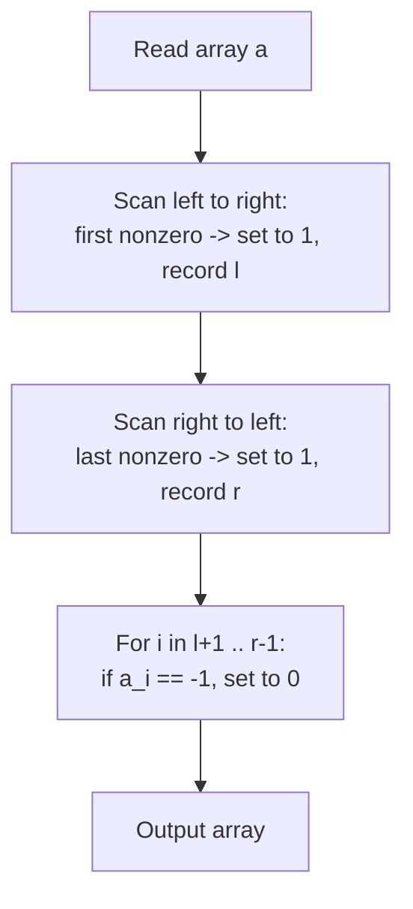

# CF 2259C — "101" (Codeforces Round 1119, Div. 3)

**Problem:** [codeforces.com/contest/2259/problem/C](https://codeforces.com/contest/2259/problem/C)
**Accepted submission:** [codeforces.com/contest/2259/submission/389699438](https://codeforces.com/contest/2259/submission/389699438)
**Tags:** constructive algorithms, greedy
**Rating:** ~1200 (Div. 3 C)
**Contest attempts:** 3× Wrong Answer → Upsolved same day, 3× Accepted while iterating on style

---

## The Hook


*A magic rat holds a stick that can turn any `-1` biscuit into cheese (`1`) or a
crumb (`0`). The rat wants the biggest possible cheese-to-cheese territory: it
plants exactly two cheese anchors — as far left and as far right as it can reach
— and turns everything strictly between them into crumbs, so no rival, shorter
territory can form in the middle. (Open the SVG directly in a browser tab if it
doesn't animate inline — GitHub's markdown preview sometimes renders embedded
SVGs statically.)*

That's the entire algorithm. The rest of this page is just proving the rat is right.

---

## Problem, In My Own Words

You get an array of length `n` with entries in `{-1, 0, 1}`. Define the *score*
of a fully-`0`/`1` array as the length of the widest window that starts and ends
with `1`, with only `0`s strictly in between (score `0` if no such window
exists). Replace every `-1` with `0` or `1` — any way you like — so that the
resulting array's score is as large as possible. You only need to output *a*
valid array achieving the max score, not the score itself.

Constraints: `n ≤ 2·10^5` per test case, sum of `n` over all test cases
`≤ 2·10^5`, up to `10^4` test cases. (Full statement, constraints, and the
official examples/notes are on the problem page linked above.)

### Sample (from the problem)

```
Input:                          Output:
6                                1 0 0 0 0 1
1 0 -1 0 0 1
7                                0 1 0 0 1 0 1
0 -1 0 0 1 0 1
5                                1 0 0 1 0
-1 0 0 -1 0
...                              ...
6                                1 0 0 0 0 1
-1 -1 -1 -1 -1 -1
```

The all-`-1` case (`n=6`) is exactly the one animated above: both anchors get
created from scratch, and the middle stays crumbs.

---

## Key Observation

The score depends *only* on where the two outermost `1`s end up. Existing `1`s
and `0`s are fixed; you can't touch them. So the whole problem collapses to a
decision about the `-1`s:

- The **leftmost** and **rightmost** nonzero-capable position (i.e. the first
  and last index that is currently `1`, or can become `1`) should be forced
  to `1`.
- Every `-1` strictly **between** them should be forced to `0`.
- Every `-1` **outside** that span (before the left anchor or after the right
  anchor) can be set to anything valid — `0` is simplest and always safe.

You never need to compute or compare candidate window lengths. The construction
*is* the answer.

---

## Why This Is Optimal

Let `l` = index of the first nonzero element after replacement, `r` = index of
the last nonzero element after replacement. The score is at most `r - l + 1`,
since no `1` exists outside `[l, r]`.

- Pushing `l` as far left as possible and `r` as far right as possible can only
  **increase** `r - l + 1` — it never removes an existing `1`, so it's always
  weakly better than leaving an outer `-1` as `0`.
- Once `l` and `r` are fixed, the score is *exactly* `r - l + 1` **only if** no
  interior `-1` is left as a `1`. Any interior `-1` promoted to `1` would only
  split the zero-run into two shorter candidate windows — it can never create a
  window longer than `r - l + 1`, and risks fragmenting it. So setting all
  interior `-1`s to `0` is always at least as good, and simplest.

Both anchors are free wins; nothing in between should ever move. No search, no
comparison of candidate lengths — direct construction from two anchors. This is
the **Anchor-and-Derive** pattern applied outside number theory: find the two
extremal values, derive everything in between deterministically, and don't
simulate the very metric you're trying to optimize. See the technique article
for the general principle.

---

## Code (final AC, cleaned of personal macros)

```cpp
#include <bits/stdc++.h>
using namespace std;

int main() {
    ios::sync_with_stdio(false);
    cin.tie(nullptr);

    int t;
    cin >> t;
    while (t--) {
        int n;
        cin >> n;
        vector<int> a(n);
        for (auto &x : a) cin >> x;

        int l = n, r = -1;
        for (int i = 0; i < n; ++i) {
            if (a[i]) { a[i] = 1; l = i; break; }
        }
        for (int i = n - 1; i >= 0; --i) {
            if (a[i]) { a[i] = 1; r = i; break; }
        }
        for (int i = l + 1; i < r; ++i) {
            if (a[i] == -1) a[i] = 0;
        }

        for (int i = 0; i < n; ++i) {
            cout << a[i] << " \n"[i == n - 1];
        }
    }
    return 0;
}
```

**Edge case to double check:** if the whole array is `-1`s or has no nonzero
element at all, `l` stays `n` and `r` stays `-1`, so the interior loop never
runs — but the two anchor-scan loops still fire (any `-1` counts as truthy, so
the leftmost/rightmost `-1` becomes an anchor `1` regardless). No extra cleanup
pass is needed here, unlike in the earlier WA attempts.

---

## Flowchart



---

## Sample Verification

Test case: `n=5`, `a = [-1, 0, 0, -1, 0]`

- Leftmost nonzero: index 0 (`-1` → `1`), so `l = 0`.
- Rightmost nonzero: index 3 (`-1` → `1`), so `r = 3`.
- No interior `-1`s remain between `l` and `r`.
- Result: `[1, 0, 0, 1, 0]` — matches the sample, score = 4.

Test case: `n=6`, `a = [-1, -1, -1, -1, -1, -1]` (the animated example)

- Leftmost nonzero: index 0 → `l = 0`, set to `1`.
- Rightmost nonzero: index 5 → `r = 5`, set to `1`.
- Interior indices 1–4 are `-1` → set to `0`.
- Result: `[1, 0, 0, 0, 0, 1]` — matches the sample, score = 6.

---

## Pitfall: Anatomy of the 3 Contest WAs

All three contest submissions simulated the *scoring process* instead of directly
constructing the answer — tracking `ans`, candidate boundaries `ll`/`rr`, and
only resolving `-1`s **inside** the window believed to be optimal.

The bug: any `-1` **outside** that discovered window (or all of them, when no
window was ever found — e.g. all-zero arrays) was never touched, so raw `-1`s
leaked into the output. Codeforces' checker caught this directly:

> `wrong answer Integer parameter [name=b[2]] equals to -1, violates the range [0, 1]`

**Lesson:** when a problem only asks for a valid construction, don't simulate
the metric you're optimizing (the score) as an intermediate step — it adds
state, adds bugs, and is usually unnecessary. Also: whenever a solution
"resolves" only a discovered subregion, explicitly check what happens to every
cell outside it. See **Boundary Ghost Values** for the general checklist on
this kind of audit.

---

## Related

- **Anchor-and-Derive** (`Tricks & Techniques/`) — general principle; this
  problem is a worked example outside number theory.
- **Boundary Ghost Values** (`Tricks & Techniques/`) — auditing that every
  array cell has a deterministic fate, not just cells inside a discovered
  window.
- **Trust the Predicate** (`Tricks & Techniques/`) — related instinct: once
  you've proven the optimal construction, act on it directly instead of
  verifying via simulation.
