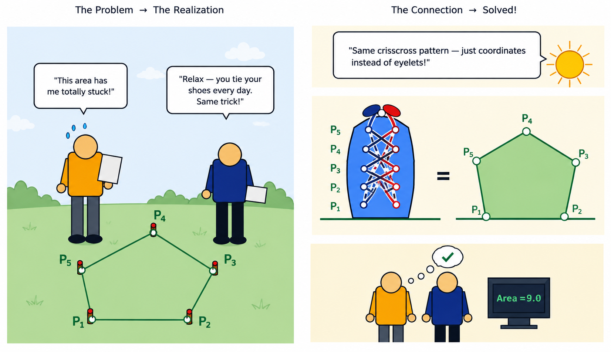
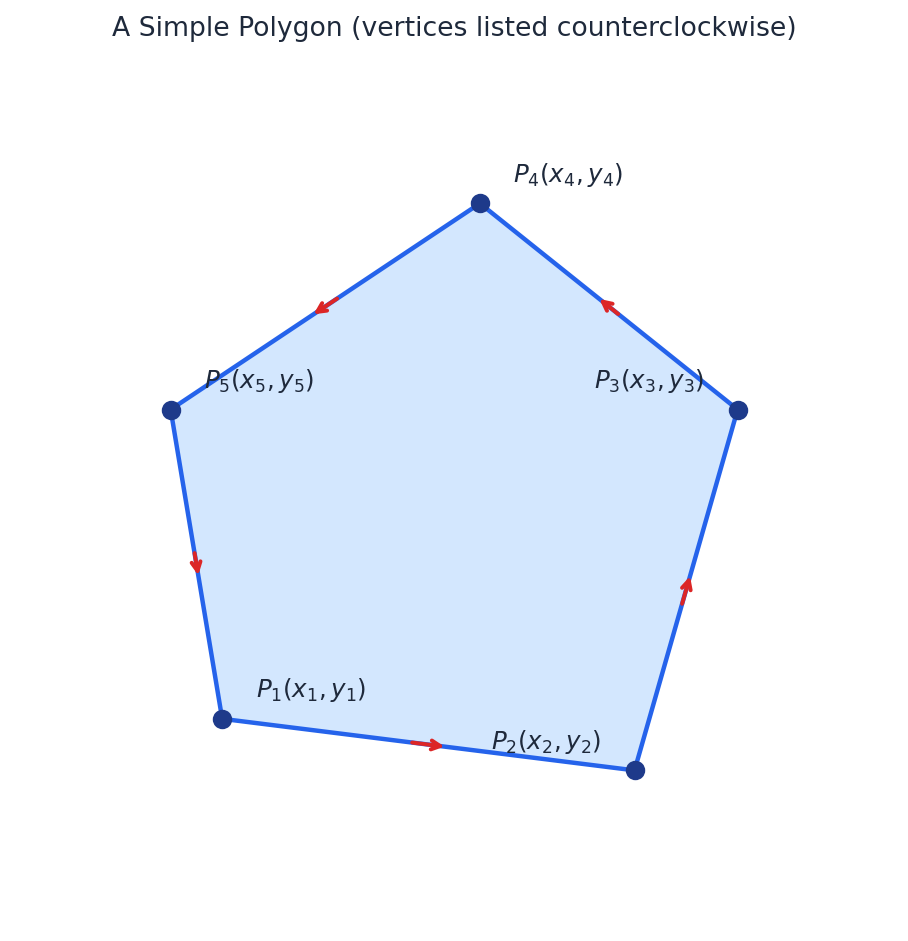
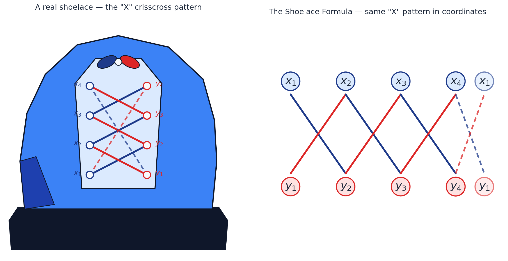
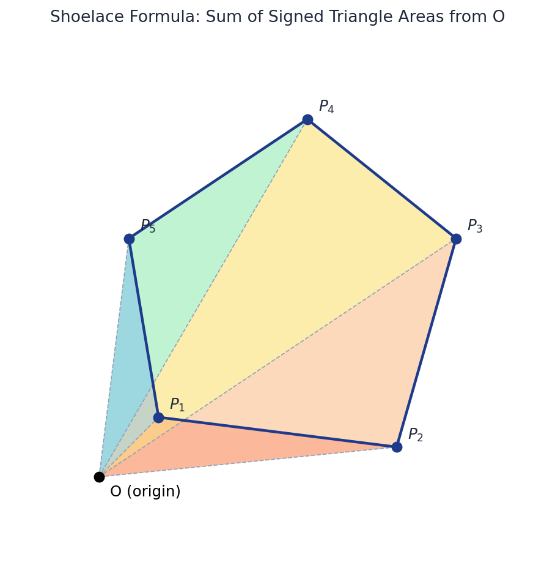
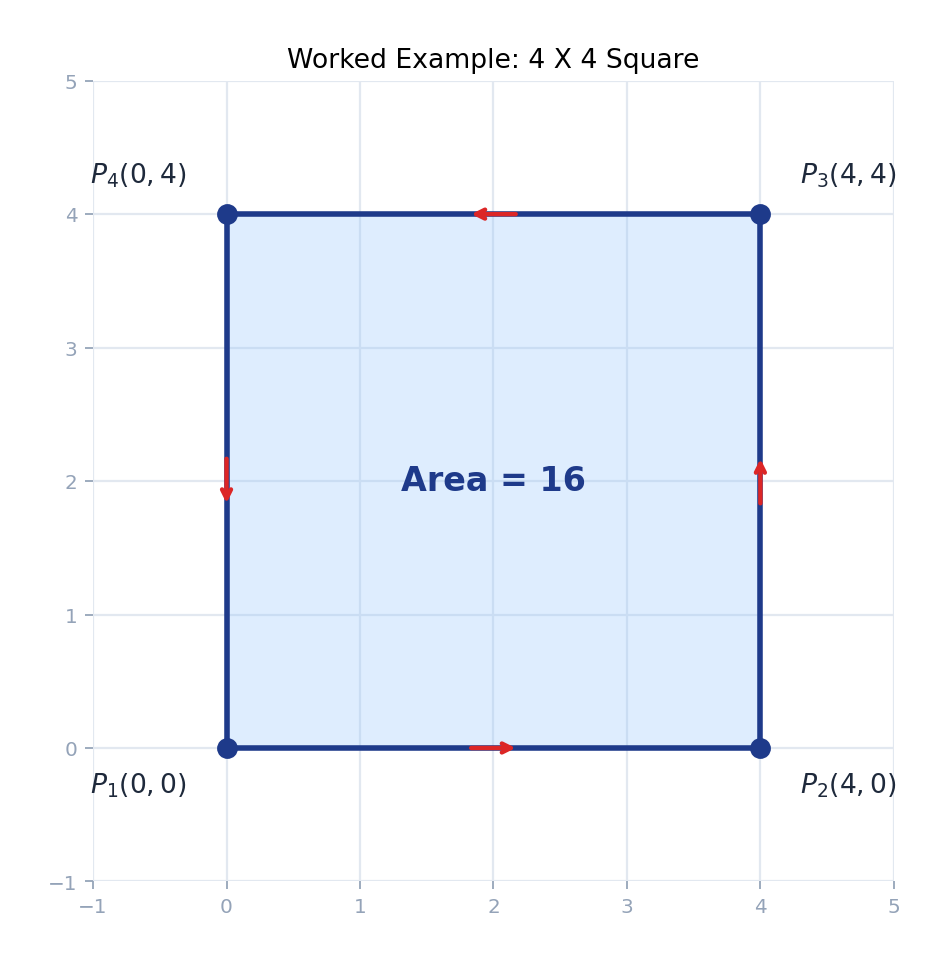
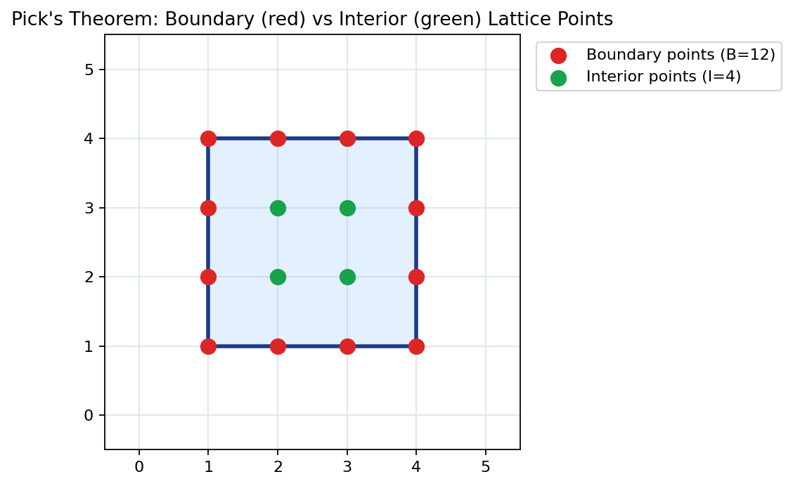
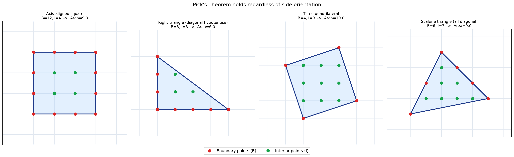

# Shoelace Formula — Computing Polygon Area from Vertex Coordinates

The Shoelace Formula (also called **Shoelace Algorithm**, **Gauss's Area Formula**, or the **Surveyor's Formula**) computes the area of a **simple polygon** directly from the coordinates of its vertices — no need to split it into triangles by hand, no need for trigonometry. Give it the vertices in order, and it gives you the area in one pass.

The name comes from the visual pattern that appears when you write the coordinates in two columns and cross-multiply diagonally — it looks like lacing up a shoe.

---

## 1. The Problem It Solves



You're given the vertices of a polygon, in order (either clockwise or counterclockwise), and you want its area.

```
P1(1,1), P2(5,0.5), P3(6,4), P4(3.5,6), P5(0.5,4)
```



Without the Shoelace Formula, you'd typically triangulate the polygon manually (pick a vertex, fan out triangles to every other vertex, sum their areas) — doable, but tedious and error-prone to code correctly for every polygon shape. The Shoelace Formula gives the same result as one clean summation.

**Requirement:** the polygon must be **simple** — its edges must not cross themselves. A self-intersecting polygon (a figure-eight shape, for example) will give a wrong or meaningless result.

---

## 2. The Formula

For a polygon with vertices $(x_1, y_1), (x_2, y_2), \ldots, (x_n, y_n)$ listed in order (the last vertex connects back to the first):

$$
\text{Area} = \frac{1}{2} \left| \sum_{i=1}^{n} (x_i \cdot y_{i+1} - x_{i+1} \cdot y_i) \right|
$$

where $(x_{n+1}, y_{n+1}) = (x_1, y_1)$ — the sequence wraps around.

Written out for a quadrilateral ($n = 4$), it looks like this "lacing" pattern (hence the name):



```
x1   x2   x3   x4   x1
  \ /  \ /  \ /  \ /
   X    X    X    X
  / \  / \  / \  / \
y1   y2   y3   y4   y1
```

You sum the **downward diagonal products** ($x_1y_2, x_2y_3, \ldots$), subtract the sum of the **upward diagonal products** ($y_1x_2, y_2x_3, \ldots$), then take half the absolute value.

Written out algebraically for $n = 4$, grouped as "all downward products minus all upward products":

$$
\text{Sum} = (x_1y_2 + x_2y_3 + x_3y_4 + x_4y_1) - (y_1x_2 + y_2x_3 + y_3x_4 + y_4x_1)
$$

This is exactly the same sum as the term-by-term version used in the code (Section 4), just grouped differently for readability:

$$
\text{Sum} = (x_1y_2 - y_1x_2) + (x_2y_3 - y_2x_3) + (x_3y_4 - y_3x_4) + (x_4y_1 - y_4x_1)
$$

Both groupings give the identical value — the first is easier to see as "two diagonal sums," which matches the lacing picture directly; the second is closer to how the loop actually gets coded, one $(x_iy_{i+1} - y_ix_{i+1})$ term computed and accumulated per iteration. Area is then:

$$
\text{Area} = \frac{1}{2}|\text{Sum}|
$$

---

## 3. Why It Works — The Geometric Intuition

Pick any point $O$ (the origin is easiest) and draw a line from $O$ to every vertex of the polygon. This splits the polygon into $n$ triangles, one per edge: $\triangle OP_1P_2, \triangle OP_2P_3, \ldots, \triangle OP_nP_1$.



Each triangle $\triangle OP_iP_{i+1}$ has a **signed area** of:

$$
\frac{1}{2}(x_i \cdot y_{i+1} - x_{i+1} \cdot y_i)
$$

"Signed" means the value can be positive or negative depending on whether $P_i \to P_{i+1}$ turns counterclockwise or clockwise around $O$. When you walk around the polygon boundary in order and sum these signed triangle areas, the parts of the triangles that fall **outside** the polygon (when $O$ isn't inside it) cancel out automatically, because they get covered once with a positive sign and once with a negative sign. What remains is exactly the polygon's area — this is why the formula works **regardless of where you place $O$**, and using the coordinate origin $(0,0)$ is simply the most convenient choice, not a requirement.

---

## 4. C++ Implementation

Plain C++ code ready to drop into a solution or adapt as needed.

```cpp
#include <bits/stdc++.h>
using namespace std;

double shoelaceArea(vector<pair<int,int>>& pts) {
    int n {(int)pts.size()};
    long long sum {};
    for (int i {}, j; i < n; ++i) {
        j = (i + 1) % n; // wraps to 0 when i = n-1
        sum += (long long)pts[i].first * pts[j].second;
        sum -= (long long)pts[j].first * pts[i].second;
    }
    return abs(sum) / 2.0;
}

int main() {
    vector<pair<int,int>> polygon {{0,0}, {5,0}, {5,5}, {0,5}};
    cout << "Area = " << shoelaceArea(polygon) << '\n';
    return 0;
}
```

**Note on overflow:** individual coordinate products can exceed the range of `int` even when each coordinate itself fits comfortably in `int` — cast to `long long` **before** multiplying, not after, or the multiplication itself overflows before the cast has a chance to help.

---

## 5. Worked Example — Classic Case

A simple square with side length 4, vertices given counterclockwise:

```
P1(0,0), P2(4,0), P3(4,4), P4(0,4)
```

Applying the formula:
Sum = (0·0 − 4·0) + (4·4 − 4·0) + (4·4 − 0·4) + (0·0 − 0·4) = (0) + (16) + (16) + (0) = 32  
Area = 1/2 × |32| = 16

Matches the expected area ($4 \times 4 = 16$) — a good check to build confidence before trusting it on irregular shapes.



---

## 6. Real-Life Cases

- **Land surveying** — this formula's oldest and most literal application: computing the area of an irregularly-shaped plot of land given GPS or theodolite coordinates of its corners. This is where the name "Surveyor's Formula" comes from.
- **GIS and mapping software** — computing the area of a country, lake, or region outlined as a polygon on a map.
- **Computer graphics** — determining whether a polygon is defined clockwise or counterclockwise (Section 7), which affects rendering and normal-vector calculations.
- **Competitive programming** — any problem that gives polygon vertices and asks for enclosed area; often combined with **Pick's Theorem** (Section 8) when the problem involves lattice points.

---

## 7. Orientation Comes for Free

Before taking the absolute value, the **sign** of the sum tells you the winding order of the vertices:

- **Positive sum** → vertices are listed **counterclockwise**
- **Negative sum** → vertices are listed **clockwise**

```cpp
long long signedSum = 0; // same loop as before, but don't take abs() yet
// signedSum > 0  -> counterclockwise
// signedSum < 0  -> clockwise
// signedSum == 0 -> degenerate (collinear points, zero area)
```

This is a useful side effect to remember — some problems explicitly ask you to determine or enforce a polygon's orientation, and you get the answer for free from the same computation you were already doing for area.

---

## 8. Related Technique: Pick's Theorem

### 8.1 What is a lattice point?

A **lattice point** is simply a point where both coordinates are integers — imagine graph paper, and every intersection of the grid lines is a lattice point: $(0,0)$, $(1,0)$, $(2,3)$, and so on. A point like $(1.5, 2)$ is **not** a lattice point.

### 8.2 What do I and B mean?

Suppose a polygon's corners all sit exactly on grid intersections. Now look at **every** grid dot, not just the corners:

- **B (Boundary points)** — every grid dot lying exactly **on an edge** of the polygon, including the corners themselves.
- **I (Interior points)** — every grid dot lying strictly **inside** the polygon, not touching any edge.

**Pick's Theorem** says these two counts, together, determine the area exactly:

$$
\text{Area} = I + \frac{B}{2} - 1
$$

### 8.3 Worked Example

Take a simple square with corners at $(1,1)$, $(4,1)$, $(4,4)$, $(1,4)$ — side length 3.



Counting the dots directly from the picture:

- Red dots on the edges (including corners): **B = 12**
- Green dots strictly inside: **I = 4**

Plugging into the formula:

$$
\text{Area} = I + \frac{B}{2} - 1 = 4 + \frac{12}{2} - 1 = 4 + 6 - 1 = 9
$$

This matches the actual area of the square ($3 \times 3 = 9$) — confirming the theorem on a shape simple enough to verify by eye.

### 8.4 Why This Pairs With the Shoelace Formula

Pick's Theorem relates three quantities: Area, I, and B. A typical CP problem hands you the polygon's vertices and asks for **I** or **B** — but not Area directly. So the usual workflow is:

1. Compute **Area** from the vertices using the **Shoelace Formula**.<br>
2. Compute **B** directly: for each edge between two consecutive vertices, the number of lattice points lying on that edge (excluding one shared endpoint, to avoid double-counting corners) is $\gcd(|x_i - x_{i+1}|,\ |y_i - y_{i+1}|)$. This trick works because a straight lattice-to-lattice segment's interior lattice points are exactly the divisions marked by their step's greatest common divisor — each unit step of size $(\Delta x/\gcd,\ \Delta y/\gcd)$ lands on another lattice point, so trusting $\gcd(|x_i - x_{i+1}|,\ |y_i - y_{i+1}|)$ per edge is safe. Summing this over all edges gives the total B. <br>
_**Note**: First, try to compute **B** on your own. If needed, refer to the **boundary()** function in the solution to Polygon Lattice Points (Section 10)._<br> 
3. Solve Pick's Theorem for the missing quantity, e.g.:

$$
I = \text{Area} - \frac{B}{2} + 1
$$

<br>  _**Note**: Since **I** is always an integer, you need to avoid floating-point arithmetic even though the formula contains B⁄2. First, think about how to handle this on your own. If needed, refer to the **relevant functions** in the solution to Polygon Lattice Points (Section 10)._

This is a strong pattern to recognize — whenever a CP problem mentions **both** a polygon and lattice/grid points, Shoelace Formula + Pick's Theorem used together is very often the intended approach.

### 8.5 Pick's Theorem Generalized

Consider the example shown in the section 8.3. This result isn't special to axis-aligned shapes. Pick's Theorem holds for any simple polygon whose vertices are lattice points — including polygons with diagonal, non-horizontal, non-vertical sides. The only difference is that counting boundary points along a diagonal edge takes a bit more care than a horizontal or vertical one (handled by the gcd trick above), but the theorem itself applies exactly the same way. See the image below for a few examples of differently-shaped lattice polygons, each still satisfying -

$$
I = \text{Area} - \frac{B}{2} + 1
$$



---

## 9. Pitfalls to Watch For

1. **Self-intersecting polygons** — the formula assumes a simple polygon. If edges cross, the result is not the visual area of the shape and shouldn't be trusted.
2. **Integer overflow** — always accumulate the sum in `long long`, and cast operands to `long long` *before* multiplying.
3. **Off-by-one in the wrap-around** — forgetting that the last vertex connects back to the first is the most common implementation mistake. Using `(i + 1) % n` (as in the code above) avoids this entirely.
4. **Degenerate input** — if all points are collinear, the signed sum is 0 and the "polygon" has zero area. Not a bug — a correct outcome worth recognizing rather than debugging.

---

## 10. Practice Problem Set

Problems below all live in the same neighborhood — computational geometry problems solvable directly with the Shoelace Formula and/or Pick's Theorem from this article. Try each with the techniques above before looking at any editorial.

| # | Problem | Short Description | Guidance |
|---|---|---|---|
| 1 | [Polygon Area](https://cses.fi/problemset/task/2191) | Given a simple polygon's vertices, compute its area. | _Hint:_ A direct application of Section 2 — implement the sum exactly as shown, but note the problem wants `2 × area` printed as an integer, not the halved value. <br><br> _Solution:_ [⏎](https://github.com/Mojahidul21/My-Competitive-Programming-Journey/blob/main/Theorem/Shoelace%20Formula/Solution%20of%20Practice%20Problem%20Set/Polygon%20Area.cpp) |
| 2 | [Polygon Lattice Points](https://cses.fi/problemset/task/2193) | Given a lattice polygon, find the number of interior and boundary lattice points. | _Hint:_ This is Section 8 end-to-end: Shoelace Formula for Area, the gcd trick for B, then solve Pick's Theorem for I. <br><br> _Solution:_ [⏎](https://github.com/Mojahidul21/My-Competitive-Programming-Journey/blob/main/Theorem/Shoelace%20Formula/Solution%20of%20Practice%20Problem%20Set/Polygon%20Lattice%20Points.cpp) |

---

## 11. Summary

| Aspect | Detail |
|---|---|
| Input | Ordered vertices of a simple polygon |
| Output | Area (and, as a side effect, orientation) |
| Time complexity | O(n) — single pass |
| Requires | Polygon must be simple (non-self-intersecting) |
| Common pairing | Pick's Theorem, when lattice points are involved |
| Core pitfall | Integer overflow — always use `long long` |
