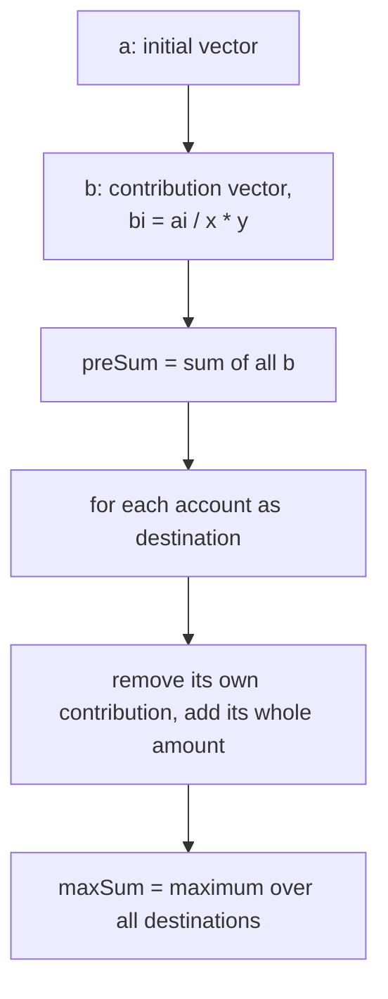

# Codeforces 2194B - Offshores: Upsolve

| | |
|---|---|
| **Problem** | Codeforces Round 1078 (Div. 2), problem B — *Offshores* |
| **Tags** | `greedy` `implementation` `math` |
| **Rating** | ★1000 |
| **Idea** | One single pass of `n-1` accounts into a destination account; total contribution computed once |
| **Complexity** | O(n) time, O(n) memory |

> [!TIP]
> Choose a destination. Each of the other `n-1` accounts sends `a[i]/x` transfers straight to it, and each transfer is worth `y`. Compute the contribution of **all** `n` accounts once (`preSum`), then in one pass, for every possible destination `i`, swap its own contribution for its whole amount: `preSum + a[i] - b[i]`. Keep the maximum.

---

## 1. The problem in one breath

`n` banks hold `a[i]` rubles. A transfer takes exactly `x` from one bank and credits only `y ≤ x` to another. Find the largest amount that can end up in a single bank.

---

## 2. Why shifting more than once is a looser move

Suppose money goes `j → k → destination`. Every hop takes `x` and delivers only `y ≤ x`, so a chunk that hops twice is taxed twice. Sending the same money **directly** from `j` to the destination is taxed once.

There is one more thing that makes an intermediary look attractive. Account `k` has a remainder `a[k] % x` that is too small to send. If `j` deposits into `k`, that remainder might grow into a full chunk, and `k` could send one **extra** transfer to the destination. So the intermediary seems to rescue `k`'s stuck remainder.

Let us count exactly what one chunk of `j` can give the destination.

**Direct:** `j` sends one chunk (`x` leaves `j`), and the destination gets

```
y
```

**Via k:** `j` sends one chunk (`x` leaves `j`), and `k` receives `y`:

```
a[k]  ->  a[k] + y
```

The number of whole chunks `k` can send changes from `⌊a[k]/x⌋` to `⌊(a[k]+y)/x⌋`. Since `y ≤ x`, this rises by **at most 1**:

```
⌊(a[k] + y) / x⌋  ≤  ⌊a[k] / x⌋ + 1
```

So `k` can send at most **one extra** chunk, and that chunk delivers `y` to the destination. Then the destination gets, from this one chunk of `j`:

```
at most y
```

That is exactly what the direct transfer already gave. So:

- the rescue can at best **tie** with direct sending, and it never gains;
- if the deposit does not complete a chunk in `k` (the floor does not rise), the destination gets **nothing**, and `j`'s chunk is wasted;
- a longer chain `j → k → l → …` only repeats the same argument at every hop.

So:

- an intermediary shift is a **looser** move — it can never beat the direct one, even when it seems to rescue a remainder;
- we do not need to think about intermediaries at all.

That leaves a simple picture: the destination is fixed, and every other account sends to it **directly, one transfer at a time** (each transfer respecting the rule "`x` leaves, `y` arrives").

___

## 3. One pass over the `n-1` sources

Take destination `d`. The other `n-1` accounts — the destination is *not* counted among them — each do:

```
account i sends floor(a[i] / x) transfers  ->  destination receives floor(a[i] / x) * y
```

The remainder `a[i] % x` is too small for a transfer and stays behind. The destination itself sends nothing and keeps its full `a[d]`:

```
answer(d) = a[d] + sum over i != d of ( a[i] / x * y )
```

In my code the term `a[i] / x * y` is stored in the **contribution vector** `b`, while `a` is the **initial vector**.



## 4. Avoid redundant summing — think prefix sum here

Evaluating `answer(d)` literally means summing `n-1` terms for every `d`:

```
for d in 1..n:            // n destinations
    for i != d: sum b[i]  // n work each   -> O(n²)
```

That is too slow for `n = 2·10⁵`. This is the exact place to think of **prefix (total) sum**: calculate the contribution of **all `n` accounts first**, once.

```
preSum = b[1] + b[2] + ... + b[n]
```

Then a destination `d` only needs an *adjustment*: its own contribution was counted in `preSum`, but the destination sends nothing, so replace it by its whole amount:

```
answer(d) = preSum + a[d] - b[d] 
```

Because `b` already holds every contribution, the adjustment needs no division at all — just read `b[d]` back. One pass through the `n` accounts tracking the maximum gives the result. Not doing this — re-summing per candidate, or sorting and patching sums — is what made this problem tricky.

## 5. The tempting trap: "keep some amount so the big account is round"

A natural tendency: if an account holds a large amount, add or keep something so that it becomes a multiple of `x`, so "nothing is wasted". Try `x = 5, y = 4`, `a = 10 9 8 7`:

| Choice | `b` total (`preSum` = 8+4+4+4 = 20) | Result |
|---|---|---|
| ❌ Round account `10` (remainder 0) | `20 + 10 - 8` | 22 |
| ✅ "Ugly" account `9` (remainder 4) | `20 + 9 - 4` | **25** |

**Why rounding is not beneficial.**

- Waste happens only in the **sources**: their remainder can't move, and each transfer they do make is taxed by `x - y`.
- The **destination** never transfers, so its remainder is not wasted — it is kept whole. Making it "round" fixes a problem it doesn't have.
- To round it up you'd have to receive more (each arrival is already taxed), and to round it down you'd have to send (another taxed transfer). Either way you lose.
- What the destination really saves is `a[d] - b[d]`: its remainder **plus** the tax it avoids on its own transfers. That is exactly the term the loop maximizes.

## 6. Solution

```cpp
#include<bits/stdc++.h>
using namespace std;
main(){
    int t;
    cin>>t;
    while(t--){
        int n,x,y;
        cin>>n>>x>>y;
        
        vector<int>a(n);
        for(auto&ai:a)cin>>ai;
 
        vector<int>b(n);
        for(int i{};i<n;++i)b[i]=a[i]/x*y;
 
        long long preSum{accumulate(b.begin(),b.end(),0ll)},maxSum{};
        for(int i{};i<n;++i)maxSum=max(maxSum,preSum+a[i]-b[i]);
        cout<<maxSum<<'\n';        
    }
}
```

## 7. Code explained with its own names

| Name | Role |
|---|---|
| `t` | number of test cases |
| `n, x, y` | accounts, amount that leaves per transfer, amount that arrives |
| `a` | **initial vector** — what each account starts with |
| `b` | **contribution vector** — `b[i] = a[i]/x*y`, what account `i` delivers if it is a source (integer division first = whole transfers only) |
| `preSum` | contribution of **all `n`** accounts, summed once; `0ll` makes the sum 64-bit |
| `i` | index of the account currently being tried as the destination |
| `a[i]` | its whole amount, which it keeps if it is the destination |
| `b[i]` | its own contribution, to be removed from `preSum` |
| `maxSum` | best total seen over all destinations; the printed answer |

Line by line:

- `b[i]=a[i]/x*y` — single-pass contribution of every account.
- `preSum{accumulate(...)}` — the total, computed once, so no candidate needs an inner loop.
- `preSum+a[i]-b[i]` — adjust the self contribution to the entire amount: add `a[i]`, take back `b[i]`.
- `maxSum=max(...)` — one pass, track the best.

**Check**, -  
**sample 1** (`x=5, y=4`, `a = 10 9 8 7`): `b = 8 4 4 4`, `preSum = 20`; candidates `22, 25, 24, 23`; max **25** ✔.  
**Sample 6** (`x=15, y=10`, `a = 45 44`): `b = 30 20`, `preSum = 50`; candidates `65, 74`; max **74** ✔.

**Overflow**, each `b[i] ≤ 10⁹` fits `int`, but `preSum` reaches about `2·10¹⁴`, so it must be `long long`. Since `preSum` is `long long`, the whole expression `preSum+a[i]-b[i]` is evaluated in 64-bit.

## 8. General tendencies that fail

- **Sorting the accounts by remainder (or a mixed score) and trusting the first.** It passes the samples but fails a tiny exhaustive test, because the benefit of being the destination has two parts (remainder and avoided tax), and one sort key can't weigh both.
- **Patching sums while walking.** Recomputing or adjusting sums per account instead of one `preSum` makes the logic tangled and easy to get wrong.
- **Trying to fix the destination's remainder** (Section 5).

When test 2 is a big list of tiny cases, read the first differing index and hand-simulate exactly that case.

## 9. Practice and links

| Problem | Related idea | Link |
|---|---|---|
| _TBD_ | total sum, then adjust one element | _TBD_ |

- [Problem](https://codeforces.com/contest/2194/problem/B)
- [AC Solution](https://codeforces.com/contest/2194/submission/392695483)
