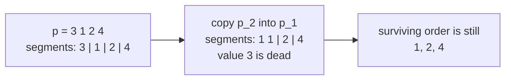
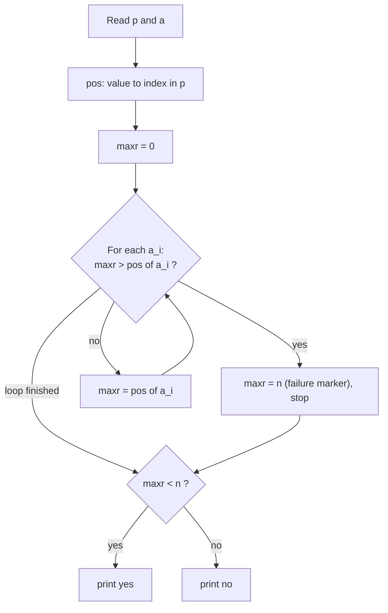

# Codeforces 2197B — Array and Permutation

| | |
|---|---|
| **Contest** | Codeforces Round 1079 (Div. 2) |
| **Problem** | [2197B: Array and Permutation](https://codeforces.com/contest/2197/problem/B) |
| **Rating** | *1100 |
| **Tags** | `implementation` `schedules` `sorting` `two pointers` |
| **Accepted submission** | [392386750](https://codeforces.com/contest/2197/submission/392386750) |
| **Core idea** | Copying a neighbour never changes the relative order of the values that survive, so the positions in `p` of the values along `a` must be non-decreasing |

---

## Problem

Given a permutation `p` and an array `a` (both of length `n`), one operation picks two **adjacent** cells and copies one into the other (`p_i := p_{i+1}` or `p_{i+1} := p_i`). Decide whether `a` can be obtained from `p` with any number of operations.

---

## Key insight: a copy moves a border

Do not picture the operation as "overwrite a cell". Picture the array as consecutive **segments**, one per value of `p`, and the operation as **moving the border between two neighbouring segments**.



On two neighbours `X | Y`, one operation makes `X` one cell longer and `Y` one cell shorter (or the reverse). Then:

- If `Y` had length 1, it vanishes and can never return.
- Two segments can never jump over each other.

> [!IMPORTANT]
> **Invariant:** the surviving values always keep the same left-to-right order they had in `p`.

### The condition

Let `pos[v]` be the index of value `v` in `p`. Then `a` is reachable **if and only if**

```
pos[a_1] <= pos[a_2] <= ... <= pos[a_n]
```

- **Equal** neighbours belong to the same segment.
- **Larger** neighbours belong to a later segment.
- **Smaller** anywhere means a value would have to cross another one, which is impossible.

This also rules out a value appearing in two separate blocks (`a = 1 2 1` gives positions going up and then back down).

**Why it is sufficient:** every value missing from `a` is swallowed by a neighbour. The survivors keep their order, and their borders can then be slid until each block has the length it has in `a`. A border can always move while both sides keep at least one cell, and every survivor has at least one cell in `a`.



The failure marker works because every real position is at most `n - 1`. So `maxr == n` can only mean "the order was broken".

---

## Walkthrough

**Sample 2:** `p = 3 1 2 4`, `a = 3 4 2 2` → **NO**

| i | a_i | pos[a_i] | maxr before | Result |
|---|-----|----------|-------------|--------|
| 0 | 3 | 0 | 0 | ✅ |
| 1 | 4 | 3 | 0 | ✅ |
| 2 | 2 | 2 | 3 | ❌ `3 > 2`, so `maxr = n`, answer `no` |

`4` is to the right of `2` in `p`, but `a` needs it to the left. That would require a crossing.

**Sample 3:** `p = 1 3 2 5 4`, `a = 3 3 3 5 4` → **YES**

Positions along `a`: `1, 1, 1, 3, 4`. Non-decreasing, so `1` and `2` die and `3` expands.  


---

## Solution

```cpp
#include <bits/stdc++.h>
using namespace std;

main() {
    int t;
    cin >> t;

    while (t--) {
        int n;
        cin >> n;

        vector<int> p(n), a(n);
        for (auto& i : p) cin >> i;
        for (auto& i : a) cin >> i;

        // pos: value -> index of that value inside the permutation p
        map<int, int> pos;
        for (int i{}; i < n; ++i) pos[p[i]] = i;

        int maxr{}; // position (in p) of the previous value of a
        for (int i{}; i < n; ++i) {
            // this value sits to the left of the previous one in p: order broken
            if (maxr > pos[a[i]]) {
                maxr = n; // failure marker, real positions are at most n - 1
                break;
            }

            maxr = pos[a[i]];
        }

        cout << (maxr < n ? "yes" : "no") << '\n';
    }
}
```

**Complexity:** O(n log n) time and O(n) memory over all test cases (sum of `n` ≤ 2·10⁵), because of the `map` lookups.

---

## Reusable lessons

> [!TIP]
> **A copy of a neighbour is a border move.**
> When an operation copies or overwrites an adjacent element, describe the state as ordered segments instead of a list of values. Segments keep their order, cannot cross, and can die.

> [!TIP]
> **Ask "what can never happen?" first.**
> Here the impossible event is two surviving values changing relative order. Once that is the rule, the answer is a simple check.

> [!TIP]
> **Turn an order invariant into a monotone check.**
> Map each element to its index in the reference order and require a non-decreasing sequence. The same trick fits other "reachable by merging or absorbing neighbours" problems.

> [!TIP]
> **An out-of-range value can act as a flag.**
> Setting `maxr = n` (one past the last valid index) marks failure without a separate `bool`. A dedicated `bool ok` is easier to read, so use the sentinel only when it is clearly commented.

> [!TIP]
> **Using fast I/O is a good havit.**
> It will speed up your execution!

> [!WARNING]
> **A simulation that depends on the order of its passes is a red flag.**
> Greedy passes in both directions over shared data usually mean the real rule (an invariant) has not been found yet.

> [!WARNING]
> **Try the smallest crossing case by hand.**
> `n = 2` with swapped values (`p = [1, 2]`, `a = [2, 1]`) refutes most wrong ideas for this problem instantly. Always check `n = 2` and all `n = 3` cases before submitting.
