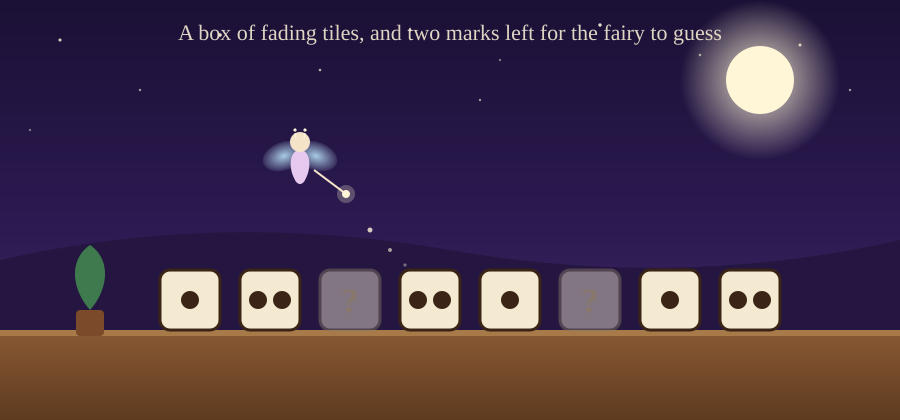
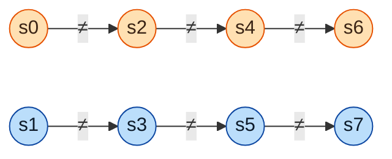
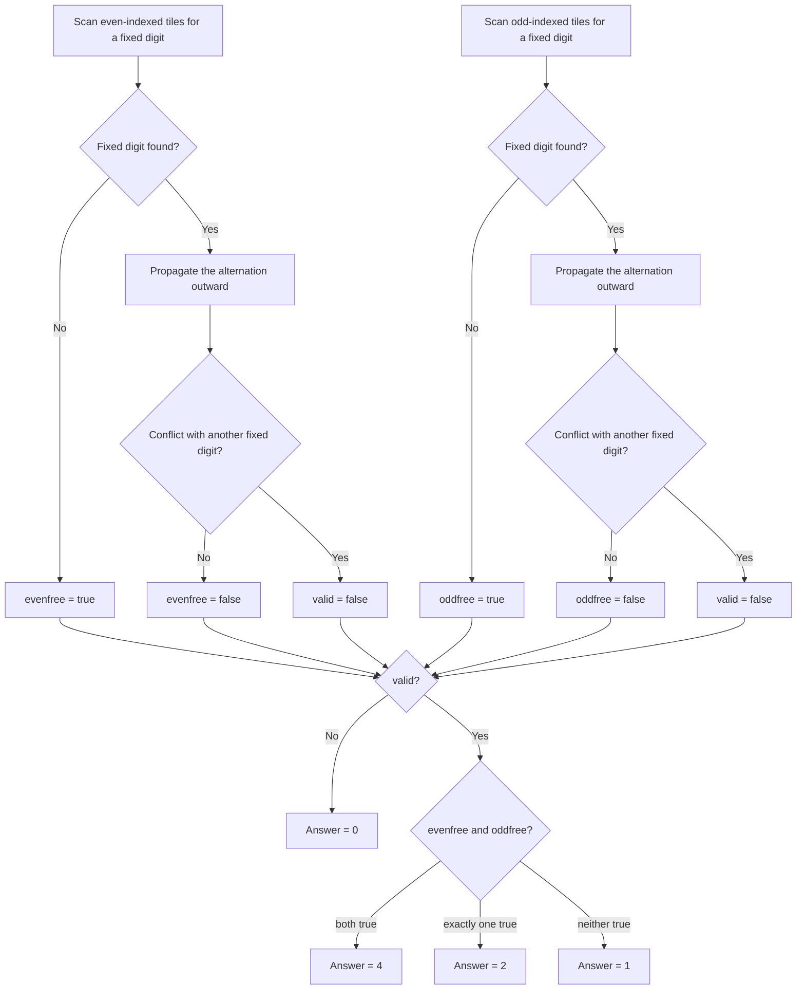

# B. Domino Tiles

**Problem:** [Codeforces 2256B](https://codeforces.com/contest/2256/problem/B) | **AC submission:** [386425561](https://codeforces.com/contest/2256/submission/386425561)



A box of old tiles, a table, and a few marks too faded to read — that's the whole setup. Each tile becomes `0` or `1`; the only rule is that no two neighboring dominoes may share a weight. The question is simply: in how many ways can the fairy fill in the blanks and still keep the row valid?

## The problem, briefly

Given a string `s` of length `n` over `{0, 1, ?}`, replace every `?` with `0` or `1`. For each `i` from `1` to `n-1`, domino `i` has weight `s_i + s_{i+1}`. The completion is valid if every two *consecutive* dominoes have different weights. Count the number of valid completions, mod `998244353`.

## Key observation: the constraint collapses

Domino `i` has weight `s_i + s_{i+1}`. Domino `i+1` has weight `s_{i+1} + s_{i+2}`. Requiring these two weights to differ:

```
s_i + s_{i+1}  ≠  s_{i+1} + s_{i+2}
```

`s_{i+1}` sits on both sides — it cancels, leaving:

```
s_i ≠ s_{i+2}
```

That's the entire problem, distilled to one line. What looked like a rule linking every tile to its immediate neighbor turns out to never involve adjacent tiles at all — it only ever compares a tile to the one **two steps away**.

## Why this splits the row in two

Since the surviving constraint only ever compares `s_i` to `s_{i+2}`, the even-indexed tiles form one chain and the odd-indexed tiles form another, and the two chains never reference each other:



This is a direct instance of the [Parity Chain](https://github.com/Mojahidul21/My-Competitive-Programming-Journey/blob/main/Miscellaneous/CP%20Vocabulary/Programming%20%26%20Problem-Solving%20Vocabulary.md#parity-chain) pattern: a constraint on `i` vs `i+1` simplifies, after algebra, into a constraint on `i` vs `i+2`. Once that happens, a size-`n` problem is really two independent, smaller problems, and the final answer is just the product of their individual counts.

## Counting one chain

Inside a single chain, `s_i ≠ s_{i+2}` for every consecutive pair forces the chain to strictly alternate — `0,1,0,1,...` or `1,0,1,0,...`. Three outcomes per chain:

- **Entirely `?`** — both alternations are possible → **2** ways.
- **At least one fixed character, no conflicts** — the alternation is pinned by that character and propagates outward in both directions → **1** way.
- **Fixed characters that break the alternation somewhere** → **0** ways for the whole answer.

## Deciding the answer

The even and odd chains are checked the same way, independently, and the results are combined at the end:



`evenfree`/`oddfree` stay `true` only while that chain hasn't hit a fixed digit yet — each still-free chain doubles the answer. `valid` turns `false` the moment any chain's alternation is broken, which zeroes out the whole answer regardless of the other chain.

## Solution

Find the first fixed character in a chain, then scan outward from it in both directions, checking the alternation holds:

```cpp
for(int i{};valid&&efree&&i<n;i+=2)
    if(s[i]!='?')
        efree=false,eid=i;

for(int i{eid-2},j{eid!=-1&&s[eid]=='1'};valid&&!efree&&i>-1;i-=2,j=!j)
    if(s[i]==flip[j])
        valid=false;

for(int i{eid+2},j{eid!=-1&&s[eid]=='1'};valid&&!efree&&i<n;i+=2,j=!j)
    if(s[i]==flip[j])
        valid=false;
```

The odd chain (starting at index `1`) is checked the same way. Once both chains are scanned, the answer follows directly from `valid`, `efree`, and `ofree`:

```cpp
cout<<(!valid?0:efree&&ofree?4:efree||ofree?2:1)<<endl;
```

Each test case is a single `O(n)` pass, well within the `Σn ≤ 2·10^5` limit.
