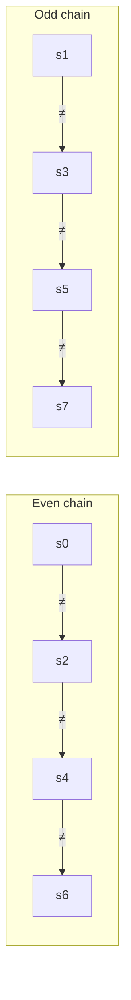

# B. Domino Tiles

**Problem:** [Codeforces 2256B](https://codeforces.com/contest/2256/problem/B) | **AC submission:** [386425561](https://codeforces.com/contest/2256/submission/386425561)

## The problem

A string `s` of length `n` over `{0, 1, ?}` represents a row of tiles. Every `?` must be replaced by `0` or `1`. Each adjacent pair `(s_i, s_{i+1})` forms a domino with weight `s_i + s_{i+1}`, and the row is valid if every two *consecutive* dominoes have different weights. Count the number of valid completions, mod `998244353`.

## Key observation: the constraint collapses

Domino `i` has weight `s_i + s_{i+1}`. Domino `i+1` has weight `s_{i+1} + s_{i+2}`. Requiring these to differ gives:

```
s_i + s_{i+1}  ≠  s_{i+1} + s_{i+2}
```

`s_{i+1}` is on both sides — it cancels, leaving:

```
s_i ≠ s_{i+2}
```

That's the whole problem, distilled. What looked like a constraint linking every tile to its immediate neighbor turns out to never involve adjacent tiles at all — it only ever compares a tile to the one **two steps away**.

## Why this splits the problem in two

If the only real constraint is `s_i ≠ s_{i+2}`, then even-indexed positions form one chain, odd-indexed positions form another, and the two chains never touch:



This is a direct instance of the [Parity Chain](https://github.com/Mojahidul21/My-Competitive-Programming-Journey/blob/main/Miscellaneous/CP%20Vocabulary/Programming%20%26%20Problem-Solving%20Vocabulary.md#parity-chain) pattern: a constraint on `i` vs `i+1` simplifying, after algebra, into a constraint on `i` vs `i+2`. Once that happens, the size-`n` problem is really two independent, smaller problems, and the final answer is just the product of their individual counts.

## Counting one chain

Inside a single chain (say the even one), `s_i ≠ s_{i+2}` for every consecutive pair forces the chain to strictly alternate — `0,1,0,1,...` or `1,0,1,0,...`. Three outcomes per chain:

- **Entirely `?`** — both alternations are possible → **2** ways.
- **At least one fixed character, no conflicts** — the alternation is pinned by that character and propagates outward in both directions → **1** way.
- **Fixed characters that break the alternation somewhere** → **0** ways for the whole answer.

## Solution

Find the first fixed character in a chain, then scan outward from it in both directions, checking the alternation holds:

```cpp
for(int i{};valid&&efree&&i<n;i+=2)
    if(s[i]!='?')
        efree=false,eid=i;

for(int i{eid-2},j{eid!=-1&&s[eid]=='1'};valid&&!efree&&i>-1;i-=2,j=!j)
    if(s[i]==flip[j])
        valid=false;

for(int i{eid+2},j{eid!=-1&&s[eid]=='1'};valid&&!efree&&i<n;i+=2,j=!j)
    if(s[i]==flip[j])
        valid=false;
```

The odd chain (starting at index `1`) is checked the same way. Once both chains are scanned:

```cpp
cout<<(!valid?0:efree&&ofree?4:efree||ofree?2:1)<<endl;
```

`efree`/`ofree` flag whether a chain was entirely `?` (a factor of 2 each); `valid` flags whether any chain's alternation was broken (forcing the whole answer to 0). Each test case is a single O(n) pass, well within the `Σn ≤ 2·10^5` limit.
