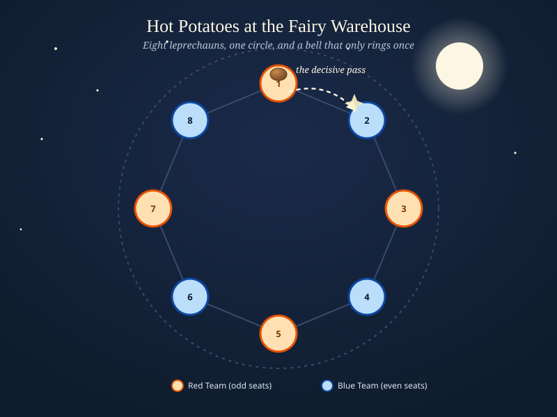
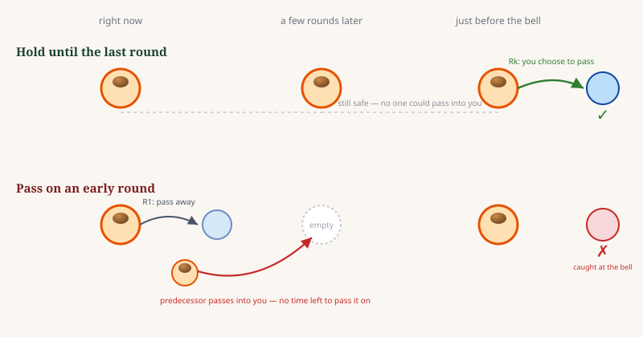
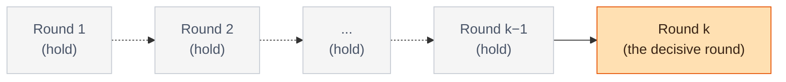
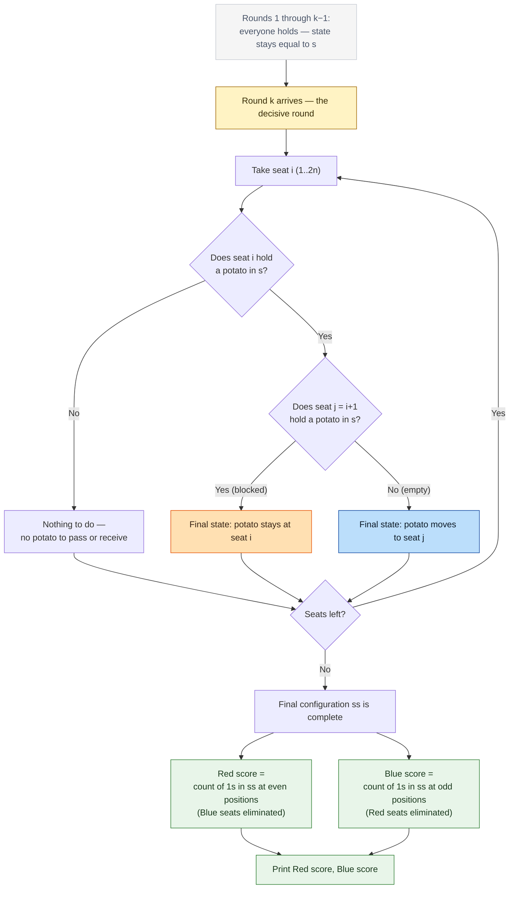

# C. Hot Potatoes at the Fairy Warehouse

**Problem:** [Codeforces 2256C](https://codeforces.com/contest/2256/problem/C) | **AC Submission:** [386578511](https://codeforces.com/contest/2256/submission/386578511)



Eight leprechauns, one circle, and a bell that only rings once — that's the whole setup. Every round, everyone holding a potato quietly decides whether to keep it or hand it to their neighbor. `k` can be as large as `10^9`. And yet, as the AC code below shows, the number of rounds never once gets read into a variable that matters. The entire game boils down to a single decisive moment.

## The problem, briefly

`2n` leprechauns sit in a circle, numbered `1` to `2n` clockwise. Odd numbers are Red Team, even numbers are Blue Team. Some of them start holding a potato. For `k` rounds, every current holder simultaneously chooses to **keep** their potato or **pass** it to the next leprechaun clockwise — but only if that next seat is empty *at the start of the round*. After round `k`, whoever is still holding a potato gets eliminated. A team's score is the number of the *other* team's leprechauns eliminated. Both teams play optimally, cooperating fully within their own team. Find both final scores.

## Key observation: every pass crosses the aisle

Seats alternate Red, Blue, Red, Blue, ... around the circle. So passing a potato clockwise always sends it from one team's leprechaun straight into the other team's next seat. There's no such thing as a "friendly" pass — every single hand-off is an attempt to make the danger someone else's problem. That reframes the whole game: each individual holder, cooperating with their team, wants to end the game *not* holding a potato, ideally by having pushed it across to the opponent before the bell.

## The insight: only the last round can change anything

Here's the part that makes `k` up to `10^9` almost irrelevant. Think about it from a single holder's point of view, deciding whether to pass **now** or wait:

- **Holding your potato blocks your neighbor from dumping one on you.** As long as you keep it, your seat stays occupied — nobody behind you gets a chance to pass into you.
- **Holding your potato costs you nothing**, because the seat in front of you can only become occupied through *your own* action. If it's empty now, it stays empty until you decide to move — so you lose nothing by waiting.
- **Passing early is the risky move.** The moment you pass, your own seat opens up. Now your predecessor is free to dump a potato on *you* at any later round — and if that happens with little time left, you're stuck holding it with no chance to pass it on before the bell.

So every rational holder does the same thing: hold, hold, hold — and only at round `k`, the very last one, make the one decision that actually matters, exactly as they would have in round `1` if that had been the last round instead.



Since every holder is following this same logic, **nobody moves during rounds `1` through `k-1`** — the configuration going into the final round is identical to the initial string `s`. Round `k` then plays out exactly like a single, first-round decision made directly on `s`.



Whatever `k` is — `1`, `100`, or `10^9` — the final configuration only ever depends on the *original* string `s`. This is why the AC solution can safely discard `k` the moment it's read.

## From k rounds to one virtual round

Since the state entering round `k` is just `s` itself, the final state is obtained with a single pass over the original string: for every seat `i` currently holding a potato, look only at its original next seat `j = (i+1) mod 2n`.



Why is a blocked pair *permanently* stuck, not just stuck for one round? If `i` and `j = i+1` both start with a potato, neither can ever move: `i` can't pass because `j` is occupied, and `j` can't pass because *its* next seat is a different question entirely, unrelated to `i`. As long as `i` holds, `j` can never receive from `i` — and since nothing changes before round `k` anyway, this deadlock (or whatever `j` independently resolves to) is exactly what's still true at the decisive round.

## Counting the scores

A team's score counts the *other* team's eliminated leprechauns. Since seats strictly alternate by parity, this is just a matter of tallying the final potatoes by seat color and crediting the opposite team:

- A potato that ends up on a **Red seat** → point for **Blue**.
- A potato that ends up on a **Blue seat** → point for **Red**.

## Verifying against the samples

**Example 1** — `n=2, k=1, s=1000`. Seat 1 holds; seat 2 (its next) is empty in `s`, so the potato moves to seat 2 — a Blue seat. Final: only seat 2 holds. Red score = 1 (one Blue eliminated), Blue score = 0. Matches `1 0`.

**Example 2** — `n=2, k=1, s=0011`. Seat 3 holds; seat 4 (next) also holds in `s`, so seat 3's potato is blocked and stays. Seat 4 holds; its next seat (wrapping to seat 1) is empty, so it moves to seat 1. Final potatoes sit on seat 3 and seat 1 — both Red seats. Blue score = 2, Red score = 0. Matches `0 2`.

Both examples hold regardless of what `k` happens to be, exactly as the theory predicts.

## Solution

```cpp
#include<bits/stdc++.h> 
using namespace std;
main(){
    int t;
    cin>>t;

    while(t--){
        int n,rscore{},bscore{};;
        string s;
        cin>>n>>s>>s;

        string ss(n*=2,'0');

        for(int i{},j{(i+1)%n};i<n;j=(++i+1)%n)
            if(s[i]!='0')
                ss[s[j]!='0'?i:j]='1';

        for(int i{1};i<n;i+=2)
            rscore+=ss[i]!='0',bscore+=ss[i-1]!='0';

        cout<<rscore<<' '<<bscore<<endl;
    }
}
```

The `cin>>n>>s>>s` line is the whole insight compressed into two characters: it reads `k` into `s`, then immediately overwrites it with the real string — `k` is read only to be discarded, because by this point in the derivation it has no bearing on the answer at all.

The main loop applies the "look one seat ahead in the original string" rule directly, and the scoring loop tallies by seat parity. One clean `O(n)` pass per test case, well inside `Σn ≤ 10^5`.

## Related

This is a nice companion piece to [Domino Tiles](../B.%20Domino%20Tiles/Approach.md) — both problems look like they demand tracking a process across many steps (`n` characters there, `k` rounds here), and both collapse once you notice the process reduces to a single independent check per element. Domino Tiles collapses a same-index dependency into a two-apart one; Hot Potatoes collapses a `k`-round game into a one-round game. Different mechanisms, same shape of surprise.
