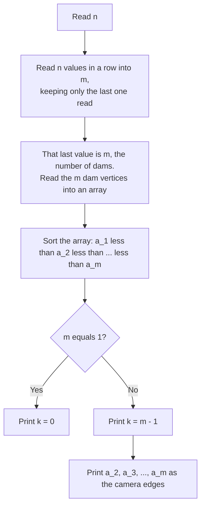
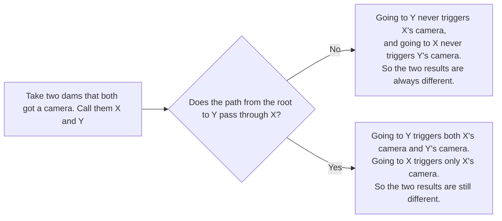

# C. Spying on the Beaver

## Problem brief

A rooted tree, root `1`, `n` vertices, parents given as `p_2, …, p_n` with the
guarantee `p_i < i` (every parent's number is smaller than its child's). `m`
vertices hold beaver dams. We need to place cameras on the fewest possible
edges so that, from the set of camera edges the Beaver crosses on its way
from the root to a dam, we can always tell *which* dam it reached. Output the
minimum number of cameras `k`, and which edges (given as the lower vertex
`u` of the edge `u–parent(u)`).  
> [_CF Problem_](https://codeforces.com/contest/2257/problem/C)

## Key observation

The rule `p_i < i` tells us something for free: **an ancestor's number is
always smaller than its descendant's number.** So just by sorting the dam
vertices, we already know a lot about who could be whose ancestor — without
ever looking at the tree.

Sort the dam vertices from smallest to largest: `a_1 < a_2 < … < a_m`.

Look at `a_1`, the smallest one. Could any other dam be its ancestor? No —
an ancestor would have to have an even smaller number, but `a_1` is already
the smallest. So `a_1` can never be "passed through" on the way to another
dam, and no other dam can be "passed through" on the way to `a_1` either.
It's completely on its own.

That means: if we put a camera above every dam **except `a_1`**, then
reaching `a_1` triggers *no* camera at all — and that "no camera" result
belongs to `a_1` alone, since nothing else can produce it. Every other dam
triggers at least its own camera, so it's never confused with `a_1` or with
each other.

So the answer is simply:

- `k = m - 1`
- Cameras go on the edges directly above every dam except the smallest one.

No tree traversal, no DFS/BFS, not even really needing the parent array.

## Why we can't do better than `m - 1`

"No camera triggered" is one specific outcome. At most **one** dam can be
allowed to produce it — if two different dams both triggered nothing, we
couldn't tell them apart. So at most one dam can go without a camera, and
every other dam needs one. That's `k ≥ m - 1`, always. Since our solution
achieves exactly `m - 1`, it's optimal.

## Code
```cpp
#include<bits/stdc++.h>
using namespace std;
main(){
    int t;
    cin>>t;
    
    while(t--){
        int n,m;
        cin>>n;
        
        while(n--)
            cin>>m;

        vector<int>a(m);
        
        for(auto&i:a)
            cin>>i;
        
        sort(a.begin(),a.end());
        cout<<m-1;
        
        for(int i{1};i<m;++i)
            cout<<' '<<a[i];
        
        cout<<'\n';
    }
}
```
Walking through it line by line:

- `while(n--) cin>>m;` — the tree structure is never needed, so instead of
  storing the `n-1` parent values, we just read past them. This loop runs
  `n` times, one more than the number of parent values on that line. The
  extra read lands exactly on the next token in the input, which happens to
  be `m`, the number of dams. So after this loop, `m` already holds the
  correct value — nothing extra needs to be done to fetch it.
- `vector<int>a(m); for(auto&i:a) cin>>i;` — read the `m` dam vertices.
- `sort(a.begin(),a.end());` — sort them ascending, so `a[0]` is the
  smallest dam — the one we established can be left without a camera.
- `cout<<m-1;` then the loop from `i=1` to `m-1` — print `k = m-1`, followed
  by every dam **except `a[0]`**, which is exactly the set of vertices that
  get a camera on the edge above them.
 > [_CF Submission_](https://codeforces.com/contest/2257/submission/387498003)

**CF Problem Tags:** dfs and similar, graphs, trees. Worth noticing that
none of these show up anywhere in the code above — the tags describe the
*setting* the problem is dressed up in, not what the solution actually
needs to do.

## Algorithm, visually



Why any two chosen dams stay distinguishable, in plain terms:



## Figure


For `n = 6`, parents `[1,2,2,1,1]`, dams `{1, 3, 5}`: sorted dams are
`1, 3, 5`. We skip `1` and place cameras above `3` and `5`. Reaching `1`
triggers nothing, reaching `3` triggers only the camera above `3`, reaching
`5` triggers only the camera above `5` — three different outcomes, `k = 2`.

## Animation


Same idea, in motion: watch the Beaver visit all three dams in one 9-second
loop, with each camera lighting up only when it's actually triggered.

## Checking it against the sample

| Case | dams (sorted) | our answer | judge's answer | same idea? |
|---|---|---|---|---|
| 1 | `[1]` | `k=0` | `0` | exact match |
| 2 | `[1,2,3]` | `k=2`, edges `2 3` | `2 2 3` | exact match |
| 3 | `[2,3]` | `k=1`, edge `3` | `1 3` | exact match |
| 4 | `[1,3,5]` | `k=2`, edges `3 5` | `2 2 5` | different edges, both correct |

Case 4 shows the judge chose a different (also valid) placement — a camera
above vertex `2` instead of `3`. That still works because `2` sits on the
only path leading into `3`'s side of the tree, so it separates `3` from
everything else just as well. The problem accepts any correct placement;
"camera directly above each non-smallest dam" is just the easiest one to
always get right.

## Related / practice problems

- Any "place the fewest markers so every outcome is uniquely identifiable"
  problem on a tree or DAG. (A **DAG**, short for *Directed Acyclic Graph*,
  is a graph where every edge points in one direction, and following edges
  in their direction can never lead you back to where you started — a
  rooted tree is one example of a DAG.)
- Problems where a numbering rule in the constraints (`p_i < i`, strictly
  increasing timestamps, etc.) quietly replaces the need to build or
  traverse the actual structure — worth checking for before reaching for
  DFS/BFS out of habit
