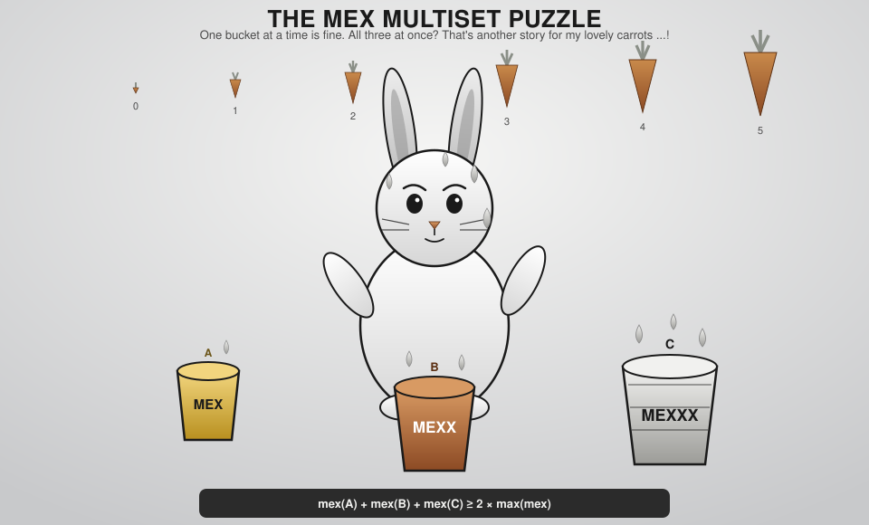
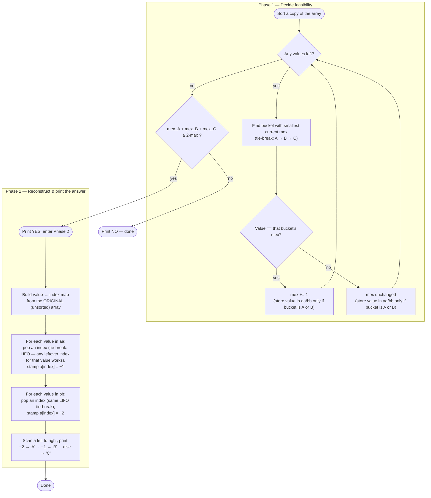
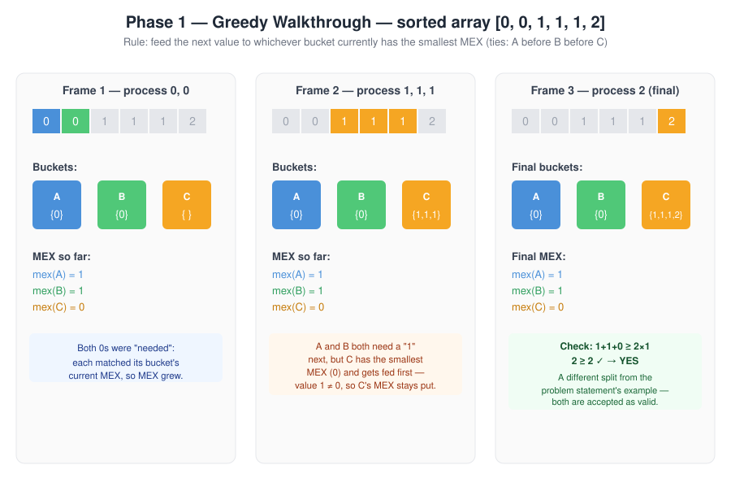
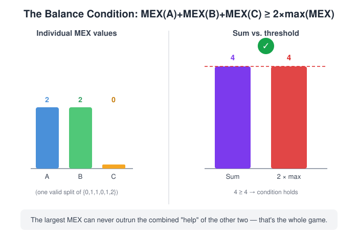
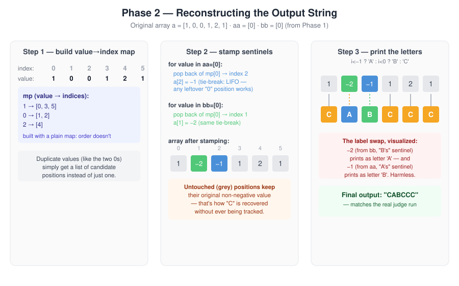

# CF 2259D — MEX Multiset

**Contest:** [Codeforces Round 1119 (Div. 3)](https://codeforces.com/contest/2259)  
**Problem:** [2259D](https://codeforces.com/contest/2259/problem/D)  
**AC Submission:** [389603721](https://codeforces.com/contest/2259/submission/389603721)

> [!NOTE]
> This is an **upsolve** writeup. The approach below is a cleaned-up explanation of my own accepted solution, not a copy of the editorial.

---

## 1. The Problem, Compressed

You're given an array `a` of `n` integers. You must place every element into exactly one of three multisets `A`, `B`, `C`. Let `mex(X)` be the smallest non-negative integer missing from `X`. You need:

```
mex(A) + mex(B) + mex(C)  ≥  2 · max(mex(A), mex(B), mex(C))
```

If it's achievable, print `YES` and one valid assignment; otherwise print `NO`.

**Constraints:** up to `10^4` test cases, `n` up to `2·10^5` total, values up to `10^9`.

> [!IMPORTANT]
> This problem is really **two problems stapled together**, and it's easy to under-weight the second one:
> 1. **Decide** whether a valid split exists at all (a pure math/greedy question).
> 2. **Construct** the actual per-element `A`/`B`/`C` string and print it — which means mapping abstract "this value goes to bucket X" decisions back onto concrete array *positions*, correctly handling duplicates.
>
> Step 2 isn't a formality tacked onto step 1 — it's roughly half the implementation, and it's where the actual submission below spends nearly half its logic. This writeup gives it a full, equal treatment.

---

## 2. Reframing the Condition

`mex` is a small, structured quantity: it only grows when a multiset contains a *contiguous* run `0, 1, 2, …, mex-1`. That structure is what makes this problem tractable — the raw numeric values barely matter past a certain point; only the runs of `0, 1, 2, …` inside each bucket matter.

Let `x ≤ y ≤ z` be the three mex values sorted. The condition

```
x + y + z ≥ 2z
```

simplifies to:

```
x + y ≥ z
```

> [!TIP]
> **Reframe:** the *largest* mex can never exceed the sum of the *other two*. This is a triangle-inequality-flavored balance condition — no single bucket is allowed to run away with all the "progress."

So the real question becomes: **how do we distribute values to keep the three mex counters roughly balanced**, and is the input rich enough (in small values) to allow it? And once we know it's possible — **how do we actually write down a string that proves it?**

---

## 3. The Full Algorithm, in One Flowchart

The diagram below is split into two equal phases on purpose — feasibility and reconstruction get the same visual weight, because they take roughly the same amount of code.



> [!IMPORTANT]
> This greedy is only used to **decide feasibility and produce one valid split** — it does not need to match any "canonical" partition. The problem accepts *any* valid assignment, so a different valid split (like the one shown in the official example) is just as correct as this greedy's output.

---

## 4. Phase 1, Traced by Hand — Test Case 1

Original array: `[1, 0, 0, 1, 2, 1]` → sorted: `[0, 0, 1, 1, 1, 2]`.



Tracing it by hand (tie-break for "smallest current mex" is **A → B → C**, so a three-way tie always goes to `A` first):

| Value processed | Smallest-mex bucket (tie-break A→B→C) | Matches bucket's mex? | mex(A) | mex(B) | mex(C) |
|---|---|---|---|---|---|
| start | — | — | 0 | 0 | 0 |
| `0` | A *(three-way tie, A wins)* | yes | **1** | 0 | 0 |
| `0` | B *(tie between B, C — B wins)* | yes | 1 | **1** | 0 |
| `1` | C *(only C left at 0)* | no (1 ≠ 0) | 1 | 1 | 0 |
| `1` | C | no | 1 | 1 | 0 |
| `1` | C | no | 1 | 1 | 0 |
| `2` | C | no | 1 | 1 | 0 |

Final: `mex(A)=1, mex(B)=1, mex(C)=0`, with `aa=[0]` and `bb=[0]` as the only values Phase 1 actually stores. Check: `1+1+0 = 2 ≥ 2·max(1,1,0) = 2`. ✅ Holds → `YES`.

> [!NOTE]
> The storyboard above draws an explicit "C" bucket for teaching purposes. The actual code never builds that container — it only ever pushes values into `aa` (for `A`) or `bb` (for `B`); `mexc` is tracked as a lone counter, and any value that logically "landed in C" is simply never stored anywhere. `C`'s membership is recovered later, by elimination, in Phase 2.

This differs from the sample explanation's split (`A={0,1,1}, B={0,1}, C={2}`, giving mex values `2,2,0`) — and that's fine. Both satisfy the inequality; the judge is a special checker that verifies the *property*, not a specific labeling.



---

## 5. Phase 2, Traced by Hand — Reconstructing the Output

This is the half of the problem that's easy to gloss over. Phase 1 only tells us `aa=[0]` and `bb=[0]` — two bare *values*, with no idea which of the two original `0`s at indices `1` and `2` belongs to which bucket. Duplicates make this genuinely fiddly, so here's the exact process, matching the real submission line for line.



**Step 1 — build a value → index map from the *original*, unsorted array** `[1, 0, 0, 1, 2, 1]`:

```
1 → [0, 3, 5]
0 → [1, 2]
2 → [4]
```

**Step 2 — stamp sentinels**, popping one index per value out of the map:

- For each value in `aa=[0]`: pop the back of `mp[0]` → index `2`. Set `a[2] = −1`.
  *(Tie-break: when a value has several leftover positions, we always take the last one in the list — LIFO. It doesn't matter which specific occurrence of a duplicate becomes "A" vs. "B" vs. "C", since they're interchangeable, so any consistent pop order is safe.)*
- For each value in `bb=[0]`: pop the back of the now-shrunk `mp[0]` → index `1`. Set `a[1] = −2`.

Array after stamping: `[1, −2, −1, 1, 2, 1]`.

**Step 3 — print**, using `(i < −1 ? 'A' : i < 0 ? 'B' : 'C')` on each position:

| Index | 0 | 1 | 2 | 3 | 4 | 5 |
|---|---|---|---|---|---|---|
| Stamped value | `1` | `−2` | `−1` | `1` | `2` | `1` |
| Printed letter | `C` | `A` | `B` | `C` | `C` | `C` |

Final string: **`CABCCC`** — which is exactly what the real submission printed on this test case.

> [!WARNING]
> **The label swap.** Notice `−2` (which came from `bb`, the "B" list) prints as `'A'`, and `−1` (from `aa`, the "A" list) prints as `'B'`. That's not a typo in this writeup — it's genuinely how the ternary is written in the accepted code. It's harmless *only* because the judge is a special checker that verifies the partition's validity, not a specific letter-to-variable correspondence. If this problem had required matching a fixed labeling convention, this would be an actual bug.

---

## 6. Common Pitfall vs. the Fix (Phase 1)

❌ **Wrong instinct:** always fill `A` first until it's "done," then move to `B`, then `C`.

```cpp
// Greedily dumps everything into A first — ignores balance entirely.
for (int v : sorted_a) {
    if (v == mexA) mexA++;
    A.push_back(v);   // always A!
}
```

This can make `mex(A)` grow arbitrarily large while `mex(B)` and `mex(C)` stay at `0`, instantly violating `x + y ≥ z` the moment `mex(A) > 0`.

✅ **Correct instinct:** always feed the bucket that is currently *behind* (tie-break: **A → B → C**), so no single mex can outpace the sum of the other two. And since `C` is recovered later by elimination, it never needs its own container:

```cpp
for (int v : sorted_a) {
    int m = min({mexa, mexb, mexc});
    if (mexa == m)      { mexa += (v == mexa); aa.push_back(v); }
    else if (mexb == m) { mexb += (v == mexb); bb.push_back(v); }
    else                { mexc += (v == mexc); /* nothing stored for C */ }
}
```

---

## 7. A Detour That Cost Real Time: `unordered_map` and Anti-Hash Attacks

> [!WARNING]
> **Lesson learned:** `unordered_map<int, vector<int>>` was tried in Phase 2 for speed, but it later failed with TLE. Reverted to `map<int, vector<int>>`: `O(log n)` regardless of input, and cheap enough for `n ≤ 2·10^5`.

---

## 8. Complexity

- Sorting the copy: `O(n log n)`.
- Single pass to fill buckets (Phase 1): `O(n)`.
- Reconstruction via value → index map (Phase 2): `O(n log n)` — `map` operations, deliberately not `unordered_map` (see Section 7).

Overall **`O(n log n)`** per test case, well within limits for `Σn ≤ 2·10^5`.

---

## 9. Accepted Code

```cpp
#include<bits/stdc++.h>
using namespace std;
main(){
    int t;
    cin>>t;

    while(t--){
        int n,mexa{},mexb{},mexc{};      // running mex counters for A, B, C
        vector<int>a,aa,bb,aaa;          // a = original array; aa/bb = values routed to A/B; aaa = sorted copy

        cin>>n;
        for(int i{},j;i<n;++i)cin>>j,a.emplace_back(j);

        aaa=a;
        sort(aaa.begin(),aaa.end());     // Phase 1 must see values in increasing order

        for(const auto&i:aaa)
            // feed whichever bucket currently has the smallest mex (tie-break: A → B → C)
            if(mexa==min({mexa,mexb,mexc}))mexa+=i==mexa,aa.emplace_back(i);
            else if(mexb==min({mexa,mexb,mexc}))mexb+=i==mexb,bb.emplace_back(i);
            else mexc+=i==mexc;          // C never stores values — only its mex counter matters

        if(mexa+mexb+mexc<2*max({mexa,mexb,mexc}))cout<<"no";
        else{
            cout<<"yes\n";
            map<int,vector<int>>mp;                       // value -> list of original indices holding it
            for(int i{};i<n;++i)mp[a[i]].emplace_back(i);
            for(const auto&i:aa)a[mp[i].back()]=-1,mp[i].pop_back();  // stamp an A-position (tie-break: LIFO pop, any leftover index works)
            for(const auto&i:bb)a[mp[i].back()]=-2,mp[i].pop_back();  // stamp a B-position (same tie-break)
            for(const auto&i:a)cout<<(i<-1?'A':i<0?'B':'C');          // -2 -> 'A', -1 -> 'B', untouched -> 'C' (see Section 5's label-swap note)
        }

        cout<<'\n';
    }
}
```

---

## 10. Practice Problems (TBD)

| Problem | Rating | Notes |
|---|---|---|
| | | |
| | | |
| | | |

---

## Related

- `Vocabulary` → MEX
- `Vocabulary` → Greedy
- `Vocabulary` → Anti-hash attack on `unordered_map`
- `General Tricks & Techniques` → Sorting for constructive assignment problems
- 
---
