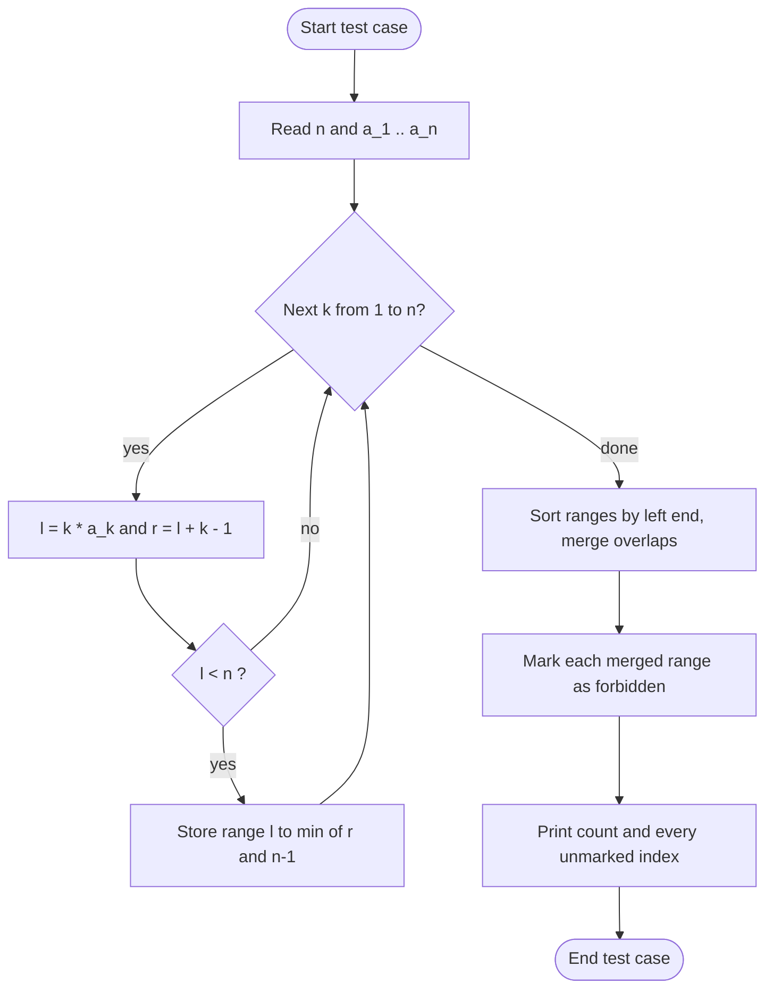

/C1.%20Floor%20of%20MEX%20(Easy%20Version)/assets/26.%20CF%202263C1__hook.svg)
# CF 2263C1 - Floor of MEX (Easy Version)

### Forbid the blocks, merge the ranges, keep the rest

| Field | Value |
|---|---|
| **Platform** | Codeforces |
| **Contest** | Codeforces Round 1120 (Div. 2) |
| **Problem** | [C1. Floor of MEX (Easy Version)](https://codeforces.com/contest/2263/problem/C1) |
| **Tags** | `constructive algorithms` `greedy` |
| **Rating tag** | *1200 |
| **Limits** | 2 seconds, 256 MB |
| **Core idea** | Every `a_k` forbids one block of indices. Keep everything that is not forbidden |
| **Technique** | Interval union (sort and merge) |
| **Complexity** | `O(n log n)` time, `O(n)` memory |
| **Author of this article** | [Ace_Azimuth_Aviator](https://codeforces.com/profile/Ace_Azimuth_Aviator) |
| **Submissions** | [TLE on test 15](https://codeforces.com/contest/2263/submission/392780588) · [Accepted](https://codeforces.com/contest/2263/submission/392890125) |
| **Status** | Solved. Accepted, 93 ms, 3224 KB |

---

## Dedication

This writing is dedicated to [tourist](https://codeforces.com/profile/tourist).

---

## Table of Contents

- [Intro](#intro)
- [Problem in Short](#problem-in-short)
- [Brain Storming](#brain-storming)
- [Approach](#approach)
- [Detect TLE before Getting WA](#detect-tle-before-getting-wa)
- [Flowchart](#flowchart)
- [Example Workout](#example-workout)
- [Simulation](#simulation)
- [Implementation with Code and Explanation](#implementation-with-code-and-explanation)
- [Keep in Vault: Reusable Assets](#keep-in-vault-reusable-assets)
- [Advance Thinking](#advance-thinking)
- [Related Problems to Practice More](#related-problems-to-practice-more)
- [Conclusion](#conclusion)
- [Appendix: Run the Stress Test Yourself](#appendix-run-the-stress-test-yourself)

---

## Intro

The statement looks like a MEX problem, but the MEX never has to be computed. The whole problem collapses once `a_k = m` is read as two plain sentences: "these blocks must contain something" and "this one block must contain nothing". Only the second sentence can hurt you, so you build the biggest set that obeys it.

The second half of the story is about speed. The idea is easy to code as "for each `k`, mark a range". That version is correct and still fails, because the ranges overlap and the same cells get marked again and again. The TLE on test 15 is the real lesson of this problem. That is why this article has two extra sections: how to smell the TLE *before* the judge shows it, and which range-handling idea is worth keeping in the vault.

---

## Problem in Short

Define `f(S, x) = mex({ floor(y / x) : y in S })`.

- Farmer John hides a set `A ⊆ {0, …, n−1}` and gives you only the array `a_k = f(A, k)` for `k = 1..n`.
- Output **any** set `B ⊆ {0, …, n−1}` with `f(B, k) = a_k` for every `k`.
- A valid `B` is guaranteed to exist. `sum of n ≤ 10^5`, `0 ≤ a_i ≤ n`.

> [!NOTE]
> Output format: first line `m = |B|`, second line the elements in any order. If `m = 0`, the second line is empty.

---

## Brain Storming

### Step 1. Translate `a_k = m` into two rules

Fix `k` and cut `0..n−1` into blocks of width `k`. Block `j` is `[j·k, j·k + k − 1]`, and `floor(y / k) = j` exactly when `y` is in block `j`. So `mex = m` says:

1. blocks `0, 1, …, m−1` each contain **at least one** element of `B`, and
2. block `m` contains **no** element of `B`.

/C1.%20Floor%20of%20MEX%20(Easy%20Version)/assets/27.%20CF%202263C1%20_%20Brain%20Storming1.svg)

### Step 2. Compare the two rules

Rule 1 is fuzzy ("at least one, somewhere in this block"). Rule 2 is sharp ("these exact indices are banned"). Now ask what *adding* an element to `B` does:

- It can never break Rule 1, because a nonempty block stays nonempty.
- It can break Rule 2 only if the new element lands in a banned block.

So the safe move is to add everything that is not banned.

### Step 3. Name the banned block

```text
F_k = [ k·a_k , k·a_k + k − 1 ]  ∩  [0, n−1]
```

### Step 4. Collect the bans and keep the rest

`B* = {0..n−1} \ (F_1 ∪ F_2 ∪ … ∪ F_n)`. The figure runs this on sample 3.

/C1.%20Floor%20of%20MEX%20(Easy%20Version)/assets/28.%20CF%202263C1%20_%20Brain%20Storming2.svg)

### Step 5. Why `B*` is correct

Let `B0` be the hidden valid set that the guarantee promises.

- `B0 ⊆ B*`: if some `y ∈ B0` sat in `F_k`, then `floor(y/k) = a_k` would be present, and the mex for that `k` could not be `a_k`.
- `B0` already puts something into blocks `0..a_k−1` for every `k`, and `B* ⊇ B0` keeps that.
- `B*` has nothing inside `F_k` by construction.

Hence `f(B*, k) = a_k` for all `k`.

> [!TIP]
> **Maximality pattern.** When the constraints are "some things must be present, some things must be absent", and presence is *monotone* (more elements never hurt it), the set of everything not forbidden is automatically the best candidate. You never need to know *which* elements the hidden set used.

### Step 6. A free bonus fact

If `a_k ≥ 1`, block `a_k − 1` must contain an index `≤ n−1`, so `(a_k − 1)·k ≤ n − 1`, which gives `k·a_k ≤ n − 1 + k < 2n`. For valid input, `k·a_k` fits in a 32-bit `int`.

---

## Approach

1. For `k = 1..n` compute `l = k·a_k` and `r = l + k − 1`.
2. If `l ≥ n`, the block is outside the array: skip it. Otherwise clip `r` to `n − 1` and keep the range `[l, r]`.
3. Take the **union** of all kept ranges. These indices are forbidden.
4. Print every index in `0..n−1` that is not in the union.

Steps 1, 2 and 4 are `O(n)`. Step 3 is where speed is decided: how you take the union.

---

## Detect TLE before Getting WA

The habit to keep: **doubt, calculate, compare, remedy**, and do it before pressing Submit.

/C1.%20Floor%20of%20MEX%20(Easy%20Version)/assets/29.%20CF%202263C1%20_%20TLE.svg)

### 1. Doubt (read the code, not the verdict)

The first solution painted every block separately:

```cpp
for (int i = 1; i <= n; ++i)
  for (int j = i * a[i-1], k = j + i; j < n && j < k; ++j)
    ans[j] = 0;                       // mark every cell of every block
```

The inner loop can run up to `i` times, and nothing remembers which cells are already marked. Pattern to flag: *inner length grows with the outer index, and the work is "paint a range" with no memory of old paint.*

### 2. Calculate (find the worst valid input)

Ask: **which valid array makes every block long and keeps it inside the array?** Long blocks need big `k`. Staying inside needs small `a_k`.

| Valid array | Block for `k` | Cells touched, `n = 10^5` |
|---|---|---|
| mostly zeros (hidden set `{n−1}`) | `[0, k−1]` | `Σ k ≈ n²/2 ≈ 5.0 · 10⁹` |
| all ones (hidden set `{0}`) | `[k, 2k−1]` clipped | `Σ min(k, n−k) ≈ n²/4 ≈ 2.5 · 10⁹` |

Both arrays are legal, so the judge is allowed to send them.

### 3. Compare with the budget

Roughly `10⁸` to `10⁹` simple steps fit in 2 seconds. `5 · 10⁹` is not a close call.

The judge agreed: test 15 is `n = 100000` with a zeros-heavy array (jury answer `{99999}`), which is exactly the first row of the table.

<details>
<summary>Reference measurement (made by the AI assistant while drafting, not on Codeforces)</summary>

Linux, `g++ -O2`, `n = 10^5`. Absolute times will differ from Codeforces.

| Version | Zeros-heavy | All ones |
|---|---|---|
| paint cells, `vector<bool>` | 10.1 s | 5.0 s |
| paint cells, `vector<int>` | 0.44 s | 0.22 s |
| merge ranges, then paint once | 0.03 s | 0.015 s |

The `vector<int>` row survives because the compiler turns the fill into fast vector stores. A bit-packed `vector<bool>` needs a read-modify-write per cell and dies. Same `O(n²)` algorithm, different constant. **A brute force that is fast on one machine is not evidence of a good algorithm. Trust the operation count.**

</details>

### 4. Remedy

The waste is re-marking cells that are already marked. Make each cell cost `O(1)` in total:

```cpp
// ❌ paints every block separately: total work = sum of block lengths
for (int k = 1; k <= n; ++k)
  for (int j = l_k; j <= r_k; ++j) forbidden[j] = 1;

// ✅ sort ranges by left end, merge overlaps, paint each merged block once
sort(range.begin(), range.end());
//   ... merge, then paint: total work = n + (number of ranges) log (number of ranges)
```

### Checklist to reuse

- [ ] Is there a loop whose bound depends on another loop's variable?
- [ ] Can the inner ranges overlap? Then the summed lengths can exceed `n` by a lot.
- [ ] Write the cost as a sum, then maximise it over *valid* inputs.
- [ ] Compare with the budget before submitting, not after.
- [ ] Remember: passing the judge's current tests does not prove the algorithm. Tests can be added later.

---

## Flowchart



---

## Example Workout
### Sample 1: `n = 6`, `a = [0, 3, 2, 2, 2, 1]`

`k = 1` gives `[0, 0]`. Every other `k` has `l = k·a_k ≥ 6`, so all are skipped. Forbidden = `{0}`, free = `{1,2,3,4,5}`. ✅

### Sample 2: `n = 5`, `a = [2, 1, 1, 1, 1]`

| `k` | `a_k` | `l = k·a_k` | `r = l + k − 1` | Kept range |
|---|---|---|---|---|
| 1 | 2 | 2 | 2 | `[2, 2]` |
| 2 | 1 | 2 | 3 | `[2, 3]` |
| 3 | 1 | 3 | 5 | `[3, 4]` (clipped) |
| 4 | 1 | 4 | 7 | `[4, 4]` (clipped) |
| 5 | 1 | 5 | 9 | skipped (`l ≥ n`) |

Merge: `[2,2] + [2,3] → [2,3]`, then `[3,4] → [2,4]`, then `[4,4] → [2,4]`.
Forbidden = `{2, 3, 4}`, free = `{0, 1}`. Output `2` / `0 1`. ✅ matches the sample.

### Sample 3: `n = 6`, `a = [1, 2, 1, 1, 1, 1]`

| `k` | `a_k` | `l` | `r` | Kept range |
|---|---|---|---|---|
| 1 | 1 | 1 | 1 | `[1, 1]` |
| 2 | 2 | 4 | 5 | `[4, 5]` |
| 3 | 1 | 3 | 5 | `[3, 5]` |
| 4 | 1 | 4 | 7 | `[4, 5]` (clipped) |
| 5 | 1 | 5 | 9 | `[5, 5]` (clipped) |
| 6 | 1 | 6 | 11 | skipped |

Sorted: `(1,1) (3,5) (4,5) (4,5) (5,5)`. Merged: `[1,1]` and `[3,5]`.
Forbidden = `{1, 3, 4, 5}`, free = `{0, 2}`. Output `2` / `0 2`. ✅

---

## Simulation
- **Your own input.** Type `n` on the first line and `a₁ … aₙ` on the second (`n ≤ 40`), then press **Load input**. Also there are three sample buttons and one "not sorted" example are included.
- **The algorithm, step by step.** Phase 1 builds one range per `k`. Phase 2 sorts. Phase 3 runs the merge loop and paints a block when it closes. Phase 4 prints `B`.
- **Controls.** Play/Pause, Step, Prev, Reset, a speed slider, and a sound switch (short synthesized tones: a rising pitch while ranges are collected, a low tone for a skipped block, a chord at the end).
- **Built-in check.** After the last step the page recomputes `f(B, k)` for every `k`. If your array is not valid (no hidden set could produce it), it says so instead of pretending the output is an answer.

### Deployed on Vercel
[Live simulation](https://simulation-cf-2263c1.vercel.app/)

### Video on Youtube
[See the video](https://www.youtube.com/watch?v=DJuu_Mr8qrA)

### Storyboard

Sample 2, `n = 5`. 🟩 = still free, 🟥 = forbidden.

**Frame 1: after `k = 1`**, block `[2, 2]`

```text
index:  0  1  2  3  4
        🟩 🟩 🟥 🟩 🟩
```

**Frame 2: after `k = 2`**, block `[2, 3]` joins

```text
index:  0  1  2  3  4
        🟩 🟩 🟥 🟥 🟩
```

**Frame 3: after `k = 3, 4, 5`**, blocks `[3, 4]`, `[4, 4]`, and one skipped

```text
index:  0  1  2  3  4
        🟩 🟩 🟥 🟥 🟥     →  B = {0, 1}
```

---

## Implementation with Code and Explanation

```cpp
#include<bits/stdc++.h>
using namespace std;
main(){
  int t;
  cin>>t;
  while(t--){
    int n;
    cin>>n;
    vector<int>a(n),ans(n,1);              // ans[i] = 1 means "i is in B"
    for(auto&ai:a)cin>>ai;

    // 1. one forbidden block per k
    vector<vector<int>>range;
    for(int i{1},l,r;i<=n;++i){
      l=i*a[i-1],r=l+i-1;  
      
      if(0<=l&&l<n)range.emplace_back(vector<int>{l,min(r,n-1)});
    }
     
    // 2. merge overlapping ranges, paint each merged block once
    if(range.size()){
      sort(range.begin(),range.end());
      int l{range[0][0]},r{range[0][1]};
      for(int i{1},ll,rr;i<(int)range.size();++i){
        ll=range[i][0],rr=range[i][1];
        
        if(ll>r){                          // gap: close the current block
          for(int j{l};j<=r;++j)ans[j]=0;
     
          l=ll,r=rr;
        }
        else r=max(r,rr);                  // overlap: extend
      }
     
      for(int j{l};j<=r;++j)ans[j]=0;      // close the last block
    }
    
    // 3. print B 
    cout<<count(ans.begin(),ans.end(),1)<<'\n';
    for(int i{};i<n;++i)
      if(ans[i])cout<<i<<' ';

    cout<<'\n';
  }
}
```

### Explanation

| Part | What it does | Why it is right |
|---|---|---|
| `l = i * a[i-1]` | Left end of `F_i`. `a` is 0-indexed, `k` is 1-indexed, hence `a[i-1]` | `floor(y/i) = a_i` starts at `y = i·a_i` |
| `r = l + i - 1` | Right end of the block | Block width is `i` |
| `l < n` | Skip blocks fully outside | They cannot contain any valid index |
| `min(r, n-1)` | Clip to the array | Indices above `n−1` do not exist |
| `sort(range...)` | Sort by `l`, then `r` | Lets one left-to-right pass merge everything |
| `ll > r` | Next range starts after the current block ends | Gap found: paint the current block, start a new one |
| `else r = max(r, rr)` | Next range overlaps the current block | Extend the current block's right end |
| final paint loop | Paints the last open block | The loop paints a block only when it sees the *next* one |

**Complexity.** Building ranges `O(n)`, sorting `O(n log n)`, each cell painted at most once `O(n)`, printing `O(n)`. Total `O(n log n)`.

**Invariant of the merge loop.** `[l, r]` is the merged block of every range seen so far, and every earlier block is already painted.

### Verification

- **Judge result:** Accepted on Codeforces (submission 392890125, 93 ms, 3224 KB).
- **Extra cross-check you can perform:** The code above could be compared against a brute-force checker on random small cases and on two worst cases with `n = 10^5`. To do it yourself, see the [Appendix](#appendix-run-the-stress-test-yourself).

---

## Keep in Vault: Reusable Assets

The reusable asset is not this problem. It is the question **"I have many ranges `[l, r]`. Which cells are covered?"** This solution answers it with **sort and merge**, so that is the part kept in detail here.

/C1.%20Floor%20of%20MEX%20(Easy%20Version)/assets/30.%20CF%202263C1%20_%20Merge.svg)

### Asset 1. Range hygiene (the lines that keep the answer correct)

These are exactly the checks this solution relies on:

- [ ] **Inclusive ends.** The block is `[l, r]` with `r = l + k − 1`. Write "inclusive" in a comment and keep it everywhere.
- [ ] **Skip blocks that start outside.** `l ≥ n` means the block holds no valid index.
- [ ] **Clip the right end.** `r = min(r, n − 1)`.
- [ ] **Convert indices once.** `a` is 0-indexed in code, `k` is 1-indexed in the statement: `a[i-1]`.
- [ ] **Know your overflow bound.** Here `k·a_k < 2n` for valid input, so `int` is safe.

### Asset 2. Sort and merge (the loop)

```cpp
// merged blocks of inclusive ranges [l, r]
// touching ranges (r + 1 == next l) stay separate blocks, which is fine for painting
vector<pair<int,int>> mergeRanges(vector<pair<int,int>> v) {
  vector<pair<int,int>> out;
  if (v.empty()) return out;
  sort(v.begin(), v.end());
  int l = v[0].first, r = v[0].second;
  for (size_t i = 1; i < v.size(); ++i) {
    auto [ll, rr] = v[i];
    if (ll > r + 1) { out.push_back({l, r}); l = ll, r = rr; }  // gap: close the block
    else r = max(r, rr);                                        // overlap: extend it
  }
  out.push_back({l, r});                                        // the last block is still open
  return out;
}
```

This is the same loop as the solution, packaged so it can be pasted into any problem that needs the union of ranges.

**Three things to remember:**

1. **Sort by left end first.** After sorting, a new range can only extend the current block or start a new one. It can never reach back.
2. **Close the last block after the loop.** The loop closes a block only when it meets the next one.
3. **Why it is fast.** Each cell is painted once, when its block closes. That removes the `Σ length` cost from [Detect TLE before Getting WA](#detect-tle-before-getting-wa).

> [!IMPORTANT]
> Vault housekeeping: before adding a new entry, check whether an interval-merge entry already exists and link to it instead of duplicating. A natural entry name is **Range Union (Sort and Merge)**. Verify that any anchor exists before linking to it.

### Related tricks to learn next (not used in this solution)

These solve the same family of "many ranges" problems. They are listed so you know they exist, and each is worth learning when the situation below appears.

| Trick | Apply it when | Practice |
|---|---|---|
| **Difference array** | You need how many ranges cover each cell, not just covered or not | Karen and Coffee, Greg and Array (see the [Related Problems to Practice More](#related-problems-to-practice-more) below.) |
| **Bucket by left end, sweep with the furthest reach** | Left ends are small integers and you want `O(n)` without sorting | After the difference array feels easy |
| **DSU "next unpainted cell" pointers** | Ranges arrive in any order and every cell must be handled exactly once, on first touch. Learn DSU (union-find) first; it is a separate topic | A DSU introduction, then revisit |
| **Lazy segment tree or BIT** | Range updates and range queries are interleaved | Later |

---

## Advance Thinking

### Is the first element special?

Yes. For `k = 1` the block width is `1`, so `F_1 = {a_1}`: a single index. Also `a_1 = mex(B)` itself, so `0..a_1 − 1` must all be in `B`. A valid input never bans any of them, and `B*` includes them automatically.

### Except for the first element, is the array sorted in non-ascending order?

No. Counterexample with `n = 5` and hidden set `B = {0, 4}`:

```text
k = 1 : {0, 4}   → mex 1
k = 2 : {0, 2}   → mex 1
k = 3 : {0, 1}   → mex 2
k = 4 : {0, 1}   → mex 2
k = 5 : {0, 0}   → mex 1        a = [1, 1, 2, 2, 1]
```

Here `a_2 = 1 < a_3 = 2`, so the array is not sorted even after dropping `a_1`. (This array is one of the preset buttons in the simulation.) What *is* true is an upper envelope that shrinks with `k`:

```text
a_k ≤ floor((n − 1) / k) + 1
```

It comes from the bonus fact `(a_k − 1)·k ≤ n − 1`. It explains the decreasing tail in the large tests, and why `k·a_k < 2n`.

### Can we stop early?

Reading cannot stop, because all of `a` must be read. But some **work** can be cut:

- **Block outside the array** (`l ≥ n`): skip it. The code already does.
- **`a_k = 0`:** the block is the prefix `[0, k−1]`. Among all zeros, only the largest such `k` matters.
- **Everything is forbidden:** if the union reaches `[0, n−1]` (for example `a_n = 0` gives `[0, n−1]`), the answer is `0` and an empty line. You can print it at once and skip the painting.
- **Paint only cells that are not yet painted:** this is already what the merge loop does. After sorting, each cell is painted once, when its block closes. If you did not want to sort, there is a separate technique for "skip cells that are already painted" built on DSU (union-find). It is not needed here. If you want it, learn DSU first and come back.

What you *cannot* do is stop the `k`-loop at the first large `k`: `a_k = 0` can appear at any `k` and produces a range that starts at `0`.

### Is the answer unique? Why does `B*` work so well?

**Short answer: no. The answer is not unique in general, and `B*` is the largest valid answer.**

- The problem says "any valid set", and C2 asks you to *count* the valid sets. Checking all subsets by brute force on the samples gives:

| Sample | Valid sets | Largest one (`B*`) |
|---|---|---|
| Sample 1 | 6 | `{1, 2, 3, 4, 5}` |
| Sample 2 | 1 | `{0, 1}` |
| Sample 3 | 1 | `{0, 2}` |

- For sample 1 the rules force `1` and `5` into `B`, force at least one of `2` or `3`, and leave `4` free. That is `3 × 2 = 6` sets, for example `{1, 2, 5}` and `{1, 3, 5}`. The sample note shows `{1, 2, 3, 4, 5}`, which is `B*`.
- Every valid set is a subset of `B*`. A subset `B ⊆ B*` is valid exactly when it still puts an element in every required block. So **a valid set exists if and only if `B*` itself is valid**, and `B*` is the one valid set that contains all the others.

That is why `B*` works so well: you do not need to know which valid set the judge had in mind.

### Where would `long long` matter?

Only if the guarantee were missing. For valid input `k·a_k < 2n ≤ 2·10⁵`, so `int` is safe. A version that skips the guarantee should use `long long` for `l` and `r`.

### Reusable range-update concepts

See [_Keep in Vault: Reusable Assets_](#keep-in-vault-reusable-assets): sort and merge is what this solution used; the other tricks are listed there to learn next.

---

## Related Problems to Practice More

| Order | Problem | Source | What it trains | Link |
|---|---|---|---|---|
| 1 | 56. Merge Intervals | LeetCode | The pure sort-and-merge loop used in this solution | [link](https://leetcode.com/problems/merge-intervals/) |
| 2 | C2. Floor of MEX (Hard Version) | Codeforces 2263C2 | The same setup, but you **count** how many valid sets exist | [link](https://codeforces.com/contest/2263/problem/C2) |
| 3 | B. Karen and Coffee | Codeforces 816B | Many ranges `[l, r]`, count cells covered by at least `k` of them (difference array and prefix sums) | [link](https://codeforces.com/contest/816/problem/b) |
| 4 | A. Greg and Array | Codeforces 295A | Range additions applied through ranges of operations (difference array used twice) | [link](https://codeforces.com/contest/295/problem/a) |

Rows 3 and 4 do not use sort and merge. They are there to learn the **difference array** from the above "Related Tricks ..." table.

---

## Conclusion

Two things to carry away:

1. **Read the constraints, then ask what is monotone.** "At least one in these blocks" never gets worse when you add elements, so the largest allowed set is an answer. No search is needed.
2. **Doubt the loop before the judge does.** A range painted inside a loop is a `Σ length` in disguise. Compute it for the worst valid input first, then sort and merge so each cell is painted once.

I hope to upsolve more problems that are this interesting and to keep turning each one into a reusable asset for the vault. Feedback, corrections, and ideas for better examples are very welcome.

---

## Appendix: Run the Stress Test Yourself

Optional practice. The stress test below will help you deeply debugging.

### What this stress test checks (and what it does not)

The problem accepts **any** valid set `B`, so there is no single expected output to compare with. Instead, the tester checks the *meaning* of your answer:

1. It picks a random hidden set and computes the array `a` by brute force.
2. It runs your program on that array.
3. It takes the `B` your program printed and recomputes `f(B, k)` for every `k`. Every value must equal `a_k`.

| Question | Which check answers it | Input size |
|---|---|---|
| Is my output **correct**? | This stress test | Small random cases (`n ≤ 12`) |
| Is my program **fast enough**? | The worst-case estimate from [Detect TLE before Getting WA](#detect-tle-before-getting-wa) | `n = 100000` |

A stress test with `n ≤ 12` can never catch a TLE. Both checks are needed.

### What you need

- **g++** installed on your (Windows 11) computer.
- **Sublime Text** (or any text editor) to save the two files.
- **Command Prompt** or **PowerShell** (Windows Terminal opens PowerShell by default on Windows 11).

### Step 1. Make a folder and save two files

Create one folder, for example `CF-2263C1`. Avoid spaces in the folder path. Save these two files inside it with Sublime Text (**File → Save As**):

```text
CF-2263C1/
├── sol.cpp            ← your accepted solution (from the Implementation section)
└── stress_test.cpp    ← the tester (code at the end of this appendix)
```

### Step 2. Open a terminal inside that folder

- Open the folder in **File Explorer**, right-click an empty space, and choose **Open in Terminal**. This opens PowerShell in that folder.
- Or: click the address bar of File Explorer, type `cmd`, and press **Enter**. This opens Command Prompt in that folder.

The prompt should end with the folder name, for example `...\CF-2263C1>`. You are already inside the project folder, so do not run `cd` again.

Check that g++ is available:

```text
g++ --version
```

If you see a version number, continue. If you see "not recognized", see the troubleshooting table below.

### Step 3. Compile both programs

```text
g++ -O2 -o sol sol.cpp
```
```text
g++ -O2 -o stress_test stress_test.cpp
```

On Windows this creates `sol.exe` and `stress_test.exe` in the same folder.

### Step 4. Run the stress test

The command is `stress_test <your solution> <number of rounds>`. Each round tests 50 random cases, so 200 rounds means 10000 cases.

**PowerShell**

```text
.\stress_test.exe .\sol.exe 200
```

**Command Prompt**

```text
stress_test.exe sol.exe 200
```

**Linux / macOS**

```text
./stress_test ./sol 200
```

> [!NOTE]
> PowerShell does not run a program from the current folder unless you write `.\` in front of its name. Command Prompt does not need it.

### Step 5. Read the result

A correct solution prints one line after a few seconds:

```text
OK: 10000 random cases passed
```

During the run the tester creates two helper files, `input.txt` and `output.txt`, in the same folder. They are overwritten every round and are safe to delete afterwards.

### Step 6. Check that the tester can catch bugs

Before trusting a stress tester, break your own solution on purpose and make sure the tester notices. Do both experiments, and restore the code after each one.

**Experiment 1: print the wrong index**

In `sol.cpp`, change the last printing line:

```cpp
if(ans[i])cout<<i<<' ';        // original
```
```cpp
if(ans[i])cout<<i+1<<' ';      // deliberate bug
```

Compile only the solution again, then run the same Step 4 command:

```text
g++ -O2 -o sol sol.cpp
```

You should see:

```text
FAIL in round 1, test case 1
n = 7
a = [0, 0, 0, 0, 2, 2, 1]
your B = [5, 6, 7]
Reason: an element is outside 0 .. n-1
```

Change `i+1` back to `i`, compile again, and confirm that `OK: 10000 random cases passed` returns.

**Experiment 2: forget to close the last block**

In `sol.cpp`, put `//` in front of the paint line that sits after the merge loop (the one with the comment `close the last block`):

```cpp
//for(int j{l};j<=r;++j)ans[j]=0;      // close the last block
```

Compile and run again. You should see:

```text
FAIL in round 1, test case 1
n = 7
a = [0, 0, 0, 0, 2, 2, 1]
your B = [0, 1, 2, 3, 4, 5, 6]
Reason: f(B, 1) = 7 but a_1 = 0
```

This is the bug that the article warns about in *Close the last block after the loop*. Remove the `//`, compile, and confirm `OK` again.

> [!TIP]
> **A stress tester should be tested too.** If a deliberately broken solution still passes, the tester is not checking what you think it is checking.

### If something goes wrong

| What you see | What it means | What to do |
|---|---|---|
| `g++ is not recognized` | The compiler folder is not in your Windows PATH | Open a new terminal after installing, or add the compiler's `bin` folder to PATH |
| `stress_test.exe is not recognized` in PowerShell | PowerShell needs `.\` for programs in the current folder | Write `.\stress_test.exe .\sol.exe 200` |
| `Your program crashed or could not be started` | The solution name is wrong, it was not compiled, or it returned an error | Check that `sol.exe` exists in the folder and runs on its own |
| `FAIL ... Reason: ...` | Your output is not a valid answer for that array | Use the printed `n`, `a`, and `your B` to trace your code by hand |
| `cd` says "cannot find the path specified" | You are already inside the project folder | Skip `cd` and run the commands directly |

### Code: `stress_test.cpp`

<details>
<summary>stress_test.cpp</summary>

```cpp
/*
Stress test for CF2263C1 - Floor of MEX (Easy version)
Usage:               stress_test <your-solution-exe> [rounds]
Windows PowerShell:  .\stress_test.exe .\sol.exe 200
Windows cmd:         stress_test.exe sol.exe 200
Linux / macOS:       ./stress_test ./sol 200
*/

#include <bits/stdc++.h>
using namespace std;

int mexOfFloors(const vector<int>& B, int k) {   // f(B, k) = mex({ floor(y / k) : y in B })
  set<int> s;
  for (int y : B) s.insert(y / k);
  int m = 0;
  while (s.count(m)) ++m;
  return m;
}

void show(const char* name, const vector<int>& v) {
  cout << name << " = [";
  for (size_t i = 0; i < v.size(); ++i) cout << (i ? ", " : "") << v[i];
  cout << "]\n";
}

int main(int argc, char** argv) {
  string exe = argc > 1 ? argv[1] : "sol.exe";
  int rounds = argc > 2 ? atoi(argv[2]) : 200;
  const int T = 50;                               // test cases per round
  mt19937 rng(12345);                             // fixed seed: same tests every run
  const int density[4] = {10, 30, 60, 90};        // chance (%) that y is in the hidden set

  for (int round = 1; round <= rounds; ++round) {
    // 1. write input.txt: pick a random hidden set, compute a by brute force
    vector<vector<int>> A(T);
    {
      ofstream in("input.txt");
      in << T << '\n';
      for (auto& a : A) {
        int n = (int)(rng() % 12) + 1;
        int p = density[rng() % 4];
        vector<int> hidden;
        for (int y = 0; y < n; ++y)
          if ((int)(rng() % 100) < p) hidden.push_back(y);
        a.resize(n);
        for (int k = 1; k <= n; ++k) a[k - 1] = mexOfFloors(hidden, k);
        in << n << '\n';
        for (int x : a) in << x << ' ';
        in << '\n';
      }
    }

    // 2. run your program: input.txt -> output.txt
    string cmd = exe + " < input.txt > output.txt";
    if (system(cmd.c_str()) != 0) {
      cout << "Your program crashed or could not be started.\nCommand tried: " << cmd << '\n';
      return 1;
    }

    // 3. check every answer: it must really produce the array a
    ifstream out("output.txt");
    for (int c = 0; c < T; ++c) {
      int n = (int)A[c].size(), m;
      vector<int> B;
      string why;
      if (!(out >> m) || m < 0 || m > n) why = "the printed size m is missing or out of range";
      else {
        B.resize(m);
        for (int& y : B)
          if (!(out >> y)) { why = "the output ended before all m numbers were printed"; break; }
      }
      if (why.empty()) {
        set<int> seen;
        for (int y : B) {
          if (y < 0 || y >= n) { why = "an element is outside 0 .. n-1"; break; }
          if (!seen.insert(y).second) { why = "an element is printed twice"; break; }
        }
      }
      if (why.empty())
        for (int k = 1; k <= n; ++k)
          if (mexOfFloors(B, k) != A[c][k - 1]) {
            why = "f(B, " + to_string(k) + ") = " + to_string(mexOfFloors(B, k)) + " but a_" + to_string(k) + " = " + to_string(A[c][k - 1]);
            break;
          }
      if (!why.empty()) {
        cout << "FAIL in round " << round << ", test case " << c + 1 << "\nn = " << n << '\n';
        show("a", A[c]); show("your B", B);
        cout << "Reason: " << why << '\n';
        return 1;
      }
    }
  }
  cout << "OK: " << rounds * T << " random cases passed\n";
}
```

</details>
