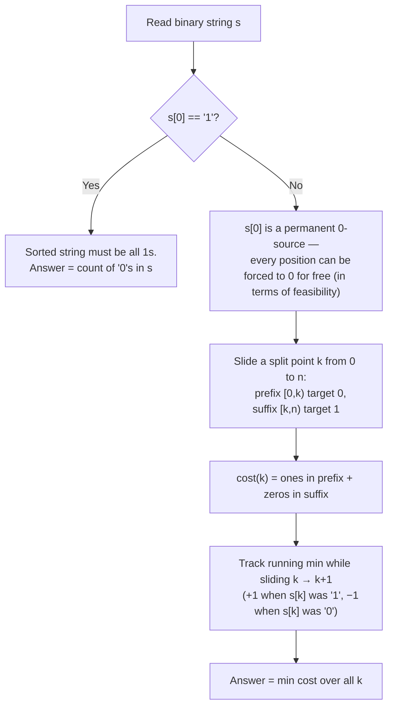

# CF 2266C — AND, OR, Sort!

**Contest:** Codeforces Round 1122 (Div. 3)
**Rating:** Div. 3 C
**Tags:** greedy, prefix sums, constructive
**Verdict:** Accepted ([submission 391582032](https://codeforces.com/contest/2266/submission/391582032))

## Problem in one line

Given a binary string `s`, repeatedly replace `s[i]` with the AND or OR of the prefix `s[0..i]`. Minimum operations to make `s` non-decreasing?

## Core insight: the operation is really "force a value"

> [!NOTE]
> AND of a prefix containing at least one `0` collapses to `0`. OR of a prefix containing at least one `1` collapses to `1`. So the operation isn't really "AND/OR" — it's **"overwrite `s[i]` with 0 (if a 0 exists earlier) or with 1 (if a 1 exists earlier)."** Each such overwrite costs exactly one operation.

Two consequences fall out immediately:

- `s[0]` can never change — AND/OR of a single element is itself.
- `0` is *always* obtainable at any position, because if `s[0] == 0`, that `0` is a permanent AND-source sitting in every prefix.

## Case split on `s[0]`

**`s[0] == '1'`:** a non-decreasing string starting with `1` must be all `1`s. Every `0` needs one OR-operation, and `s[0]=1` is a source for all of them. **Answer = count of `0`s.**

**`s[0] == '0'`:** the sorted target has shape `0^k 1^(n-k)` for some split point `k`. For a fixed `k`:
