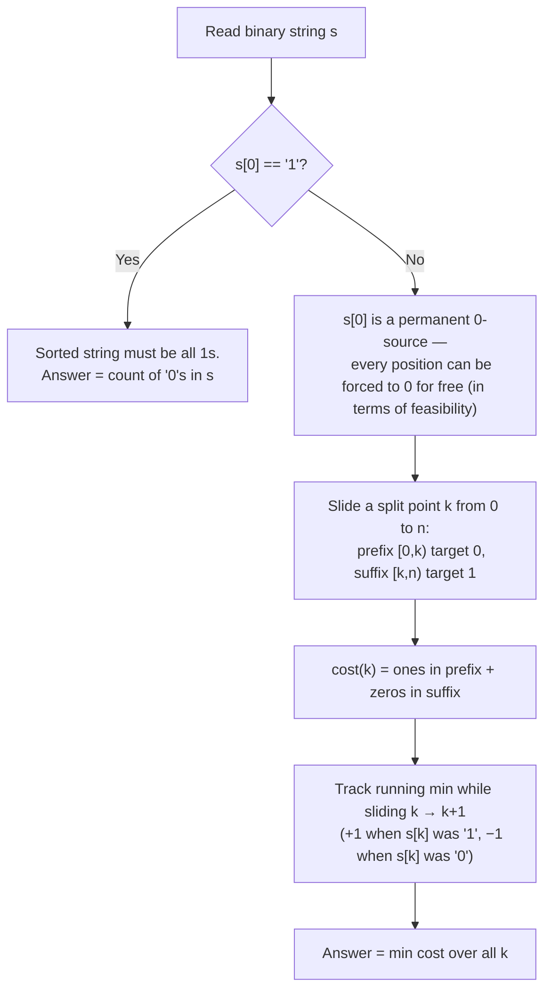

# CF 2266C — AND, OR, Sort!
> **Contest:** Codeforces Round 1122 (Div. 3)  
> **Rating:** Div. 3 C  
> **Tags:** `greedy` `string`  
> **Verdict:** Accepted ([submission 391583312](https://codeforces.com/contest/2266/submission/391583312))

## Problem in one line

Given a binary string `s`, repeatedly replace `s[i]` with the AND or OR of the prefix `s[0..i]`. Minimum operations to make `s` non-decreasing?  
  
[Full Problem](https://codeforces.com/contest/2266/problem/C)

## Core insight: the operation is really "force a value"

> [!NOTE]
> AND of a prefix containing at least one `0` collapses to `0`. OR of a prefix containing at least one `1` collapses to `1`. So the operation isn't really "AND/OR" — it's **"overwrite `s[i]` with 0 (if a 0 exists earlier) or with 1 (if a 1 exists earlier)."** Each such overwrite costs exactly one operation.

Two consequences fall out immediately:

- `s[0]` can never change — AND/OR of a single element is itself.
- `0` is *always* obtainable at any position, because if `s[0] == 0`, that `0` is a permanent AND-source sitting in every prefix.

## Case split on `s[0]`



**`s[0] == '1'`:** a non-decreasing string starting with `1` must be all `1`s. Every `0` needs one OR-operation, and `s[0]=1` is a source for all of them. **Answer = count of `0`s.**

**`s[0] == '0'`:** the sorted target has shape `0^k 1^(n-k)` for some split point `k`. For a fixed `k`:

```
cost(k) = (# of 1s in s[0 .. k-1])   // must be AND'd down to 0
        + (# of 0s in s[k .. n-1])   // must be OR'd up to 1
```

Slide `k` from `0` to `n`, updating the running total in O(1) per step, and take the minimum. This is your loop:

```cpp
int
ones{},
zeros{(int)count(s.begin(),s.end(),'0')},
ans{zeros};

for(int i{};i<n;++i)
    s[i]!='0'?++ones:--zeros,
    ans=min(ans,ones+zeros);
```

## Why feasibility doesn't need special-casing

> [!IMPORTANT]
> Not every split point `k` is actually *achievable* by a valid operation order — a suffix `0` needs some `1` earlier in the string to OR against, and that `1` must trace back to an original `1`, not a manufactured one. Let `p` = index of the first original `1`. Split points `k < p` are infeasible: the suffix would contain original `0`s at positions `< p` with no `1` anywhere before them to source from.
>
> The reassuring part: **you never have to filter these out.** For `k < p`, `cost(k) = (total zeros) - k`, which is strictly decreasing as `k → p`. So every infeasible split point costs *at least* as much as the feasible split `k = p`. The unconstrained sliding-window minimum lands on a feasible answer automatically — the infeasible region is provably never optimal, so it's harmless to include in the scan.

This is the kind of "the greedy formula silently self-corrects" argument worth remembering — it's why the code has no explicit feasibility check and is still correct.

## ❌ / ✅ Same idea, the slow vs. fast version

**❌ Naive: recompute `cost(k)` from scratch for every `k`**
```cpp
int ans{n};
for (int ones,zeros,k{}; k <= n; ++k) {
    ones = count(s.begin(), s.begin() + k, '1'),
    zeros = count(s.begin() + k, s.end(), '0'),
    ans = min(ans, ones + zeros);
}

// O(n) per k → O(n^2) total — too slow for n up to 2·10^5
```

**✅ Optimal: maintain the running cost while sliding `k`**
```cpp
int
ones{},
zeros{count(s.begin(), s.end(), '0')},
ans{zeros};
for (int i{}; i < n; ++i) {
    if (s[i] == '1') ++ones;  // s[i] enters the "must become 0" prefix
    else --zeros;             // s[i] leaves the "must become 1" suffix
    ans = min(ans, ones + zeros);
}

// O(n) total
```

The only change is turning a recomputation into an incremental update — a very common Div. 3/4 pattern once a problem reduces to "minimize prefix-cost + suffix-cost over a single split point."

## Accepted Full Solution
[Submission 391583312](https://codeforces.com/contest/2266/submission/391583312)
```cpp
#include<bits/stdc++.h>
using namespace std;
main(){
    int t;
    cin>>t;
    
    while(t--){
        int n;
        string s;
        cin>>n>>s;

        if(s[0]!='0')cout<<count(s.begin(),s.end(),'0');
        else{
            int
            ones{},
            zeros{(int)count(s.begin(),s.end(),'0')},
            ans{zeros};

            for(int i{};i<n;++i)
                s[i]!='0'?++ones:--zeros,
                ans=min(ans,ones+zeros);

            cout<<ans;
        }

        if(t)cout<<'\n';
    }
}
```

## Complexity

O(n) per test case, O(∑n) overall — well inside the 2·10⁵ sum-of-n limit.

## Practice problems
| Problem | Pattern | Notes |
|---|---|---|
| CF 2266C | Sliding split-point argmin | this writeup |
| TBD | — | fill with another prefix-cost/suffix-cost split-point problem when solved |

## Related
TBD
