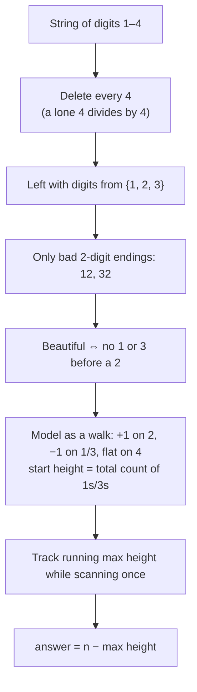

# 2230B — Digit String

**Contest:** Educational Codeforces Round 190 (Div. 2)  
**Tags:** `greedy` `implementation` `math`    
**Rating:** *1000  
**Problem link:** https://codeforces.com/problemset/problem/2230/B

## Statement (condensed)

A string of digits `1`–`4` is *beautiful* if no subsequence of it, read as a number, is divisible by 4. Find the minimum number of deletions needed to make the given string beautiful.

## Key insight

> [!NOTE]
> A number is divisible by 4 iff its **last two digits** are. Nearly the whole solution follows from this one fact.

1. **A lone `4` can never survive.** `4` itself is a subsequence equal to 4 — divisible by 4. Every `4` must go.
2. **Odd digits can't end a bad number.** With `4`s gone, the alphabet is `{1, 2, 3}`. Anything ending in an odd digit is odd, so only subsequences *ending in `2`* are dangerous.
3. **Only `12` and `32` are dangerous endings.** Of `11,12,13,21,22,23,31,32,33`, only `12` (÷4=3) and `32` (÷4=8) divide evenly. So the one forbidden pattern is: **a `1` or `3` appearing before a `2`**.
4. **Shape constraint.** The surviving `{1,2,3}`-subsequence is beautiful iff it looks like `[block of 2s][block of 1s/3s]` — every kept `2` before every kept `1`/`3`.
5. **This is a maximum-walk problem.** Walk left to right; `+1` at each `2`, `−1` at each `1`/`3`, flat at each `4`, starting height = total count of `1`s/`3`s. The global maximum height reached, over *every* prefix (including the empty prefix), is the longest achievable beautiful subsequence. Deletions = `n − max height`.



> [!TIP]
> This walk framing is the reusable trick: whenever a valid subsequence must look like `[pattern A][pattern B]`, model each character as a step (+1 / −1 / flat) and take the running max of the walk in one pass. It's a strictly stronger tool than checking a couple of hand-picked "obvious" split points — see below for why those aren't enough.

## ❌ / ✅ — where the first attempt went wrong

The first submission (391934589, WA on test 2) reasoned about two specific split strategies instead of sweeping every possible split point:

- **`a`** = count of `4`s → delete those, keep everything else.
- **`b`** = count of `1`s/`3`s before the **rightmost `2`** → delete those, keep everything else.
- **`c`** = count of `2`s after the **leftmost `1`/`3`** → delete those, keep everything else.
- Answer = `a + min(b, c)`.

Both are *valid* strategies (each produces a genuinely beautiful string), but they're only two candidates out of up to `n+1` possible split points, and the true optimum can sit strictly between them — a "good middle, bad edges" string breaks both:

```cpp
// ❌ WA on test 2 — submission 391934589, macros unpacked (logic unchanged)
#include<bits/stdc++.h>
using namespace std;

int main(){
    ios::sync_with_stdio(0);
    cin.tie(0);

    int t;
    cin>>t;
    while(t--){

        string s;
        cin>>s;


        int
        // length of the string
        n{(int)s.size()},

        // all 4s
        a{(int)count(s.begin(),s.end(),'4')},

        // all 1s and 3s before the rightmost 2
        b{},

        // all 2s after the leftest 1 and 3
        c{};


        // calculate b
        for(int i{n-1};i;--i){
            if(s[i]=='2'){
                b=count(s.begin(),s.begin()+i,'1')+count(s.begin(),s.begin()+i,'3');
                break;
            }
        }

        //calculate c
        for(int i{};i<n-1;++i){
            if(s[i]=='1'||s[i]=='3'){
                c=count(s.begin()+i+1,s.end(),'2');
                break;
            }
        }

        cout<<a+min(b,c);

        if(t)cout<<'\n';
    }
    return 0;
}
```

> [!NOTE]
> The loop `for(int i{n-1};i;--i)` never inspects index `0` directly — but that's harmless. The only way index `0` would matter is if the rightmost `2` sits at index `0` itself (i.e. it's the only `2` in the string), and in that case "count of `1`s/`3`s before it" is asking about the empty prefix before position `0`, which is correctly `0` — exactly the value `b`'s default initialization already holds. So the min-of-two-candidates flaw demonstrated below is the actual (and only) bug in this submission.

**Counterexample:** `s = "122332"` (a `1`, two `2`s, two `3`s, a `2`).

Walking it by hand: heights are `3, 2, 3, 4, 3, 2, 3` (start=3, then per-char `−1,+1,+1,−1,−1,+1`). The peak is **4**, reached right after the two leading `2`s — strictly *between* the leftmost bad digit (`1` at index 0) and the rightmost `2` (index 5), so neither `b` nor `c` alone finds it:

- `b` = bad digits before the rightmost `2` = `1` (idx 0) + `3` (idx 3) + `3` (idx 4) = **3**
- `c` = `2`s after the leftmost bad digit = idx 1, 2, 5 = **3**
- WA answer: `min(3,3) = 3`

But the true optimum keeps `"22" + "33"` (delete the leading `1` and the trailing lone `2`) → **2** deletions, giving `"2233"`, which is beautiful (all `2`s precede all `3`s). The walk's running max (`4`) proves `2` is achievable and optimal; neither fixed-split candidate can express "sacrifice one `2` in exchange for keeping a whole block of `3`s." This is exactly the shape of bug the real WA hit — the actual failing stress test (submission 391934589, test 2) differs at the **1686th** number with **expected `2`, found `3`** — the same expected-vs-found gap as this hand-built case.


```cpp
// ✅ Accepted — submission 391942529
#include<bits/stdc++.h>
using namespace std;
main (){
    int t;
    cin>>t;

    while(t--){
        string s;
        cin>>s;

        int
        c2{(int)count(s.begin(),s.end(),'2')},
        c4{(int)count(s.begin(),s.end(),'4')},
        c13{(int)s.size()-c2-c4},
        c2SoFar{},
        c13Remaining{c13},
        best{c13};

        for(const auto&i:s){
            if(i=='2')++c2SoFar;
            else if(i!='4')--c13Remaining;

            best=max(best,c2SoFar+c13Remaining);
        }

        cout<<(int)s.size()-best<<'\n';
    }
}
```

`c2SoFar` and `c13Remaining` are exactly the walk's "twos in prefix" / "bad digits remaining in suffix" — `best` is the running max height, updated at *every* character, not just at two hand-picked positions. That's the whole fix: replace two candidate splits with all of them.

## Practice problems

| Problem | Pattern | Link |
|---|---|---|
| 2230B — Digit String | maximum-walk / all-split-points sweep, not just endpoint candidates | https://codeforces.com/problemset/problem/2230/B |
| — | subsequence divisibility-by-small-number reductions | *(TBD)* |
| — | two-block / shape-constrained longest subsequence DP | *(TBD)* |

## Related

- *Maximum-Walk / Running-Max Split-Point DP*
- *Divisibility rule: last-two-digits-mod-4*
- *Endpoint-only greedy pitfall*
